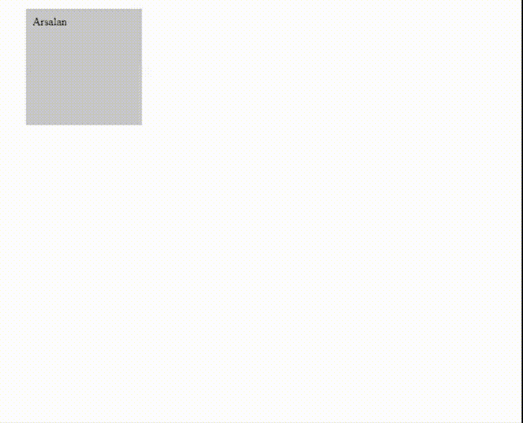

# CSS 浮动动画

> 原文:[https://www.geeksforgeeks.org/css-floating-animation/](https://www.geeksforgeeks.org/css-floating-animation/)

在本文中，我们将解释 CSS 动画的基础知识，并演示如何添加浮动动画。CSS 动画需要以下内容。

*   动画宣言。
*   定义获取动画的属性的**关键帧**。它还提供属性，说明何时以及如何制作动画。

基本上，动画是以下属性的简写属性:动画名称、动画持续时间、动画计时功能、动画延迟、动画迭代次数、动画方向、动画填充模式和动画播放状态。对于本文，我们将使用**动画-名称、动画-持续时间、动画-迭代-计数、动画-计时-函数。**

*   **动画-名称:**浮动(这是指下面定义的@关键帧)。
*   **动画-时长:** 3s(这是指你的动画从开始到结束需要的秒数)。
*   **动画-迭代-计数:**无限(停止前动画的循环次数)。
*   **动画-计时-功能:**放松(开始动画和结束动画的计时)。

您可以将它们组合在同一个关键字下，如下所示。

```html
animation: floating 3s ease-in-out infinite
```

我们来说说**@关键帧**。它可以控制动画。通过使用此属性，您可以随意更改动画。首先从动画名称后面的**@关键帧**规则开始(在这种情况下，它是“浮动的”)。在**@关键帧**中，您可以看到已经声明了 3 个百分比值。接下来是包含属性及其值的代码片段。这些百分比表示沿动画序列的断点。

*   0%选择器包含一个在动画开始时执行的块。
*   50%选择器包含一个在中间点执行的块。
*   100%选择器包含一个一旦动画完成就执行的块。

在每个断点，我们都有属性转换。允许用户旋转、倾斜、缩放或平移给定元素的变换属性。在这种情况下，我们将使用 translate 属性。基本上翻译帮助我们垂直和水平放置东西。
**index.html**T3】

## 超文本标记语言

```html
<!DOCTYPE html>
<html>

<head>
    <title>Floating Animation</title>
    <link rel="stylesheet" type="text/css"
            href="style.css">
</head>

<body>
    <div class="floating" style=
            "height: 150px; width: 150px;
            background: rgb(200, 200, 200);
            padding: 10px">
        Arsalan
    </div>
</body>

</html>
```

**style.css**

## 钢性铸铁

```html
.floating { 
    animation-name: floating;
    animation-duration: 3s;
    animation-iteration-count: infinite;
    animation-timing-function: ease-in-out;
    margin-left: 30px;
    margin-top: 5px;
}

@keyframes floating {
    0% { transform: translate(0,  0px); }
    50%  { transform: translate(0, 15px); }
    100%   { transform: translate(0, -0px); }   
}
```

**输出:**



**支持的浏览器:**

*   谷歌 Chrome
*   微软公司出品的 web 浏览器
*   火狐浏览器
*   歌剧
*   旅行队