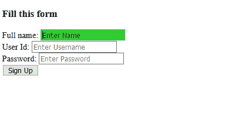

# CSS:焦点选择器

> 原文:[https://www.geeksforgeeks.org/css-focus-selector/](https://www.geeksforgeeks.org/css-focus-selector/)

**:聚焦** [**CSS 伪类**](https://www.geeksforgeeks.org/css-pseudo-classes/) **选择器**用于瞄准聚焦元素 ie。，它选择用户当前关注的元素。这个选择器作用于用户输入元素，通常在表单中使用，一旦用户点击它或者点击一个元素，或者选择任何键盘事件，这个选择器就会被触发。

**语法:**

```css
:focus {
  // CSS property
}
```

**示例:**本示例说明了**:焦点选择器**以选定的元素为目标。

## 超文本标记语言

```css
<!DOCTYPE html>
<html>
<head>
    <style>
    input:focus {
        background-color: limegreen;
    }
    </style>
</head>

<body>
    <h3>Fill this form</h3>
    <form> Full name:
        <input type="text"
               placeholder="Enter Name"
               name="name">
        <br> User Id:
        <input type="text"
               placeholder="Enter Username"
               name="uid">
        <br> Password:
        <input type="password"
               placeholder="Enter Password"
               name="pass">
        <br>
        <button type="button"
                onclick="#">Sign Up</button>
    </form>
</body>
</html>
```

**输出:**



**支持的浏览器:**

*   谷歌 Chrome 4.0
*   微软边缘 12.0
*   Internet Explorer 8.0
*   Firefox 2.0
*   Safari 3.1
*   歌剧 9.6