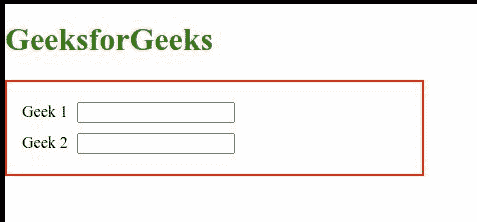

# CSS:焦点-在选择器内

> 原文:[https://www.geeksforgeeks.org/css-focus-within-selector/](https://www.geeksforgeeks.org/css-focus-within-selector/)

*:focus-in*伪类是一个选择由一个聚焦元素组成的元素作为子元素的类。当任何子元素获得焦点时，都会应用 CSS 规则。示例包括点击链接、选择输入等。

**语法:**

```
:focus {
    /* CSS Properties */
}
```

**示例:**以下是说明使用*:focus-in*伪类选择器的示例。

## 超文本标记语言

```
<!DOCTYPE html>
<html lang="en">

<head>
    <style>
        form {
            border: 2px solid red;
            padding: 15px;
            width: 30%;
        }

        form:focus-within {
            background: #ff8;
            color: black;
        }

        input {
            margin: 5px;
        }
    </style>
</head>

<body>
    <h1 style="color: green;">
        GeeksforGeeks
    </h1>

    <form>

        <label>Geek 1</label>
        <input type="text">
        <br>
        <label>Geek 2</label>
        <input type="text">
    </form>
</body>

</html>
```

**输出:**



**支持的浏览器:**

*   铬
*   火狐浏览器
*   边缘
*   歌剧
*   旅行队
*   互联网浏览器(不支持)。