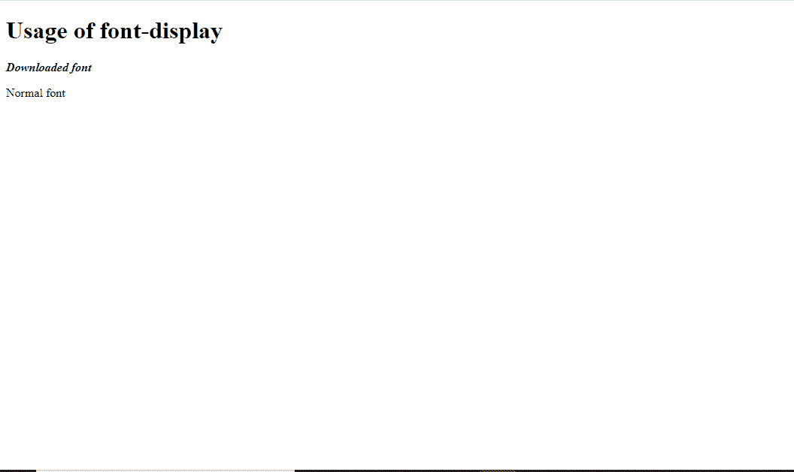

# CSS |字体显示属性

> 原文:[https://www.geeksforgeeks.org/css-font-display-property/](https://www.geeksforgeeks.org/css-font-display-property/)

使用网络字体时，文本将是不可见的，直到加载网络字体或三秒钟过去，此时将使用回退字体。

**字体显示允许自定义网页呈现时网页字体的显示方式。**

它是使用定义样式表中自定义字体的 *@font-face* 规则应用的。

**语法:**

```html
@font-face {
  font-family: Sample;
  src: url(samplefont.woff) format('woff'),
       url(samplefontbold.woff) format('woff');
  font-weight: normal;
  font-style: normal;
  font-display: optional;
}
```

**示例:**

```html
<!DOCTYPE html>
<html>
<head>
    <title>CSS | font-display</title>
    <meta name='viewport' content="width=device-width, initial-scale=1">
    <style>
        @font-face {
        font-family: Roboto;
        src: url(Roboto\Roboto-BoldItalic.ttf) format('truetype');
        font-style: italic;
        font-weight: bold;
        font-display: block;
    }

    div{
        font-family: Roboto;
        font-style: italic;
        font-weight:bold;
    }
</style>
</head>
<body>
<h1>Usage of font-display</h1>
<div>Downloaded font</div>
<p>Normal font</p>
</body>
</html>
```

**输出:**


**下载的字体短时间后出现。**试着在 IDE 上运行看看。

字体显示属性时间线分为三个时段:

*   街区
*   交换
*   失败

**封锁期:**在网页字体没有加载之前，文本是不可见的，在此期间渲染被封锁。

**交换期:**本来回退字体是用来渲染文字的，如果在交换期内网页字体加载成功，回退字体就和网页字体交换。

**失效期:**此时认为加载失败，使用回退字体。

此属性接受以下值:

*   自动(初始值):在该值下，字体显示技术由浏览器选择。这通常类似于块值。
*   Block:它进入一个小的块周期，然后进入一个无限的交换周期，所以渲染是无限允许的。在更简单的形式中，它隐藏文本，直到加载 web 字体。
*   交换:在这个值下，字体具有最小的块周期和无限的交换周期。在加载 web 字体之前，它使用后退字体
*   后退:它给字体一个最小的阻塞周期(100 毫秒)和一个小的交换周期(大约 3 秒)。它尝试短期加载 web 字体，然后进入故障期，并使用回退字体。
*   可选:它给字体一个最小的阻塞期，没有交换期。它短时间隐藏文本，然后使用后退字体，直到 web 字体是可以使用的自定义字体。