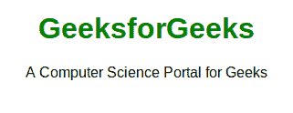

# CSS @字体规则

> 原文:[https://www.geeksforgeeks.org/css-font-face-rule/](https://www.geeksforgeeks.org/css-font-face-rule/)

**@ font-face**[CSS at-rule 规则](https://www.geeksforgeeks.org/css-at-rules/)用于关联可在样式表中使用的字体名称。规则中使用字体系列描述符来命名字体，src 描述符与外部字体名称相关联。这可以用于可下载的字体。这个 CSS **@font-face** 规则可以包含多个属性(最多 24 个)。

**语法:**

```css
@font-face {
  font-family: fontName;
  src: url(fontFile path);
  font-stretch: font-stretch Property;
  font-weight: font-weight Property;
  font-style: font-style Property;
}
```

**参数:**如下所述，@字体规则接受四个参数:

*   [**字体家族:**](https://www.geeksforgeeks.org/css-font-family-property/) 指定一个元素的字体。
*   **src:** 用于指定外部资源 ie 的位置(URL)。，它保存文件路径(url)。
*   [**字体-拉伸:**](https://www.geeksforgeeks.org/css-font-stretch-property/) 用于设置文字的宽窄。
*   [**字体粗细:**](https://www.geeksforgeeks.org/css-font-weight-property/) 用于设置与 HTML 文本一起使用的字体的粗细。
*   [**字体样式:**](https://www.geeksforgeeks.org/css-font-style-property/) 它用于将给定的特定文本以其字体系列中的普通、斜体或斜体字显示。

**很少托管字体服务:**这些服务会为你提供各种类型的字体。

*   [Fonts.com](https://www.fonts.com)
*   [谷歌字体](https://fonts.google.com/)
*   典型
*   [排版](https://www.typography.com)

**示例 1:** 该示例说明了使用@font-face 规则来指定不同的字体属性以相应地修饰文本。

## 超文本标记语言

```css
<!DOCTYPE html>
<html>

<head>
    <title>CSS @font-face rule</title>
    <style>
    @font-face {
        font-family: fontName;
        src: url(sansation_light.woff);
    }

    @font-face {
        font-family: fontName;
        src: url(sansation_bold.woff);
        font-weight: bold;
    }

    div {
        font-family: fontName;
    }

    h1 {
        color: green;
    }
    </style>
</head>

<body>
    <center>
        <h1>GeeksforGeeks</h1>
        <div>A Computer Science Portal fo Geeks</div>
    </center>
</body>

</html>
```

**输出:**


**示例 2:** 该示例通过指定文件路径的来源及其格式来说明@font-face 规则的使用。

## 超文本标记语言

```css
<!DOCTYPE html>
<html lang="en">

<head>
    <title>CSS @font-face rule</title>
    <style type="text/css">
    @font-face {
        font-family: "OpenSans";
        src: url("/examples/fonts/OpenSans-Regular.eot");
        src: url("/examples/fonts/OpenSans-Regular.ttf") format("truetype");
        font-stretch: normal;
        font-weight: normal;
        font-style: normal;
    }

    @font-face {
        font-family: "OpenSansBold";
        src: url("/examples/fonts/OpenSans-Bold.eot");
        src: url("/examples/fonts/OpenSans-Bold.ttf") format("truetype");
        font-stretch: normal;
        font-weight: normal;
        font-style: normal;
    }
    /* Specify the OpenSans bold font */

    h1 {
        font-family: "OpenSansBold", Arial, sans-serif;
        color: green;
    }

    p {
        font-family: "OpenSans", Arial, sans-serif;
    }
    </style>
</head>

<body>
    <center>
        <h1>GeeksforGeeks</h1>

<p>A Computer Science Portal for Geeks</p>

    </center>
</body>

</html>
```

**输出:**



**注:**有 5 种字体格式，分别是:TTF/OTF、WOFF、WOFF2、SVG、EOT。

**支持的浏览器:****CSS @字体规则**支持的浏览器如下:

*   谷歌 Chrome (TTF/OTF、WOFF、WOFF2 和 SVG)
*   互联网浏览器(专题信托基金/OTF、WOFF 和埃及)
*   火狐(TTF/OTF、WOFF 和 WOFF2)
*   Safari TTF/OTF、WOFF 和 SVG)
*   歌剧 TTF/OTF、WOFF、WOFF2 和 SVG