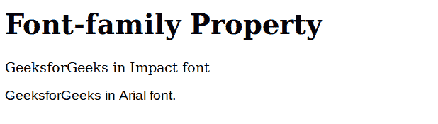

# CSS 字体系列属性

> 原文:[https://www.geeksforgeeks.org/css-font-family-property/](https://www.geeksforgeeks.org/css-font-family-property/)

**字体系列**属性指定元素的字体。它可以有多种字体作为备份系统，即如果浏览器不支持一种字体，则可以使用另一种字体。换句话说，该属性用于根据列表中的优先级为选定元素指定*族名称*&/或*通用族名称*。

*字族*可以分为两种类型:

*   **族名:**包含一个字体族的名称，如“times”、“courier”、“arial”等。
*   **通用名族**:包含通用名族的名称，如“衬线”、“无衬线”、“草书”、“幻想”、“单空间”。

**语法:**

```html
element_selector {
    font-family: family-name|generic-family|initial|inherit;
} 
```

**属性值:**

*   **字体-名称**:用逗号分隔的引号指定字体的名称。
*   [**通用系列**](https://www.geeksforgeeks.org/css-generic-font-family-collection/) :用于从字体池中的可用字体列表中设置 HTML 文档中文本的字体。
*   [**初始**](https://www.geeksforgeeks.org/css-value-initial/) :用于将元素的 CSS 属性设置为默认值。
*   [**继承**](https://www.geeksforgeeks.org/css-value-inherit/) :用于从元素的父元素属性值继承元素的属性。

**注意:**在 HTML &中使用*样式*属性时，*字体名称*可以用单引号声明，如果包含空格，也必须用引号声明。

我们将通过实现*字体系列*属性来理解它的用法。

**示例:**该示例说明了字体系列属性的使用。

## 超文本标记语言

```html
<!DOCTYPE html>
<html>
<head>
    <title> CSS | font-family Property </title>
    <style>
    .para1 {
        font-family: "Impact", Times, serif;
    }

    .para2 {
        font-family: Arial, Helvetica, sans-serif;
    }
    </style>
</head>

<body>
    <h1>Font-family Property</h1>
    <p class="para1">GeeksforGeeks in Impact font</p>

    <p class="para2">GeeksforGeeks in Arial font.</p>

</body>
</html>
```

**输出:**



**支持的浏览器:**支持*字体系列*属性的浏览器如下:

*   谷歌 Chrome 1.0
*   Internet Explorer 3.0
*   微软边缘 12.0
*   Firefox 1.0
*   歌剧 3.5
*   Safari 1.0