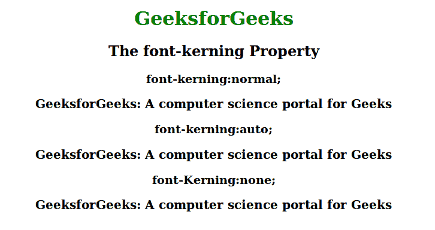

# CSS |字体字距属性

> 原文:[https://www.geeksforgeeks.org/css-font-kerning-property/](https://www.geeksforgeeks.org/css-font-kerning-property/)

此属性用于控制存储在字体中的字距调整信息的使用。字距调整定义了字母的间距。对于那些没有字距调整信息的字体，此属性没有可见效果。

**语法:**

```html
font-kerning: auto|normal|none;
```

**默认值:**

*   **自动**

**属性:**

*   **自动:**为默认值。浏览器决定是否应用字体字距调整。
*   **正常:**用于指定字体字距调整在浏览器上正常应用。
*   **无:**用于指定不应用字体字距调整。

**示例:**

## 超文本标记语言

```html
<!DOCTYPE html>
<html>
    <head>
        <title>
            CSS | font-kerning Property
        </title>
        <style>
            div {
                font-family: serif;
                font-size: 20px;
                font-weight:bold;
            }
            div.geeks {
                font-kerning: normal;
            }
            div.SUDO {
                font-kerning: auto;
            }
            div.gfg {
                font-Kerning:none;
            }
            h1 {
                color:green;
            }
            body {
                text-align:center;
            }
        </style>
    </head>
    <body>
        <h1>GeeksforGeeks</h1>
        <h2>The font-kerning Property</h2>
        <h3>font-kerning:normal;</h3>
        <div class="geeks">
         GeeksforGeeks:
         A computer science portal for Geeks
        </div>
        <h3>font-kerning:auto;</h3>
        <div class="sudo">
         GeeksforGeeks:
         A computer science portal for Geeks</div>
        <h3>font-Kerning:none;</h3>
        <div class="gfg">
         GeeksforGeeks:
         A computer science portal for Geeks
        </div>
    </body>
</html>                   
```

**输出:**



**支持的浏览器:**支持的浏览器 *CSS |字体间距属性*如下:

*   谷歌 Chrome 32.0-网络工具包-
*   Internet Explorer 10.0
*   Firefox 34.0
*   歌剧
*   Safari 7.0