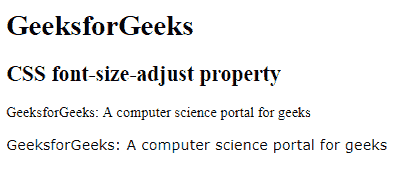

# CSS |字号-调整属性

> 原文:[https://www . geeksforgeeks . org/CSS-font-size-adjust-property/](https://www.geeksforgeeks.org/css-font-size-adjust-property/)

CSS 中的 font-size-adjust 属性用于根据小写字母而不是大写字母的高度来调整字体大小，从而更好地控制字体大小。当文本提供了多种样式并在这些样式之间转换时调整字体时，这非常有用。

**语法:**

```
font-size-adjust: number|none|initial|inherit;
```

**默认值:**

*   **无**

**房产价值:**

*   **数字:**设置字体大小调整属性的数字。
*   **无:**设置默认值。
*   **初始值:**将字体大小调整属性设置为默认值。
*   **继承:**字号调整属性从其父级继承。

**例:**

## 超文本标记语言

```
<!DOCTYPE html>
<html>
    <head>
        <title>
            CSS font-size-adjust property
        </title>

        <style>
            .GFG1 {
                font-family: Times, serif;
            }

            .GFG2 {
                font-family: Verdana, sans-serif;
            }
            div {
                font-size-adjust: 0.58;
            }
        </style>
    </head>

    <body>
        <h1>GeeksforGeeks</h1>

        <h2>
            CSS font-size-adjust property
        </h2>

        <p class = "GFG1">
            GeeksforGeeks: A computer science
            portal for geeks
        </p>

        <p class = "GFG2">
            GeeksforGeeks: A computer science
            portal for geeks
        </p>

    </body>
</html>                   
```

**输出:**



**支持的浏览器:**支持/不支持的浏览器*字号调整*属性如下:

*   Firefox 3.0