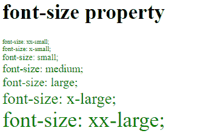
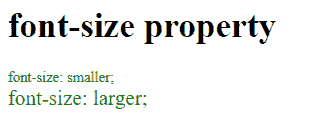
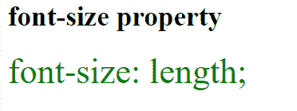
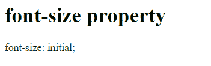

# CSS |字号属性

> 原文:[https://www.geeksforgeeks.org/css-font-size-property/](https://www.geeksforgeeks.org/css-font-size-property/)

CSS 中的 font-size 属性用于设置 HTML 文档中文本的字体大小。

**语法:**

```css
font-size: medium|xx-small|x-small|small|large|x-large
           |xx-large|smaller|larger|length|initial|inherit;
```

**默认值:**

*   **中等**

**房产价值:**

*   **绝对大小:**绝对大小用于绝对设置字体大小。绝对大小的默认值是中等。绝对规模的物业名单为*xx-小型、x-小型、小型、中型、大型、x-大型、xx-大型*。

**语法:**

```css
font-size: medium|xx-small|x-small|small|large|x-large|xx-large;
```

**例:**

## 超文本标记语言

```css
<!DOCTYPE html>
<html>
    <head>
        <title>
            CSS font-size property
        </title>

        <!-- CSS style to set font-size property -->
        <style>
            .xxsmall {
                color:green;
                font-size:xx-small;
            }
            .xsmall {
                color:green;
                font-size:x-small;
            }
            .small {
                color:green;
                font-size:small;
            }
            .medium {
                color:green;
                font-size:medium;
            }
            .large {
                color:green;
                font-size:large;
            }
            .xlarge {
                color:green;
                font-size:x-large;
            }
            .xxlarge {
                color:green;
                font-size:xx-large;
            }
        </style>
    </head>

    <body>
        <h1>font-size property</h1>

        <div class = "xxsmall">font-size: xx-small;</div>
        <div class = "xsmall">font-size: x-small;</div>
        <div class = "small">font-size: small;</div>
        <div class = "medium">font-size: medium;</div>
        <div class = "large">font-size: large;</div>
        <div class = "xlarge">font-size: x-large;</div>
        <div class = "xxlarge">font-size: xx-large;</div>
    </body>
</html>                   
```

**输出:**



*   **相对大小:**包含较小和较大两个值。字体大小是小还是大取决于父元素。

**语法:**

```css
font-size: smaller|larger;
```

**例:**

## 超文本标记语言

```css
<!DOCTYPE html>
<html>
    <head>
        <title>
            CSS font-size Property
        </title>

        <!-- CSS property to set font-size -->
        <style>
            .smaller {
                color:green;
                font-size:smaller;
            }
            .larger {
                color:green;
                font-size:larger;
            }
        </style>
    </head>

    <body>
        <h1>font-size property</h1>

        <div class = "smaller">font-size: smaller;</div>
        <div class = "larger">font-size: larger;</div>
    </body>
</html>                   
```

**输出:**



*   **长度:**该属性用于设置字体长度。长度可以是 px、cm 等形式。

**语法:**

```css
font-size: length;
```

**例:**

## 超文本标记语言

```css
<!DOCTYPE html>
<html>
    <head>
        <title>
            CSS font-size Property
        </title>

        <!-- CSS property to set font-size -->
        <style>
            .length {
                color:green;
                font-size: 40px;
            }
        </style>
    </head>

    <body>
        <h1>font-size property</h1>

        <div class = "length">font-size: length;</div>
    </body>
</html>                   
```

**输出:**



*   **全局:**此属性包含三种类型的值，如 initial | inherit | unset。

**语法:**

```css
font-size: initial|inherit|unset;
```

**例:**

## 超文本标记语言

```css
<!DOCTYPE html>
<html>
    <head>
        <title>
            CSS font-size Property
        </title>

        <!-- CSS property to set font-size -->
        <style>
            .length {
                color:green;
                font-size: initial;
            }
        </style>
    </head>

    <body>
        <h1>font-size property</h1>

        <div class = "length">font-size: initial;</div>
    </body>
</html>                   
```

**输出:**



**支持的浏览器:**字体大小属性支持的浏览器如下:

*   谷歌 Chrome 1.0
*   Internet Explorer 5.5
*   Firefox 1.0
*   Safari 1.0
*   Opera 7.0