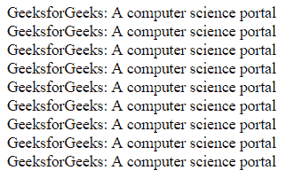

# CSS |字体拉伸属性

> 原文:[https://www.geeksforgeeks.org/css-font-stretch-property/](https://www.geeksforgeeks.org/css-font-stretch-property/)

CSS 中的字体拉伸属性用于设置文本的宽度或宽度。该属性对任何字体都不起作用。它只在字体系列有宽度变化的面时起作用。

**语法:**

```html
font-stretch: normal|ultra-condensed|extra-condensed|condensed|
semi-condensed|semi-expanded|expanded|extra-expanded|ultra-expanded; 
```

**默认值:**

*   **正常**

**属性值:**

*   **正常:**为默认字体脸。它不会拉伸字体。
*   **超浓缩:**用于指定比正常更浓缩的字体。
*   **超浓缩:**用于设置文字窄于正常，不窄于超浓缩。
*   **浓缩:**用于设置文字窄于半浓缩，不窄于超浓缩。
*   **半浓缩:**用于设置文字窄于正常，不窄于半浓缩。
*   **半展开:**用于设置文字比正常宽，但不宽则展开。
*   **展开:**用于设置文本比半展开更宽，但比超展开不宽。
*   **超展开:**用于设置文字比展开的宽，但不是比超展开的宽。
*   **超展开:**用于设置文字比超展开更宽。

**示例:**

## 超文本标记语言

```html
<!--HTML code to illustrate font-stretch
Property -->
<!DOCTYPE html>
<html>
    <head>
        <title>
            CSS font-stretch Property
        </title>

        <style>
            .normal {
                font-stretch: normal;
            }

            .ultra_condensed {
                font-stretch: ultra-condensed;
            }

            .extra_condensed {
                font-stretch: extra-condensed;
            }

            .condensed {
                font-stretch: condensed;
            }

            .extra_condensed {
                font-stretch: extra-condensed;
            }

            .semi_expanded {
                font-stretch: semi-expanded;
            }

            .expanded {
                font-stretch: expanded;
            }

            .extra_expanded {
                font-stretch: extra-expanded;
            }

            .ultra_expanded {
                font-stretch: ultra-expanded;
            }
        </style>
    </head>

    <body>
        <div class = "normal">
            GeeksforGeeks: A computer science portal
        </div>

        <div class = "ultra_condensed">
            GeeksforGeeks: A computer science portal
        </div>

        <div class = "extra_condensed">
            GeeksforGeeks: A computer science portal
        </div>

        <div class = "condensed">
            GeeksforGeeks: A computer science portal
        </div>

        <div class = "extra_condensed">
            GeeksforGeeks: A computer science portal
        </div>

        <div class = "semi_expanded">
            GeeksforGeeks: A computer science portal
        </div>

        <div class = "expanded">
            GeeksforGeeks: A computer science portal
        </div>

        <div class = "extra_expanded">
            GeeksforGeeks: A computer science portal
        </div>

        <div class = "ultra_expanded">
            GeeksforGeeks: A computer science portal
        </div>
    </body>

</html>                                   
```

**输出:**



**注意:**这个属性对任何字体都不起作用。

**支持的浏览器:***字体拉伸属性*支持的浏览器如下:

*   谷歌 Chrome 48.0
*   Internet Explorer 9.0
*   Firefox 9.0
*   Opera 35.0
*   Safari 11.0