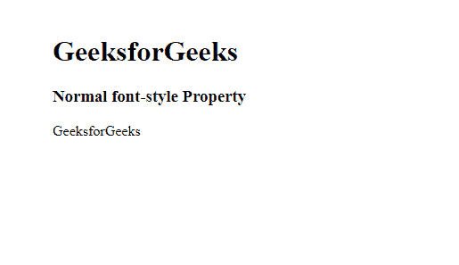
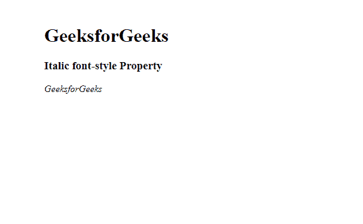
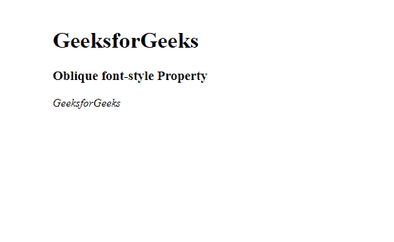
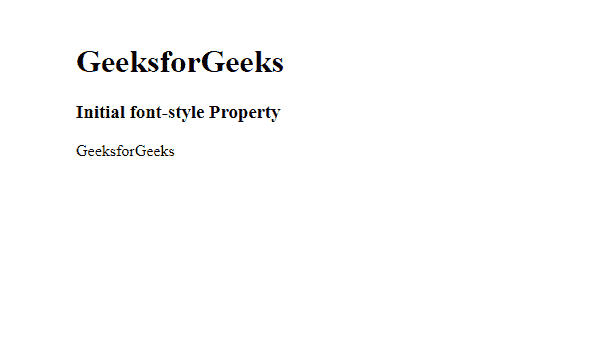
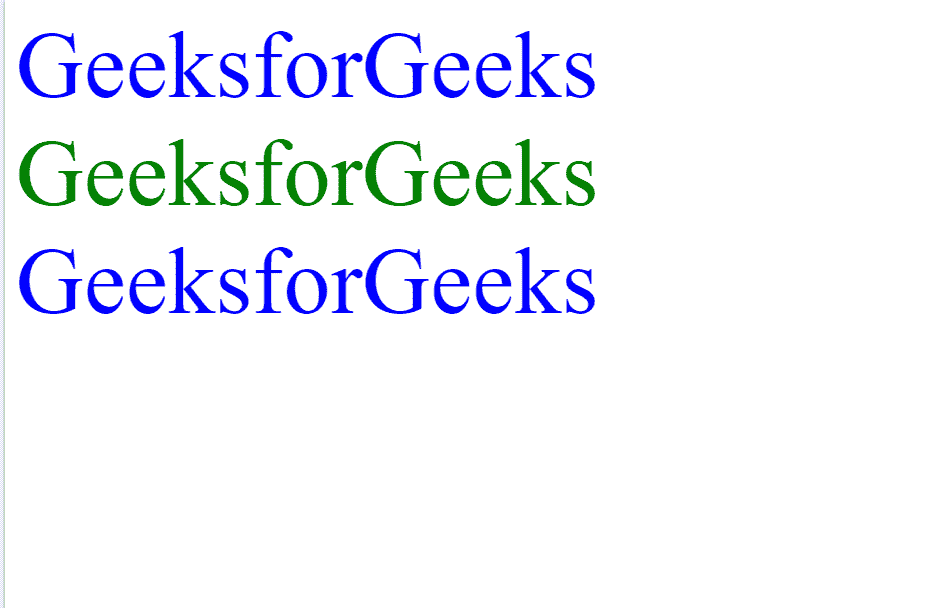

# CSS 字体样式属性

> 原文:[https://www.geeksforgeeks.org/css-font-style-property/](https://www.geeksforgeeks.org/css-font-style-property/)

一个**字体样式** CSS 属性用于从其[字体系列](https://www.geeksforgeeks.org/css-font-family-property/)中给定的特定文本设置普通、斜体或斜面的样式。使用*字体样式的*属性，我们可以在装饰特定文本的同时赋予重要性。它有助于创造更好的用户体验。在 CSS 中，如果我们想给任何类型的文本设计，那么我们可以使用 CSS 字体样式属性。

**语法:**

```css
font-style: normal|italic|oblique|initial|inherit;
```

**属性值:**

*   **正常:**这是浏览器将显示正常字体文本的字体样式的默认值。
*   **斜体**:这种字体样式用于在浏览器中将文本显示为斜体。
*   **倾斜**:这种字体样式为文字的倾斜指定了一个角度。浏览器中显示的字体样式是倾斜的。
*   **初始**:该字体样式属性用于将字体设置为默认值。
*   **继承**:这个字体样式的属性用于从其父元素继承当前属性。

我们将通过示例讨论所有字体样式属性。让我们从**普通**字体样式属性开始。

*   **字体样式:普通:**浏览器会显示普通字体文本，它是默认值。

**语法:**

```css
font-style: normal;
```

**示例:**本示例说明了值设置为正常的**字体**。

## 超文本标记语言

```css
<!DOCTYPE html>
<html>
<head>
    <title> CSS | font-style Property </title>
    <style>
    p.a {
        font-style: normal;
    }
    </style>
</head>

<body>
    <h1>GeeksforGeeks</h1>
    <h3>Normal font-style Property</h3>
    <p class="a">GeeksforGeeks</p>

</body>
</html>
```

**输出:**



**字体:斜体:** 这是用来在 *中制作字体的斜体。*

**语法:**

```css
font-style: italic;
```

**示例:**本示例说明了**字体样式的**，其值设置为斜体。

## 超文本标记语言

```css
<!DOCTYPE html>
<html>
<head>
    <title> CSS | font-style Property </title>
    <style>
    p.a {
        font-style: italic;
    }
    </style>
</head>

<body>
    <h1>GeeksforGeeks</h1>
    <h3>Italic font-style Property</h3>
    <p class="a">GeeksforGeeks</p>

</body>
</html>
```

**输出:**



**字体样式:倾斜:**浏览器显示倾斜字体样式。

**语法:**

```css
font-style: oblique;
```

**示例:**本示例说明了**字体的**，其值设置为倾斜。

## 超文本标记语言

```css
<!DOCTYPE html>
<html>
<head>
    <title> CSS | font-style Property </title>
    <style>
    p.a {
        font-style: oblique;
    }
    </style>
</head>

<body>
    <h1>GeeksforGeeks</h1>
    <h3>Oblique font-style Property</h3>
    <p class="a">GeeksforGeeks</p>

</body>
</html>
```

**输出:**



**字体样式:初始:**浏览器显示一个初始字体样式，这是默认的。

**语法:**

```css
font-style: initial;
```

**示例:**本示例说明了**字体样式的**，其值设置为初始值。

## 超文本标记语言

```css
<!DOCTYPE html>
<html>
<head>
    <title> CSS | font-style Property </title>
    <style>
    p.a {
        font-style: initial;
    }
    </style>
</head>

<body>
    <h1>GeeksforGeeks</h1>
    <h3>Initial font-style Property</h3>
    <p class="a">GeeksforGeeks</p>

</body>
</html>
```

**输出:**



**字体样式:Inherit:** 这从其父元素继承属性。

**示例:**在本例中，我们将 color 的值设置为 inherit，它将从其父元素继承 color 属性。

## 超文本标记语言

```css
<!DOCTYPE html>
<html>
<head>
    <title> CSS | font-style Property </title>
    <style>
    span {
        color: blue;
        font-size: 70px;
    }

    .extra span {
        color: inherit;
    }
    </style>
</head>

<body>
    <div>
        <span>GeeksforGeeks</span>
    </div>
    <div class="extra"
         style="color:green">
      <span>GeeksforGeeks</span>
    </div>
    <div style="color:red">
        <span>GeeksforGeeks</span>
    </div>
</body>
</html>
```

**输出:**



**支持的浏览器:**字体属性支持的浏览器如下:

*   谷歌 Chrome 1.0
*   Internet Explorer 4.0
*   微软边缘 12.0
*   Firefox 1.0
*   Opera 7.0
*   Safari 1.0