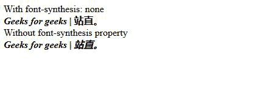
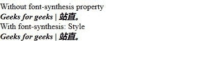
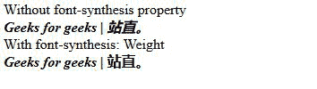
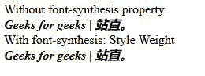

# CSS 字体合成属性

> 原文:[https://www.geeksforgeeks.org/css-font-synthesis-property/](https://www.geeksforgeeks.org/css-font-synthesis-property/)

**字体合成**属性控制浏览器合成缺少的字体样式，如粗体、斜体或下划线。
不同的字体语言(如中文和日文)不包括这些字体变体，因此合成它们可能会妨碍文本的易读性，因此必须关闭字体的默认浏览器合成。

**语法:**

```css
font-synthesis: none | weight | style | style weight;
```

**属性值:**

*   **none:** None indicates that one can not synthesize the weight and style typeface.

    **语法:**

    ```css
    font-synthesis:none;
    ```

    **示例:**

    ```css
    <!DOCTYPE html>
    <html lang="en">
    <head>
      <meta charset="UTF-8">
      <meta name="viewport" 
            content="width=device-width,
                     initial-scale=1.0">
      <title>Document</title>
    </head>
    <style>
      em {
        font-weight: bold;
      }
      .para {
        font-synthesis: none;
      }
    </style>
    <body>
      <span>With font-synthesis: none</span><br>
      <em class="para">Geeks for geeks | ???</em>
      <br/>
      <span>Without font-synthesis property
         </span><br>
      <em>Geeks for geeks | ???</em>
    </body>
    </html>
    ```

    **输出:**

    

    *   **Style:** According to this a italic typeface may be synthesized by the browser if required.

        **语法:**

        ```css
        font-synthesis: style
        ```

        **示例:**

        ```css
        <!DOCTYPE html>
        <html lang="en">
        <head>
          <meta charset="UTF-8">
          <meta name="viewport"
                content="width=device-width, 
                         initial-scale=1.0">
          <title>Document</title>
        </head>
        <style>
          em {
            font-weight: bold;
          }
          .para {
            font-synthesis: style;
          }
        </style>
        <body>
          <span>Without font-synthesis
                property</span><br>
          <em>Geeks for geeks | ???</em>
          <br>
          <span>With font-synthesis: Style
            </span><br>
          <em class="para">Geeks for geeks | ???</em>
        </body>
        </html>
        ```

        **输出:**

        

        *   **weight:** According to this a bold typeface may be synthesized by the browser if required.

            **语法:**

            ```css
            font-synthesis: weight
            ```

            **示例:**

            ```css
            <!DOCTYPE html>
            <html lang="en">
            <head>
              <meta charset="UTF-8">
              <meta name="viewport" 
                    content="width=device-width,
                             initial-scale=1.0">
              <title>Document</title>
            </head>
            <style>
              em {
                font-weight: bold;
              }
              .para {
                font-synthesis: weight;
              }
            </style>
            <body>
              <span>Without font-synthesis property</span><br>
              <em>Geeks for geeks | ???</em>
              <br>
              <span>With font-synthesis: Weight</span><br>
              <em class="para">Geeks for geeks | ???</em>
            </body>
            </html>
            ```

            **输出:**

            

            *   **Style weight:**  According to this a bold and italic typeface may be synthesized by the browser if required.

                **语法:**

                ```css
                font-synthesis: style weight
                ```

                **示例:**

                ```css
                <!DOCTYPE html>
                <html lang="en">
                <head>
                  <meta charset="UTF-8">
                  <meta name="viewport" 
                        content="width=device-width, 
                                 initial-scale=1.0">
                  <title>Document</title>
                </head>
                <style>
                  em {
                    font-weight: bold;
                  }
                  .para {
                    font-synthesis: style weight;
                  }
                </style>
                <body>
                  <span>Without font-synthesis property</span><br>
                  <em>Geeks for geeks | ???</em>
                  <br>
                  <span>With font-synthesis: Style Weight</span><br>
                  <em class="para">Geeks for geeks | ???</em>
                </body>
                </html>
                ```

                **输出:**

                

            **支持的浏览器:**

            *   火狐浏览器
            *   苹果 Safari