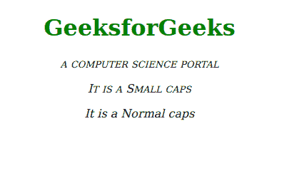
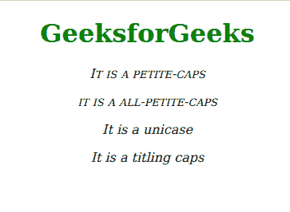

# CSS 字体-变体-大写属性

> 原文:[https://www . geesforgeks . org/CSS-font-variant-caps-property/](https://www.geeksforgeeks.org/css-font-variant-caps-property/)

*字体变体大写*属性在不移动基线的情况下垂直更改字符的位置，并将它们显示为上标或下标。如果给定字体有一些大小不同的大写字母字形，则此属性选择最合适的字形。

**语法:**

```html
font-variant-caps: keyword_values
```

或者

```html
font-variant-caps: Global_values
```

**默认值:**

*   **正常**

**属性值:**该属性接受上面提到的和下面描述的两个值。

*   **关键字 _ 值:**该属性是指*关键字 _ 值*定义的单位，如*普通、小楷、全小楷、小楷、全小楷、unicase、titling-caps、*等。
*   **Global_values:** 该属性是指*初始、继承、取消设置、*等全局值。

**语法:**

```html
font-variant-caps: small-caps | all-small-caps | normal |
 inherit | petite-caps |  unicase | all-petite-caps |
 titling-caps | unset | initial 
```

**示例 1:** 下面的代码说明了*字体变体大写*属性与*全小写、小大写、普通的用法。*

## 超文本标记语言

```html
<!DOCTYPE html>
<html>

<head>
    <style>
        .allSmallCaps {
            font-variant-caps: all-small-caps;
            font-style: italic;
        }

        .smallCaps {
            font-variant-caps: small-caps;
            font-style: italic;
        }

        .Normal {
            font-variant-caps: normal;
            font-style: italic;
        }
    </style>
</head>

<body>
    <div class="Container" style="text-align: center;">
        <h1 style="color: green; text-align: center;">
            GeeksforGeeks</h1>
        <p class="allSmallCaps">
            a computer Science portal
        </p>

        <p class="smallCaps">It is a Small caps</p>

        <p class="Normal">It is a Normal caps</p>

    </div>
</body>

</html>
```

**输出:**



**示例 2:** 以下代码说明了*字体变体大写*属性与*小写、unicase、全小写、titing-caps 的使用。*

## 超文本标记语言

```html
<!DOCTYPE html>
<html>

<head>
    <style>
        .petite-caps {
            font-variant-caps: petite-caps;
            font-style: italic;
        }

        .all-petite-caps {
            font-variant-caps: all-petite-caps;
            font-style: italic;
        }

        .unicase {
            font-variant-caps: unicase;
            font-style: italic;
        }

        .titling-caps {
            font-variant-caps: titling-caps;
            font-style: italic;
        }
    </style>
</head>

<body>
    <div class="Container" style="text-align:center;">
        <h1 style="color: green; text-align:center;">
            GeeksforGeeks</h1>
        <p class="petite-caps">
            It is a petite-caps
        </p>

        <p class="all-petite-caps">
            It is a all-petite-caps
        </p>

        <p class="unicase">
            It is a unicase
        </p>

        <p class="titling-caps">
            It is a titling caps
        </p>

    </div>
</body>

</html>
```

**输出:**



**支持的浏览器:**

*   铬
*   火狐浏览器
*   边缘
*   歌剧