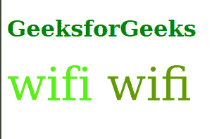

# CSS 字体-变体-连字属性

> 原文:[https://www . geeksforgeeks . org/CSS-font-variant-连字-property/](https://www.geeksforgeeks.org/css-font-variant-ligatures-property/)

CSS *字体变体连字*属性用于控制文本字体上的连字。连字是将两个或多个字符组合成一个字符的特殊字符。连词通常用于给文本赋予某种风格或外观。

**语法:**

```
font-variant-ligatures: Keyword_values
```

或者

```
 font-variant-ligatures: Global_values 
```

**属性值:**该属性接受上面提到的和下面描述的属性值。

*   **Keyword_values:** 该属性值是指由“正常”、“无”、“常见连字”、“无常见连字”、“任意连字”、“无任意连字”、“历史连字”、“无历史连字”、“上下文”、“无上下文”定义的值。
*   **Global_values:** 该属性值是指“继承”、“初始”、“未设置”定义的值。

**示例 1:** 以下是使用*常用连字*和*非常用连字*说明*字体变体连字*属性使用的示例。

## 超文本标记语言

```
<!DOCTYPE html>
<html lang="en">

<head>
    <style>
        div {
            font-size: 5vw;
        }

        .off {
            font-variant-ligatures: no-common-ligatures;
            color: rgb(83, 241, 21);
        }

        .on {
            font-variant-ligatures: common-ligatures;
            color: rgb(96, 153, 4);
        }
    </style>
</head>

<body>
    <h1 style="color: green;">GeeksforGeeks</h1>
    <div>
        <span class="off">wifi</span>
        <span class="on">wifi</span>
    </div>
</body>

</html>
```

**输出:**



**支持的浏览器:**

*   铬
*   火狐浏览器
*   旅行队
*   歌剧
*   边缘
*   互联网浏览器(不支持)。