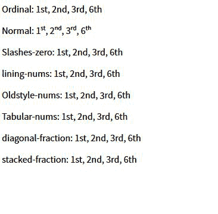

# CSS 字体-变体-数字属性

> 原文:[https://www . geesforgeks . org/CSS-font-variant-numeric-property/](https://www.geeksforgeeks.org/css-font-variant-numeric-property/)

CSS 的**字体变体数字属性**用于控制替换字形的使用。这是根据单位或标记，如数字或分数来完成的。

**语法:**

```css
font-variant-numeric: value
```

**属性值:**

*   **正常:**使用正常会移除字体-变体-数字属性的每个效果。
*   **序数:**该值直接表示开放式值，即 ordn。该术语使用特殊的符号作为序数标记。
*   **狂砍-零:**狂砍-零使用了带斜线的零。该属性值在区分 0 和 0 时非常有用
*   **内衬-nums:** 内衬 nums 属性对应于开放类型值，即 lnum。该关键字激活基线上的数字。
*   **old style-nums:**old style-nums 属性对应于开放类型值，即 onum。此关键字激活一些数字有后代的图形集。
*   **比例数:**该属性激活那些不是每个数都是相同大小的规范。它的开放类型值是 pnum。
*   **表格式-nums:** 表格式-nums 开放类型值为 tnum。它激活那些数字集大小相同的数字集。
*   **对角分数:**开型值为 frac。这将激活分子和分母变小并用斜线隔开的那组数字。
*   **堆叠分数:**其开型值为 arac。这将激活那些分子和分母变小、堆叠并由水平线分隔的图形集。

**示例:**

```css
<!DOCTYPE html>
<html lang="en">
    <head>
        <meta charset="UTF-8" />
        <meta name="viewport" 
              content="width=device-width,
                       initial-scale=1.0" />
        <link
            href=
"https://fonts.googleapis.com/css2?family=Source+Sans+Pro:ital,
              wght@0, 200;0, 400;1, 400&display=swap"
            rel="stylesheet"
        />
        <title>Document</title>
    </head>
    <style>
        * {
            font-family: "Source Sans Pro";
        }
        .value1 {
            font-variant-numeric: normal;
        }
        .value2 {
            font-variant-numeric: ordinal;
        }
        .value3 {
            font-variant-numeric: slashed-zero;
        }
        .value4 {
            font-variant-numeric: lining-nums;
        }
        .value5 {
            font-variant-numeric: oldstyle-nums;
        }
        .value6 {
            font-variant-numeric: tabular-nums;
        }
        .value7 {
            font-variant-numeric: diagonal-fractions;
        }
        .value7 {
            font-variant-numeric: stacked-fractions;
        }
    </style>
    <body>
        <p>
            <span>Ordinal: </span>
            <span class="value1">1st, 2nd, 3rd, 6th</span>
        </p>
        <p>
            <span>Normal: </span>
            <span class="value2">1st, 2nd, 3rd, 6th</span>
        </p>
        <p>
            <span>Slashes-zero: </span>
            <span class="value3">1st, 2nd, 3rd, 6th</span>
        </p>
        <p class="value4">
            <span>lining-nums: </span>
            1st, 2nd, 3rd, 6th
        </p>
        <p class="value5">
            <span>Oldstyle-nums: </span>
            1st, 2nd, 3rd, 6th
        </p>
        <p class="value6">
            <span>Tabular-nums: </span>
            1st, 2nd, 3rd, 6th
        </p>
        <p class="value7">
            <span>diagonal-fraction: </span>
            1st, 2nd, 3rd, 6th
        </p>
        <p class="value7">
            <span>stacked-fraction: </span>
            1st, 2nd, 3rd, 6th
        </p>
    </body>
</html>
```

**输出:**



**支持的浏览器:**

*   谷歌 Chrome
*   边缘
*   Mozilla Firefox
*   歌剧
*   旅行队