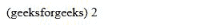
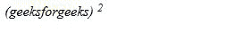
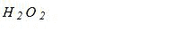

# CSS 字体-变体-位置属性

> 原文:[https://www . geesforgeks . org/CSS-font-variant-position-property/](https://www.geeksforgeeks.org/css-font-variant-position-property/)

CSS 的**字体变体位置**用于将字体的位置更改为上标、下标或普通字体。它们相对于字体基线定位，保持不变。

**语法:**

```css
font-variant-position: normal | sub | super
```

**属性值:**

*   **Normal:** Normal deactivates superscript and subscript glyphs. If not present any super or sub than the font style will be to the baseline.

    **语法:**

    ```css
    font-variant-position: normal
    ```

    **示例:**

    ```css
    <!DOCTYPE html>
    <html lang="en">
    <head>
      <meta charset="UTF-8">
      <meta name="viewport"
            content="width=device-width,
                     initial-scale=1.0">
      <title>Document</title>
    </head>
    <style>
      em{
        font-style: unset;
      }
      .font{
        font-variant-position: normal;
      }
    </style>
    <body>
      <em>
        (geeksforgeeks)
        <em class="font">
          2
        </em>
      </em>
    </body>
    </html>
    ```

    **输出:**

    

    *   **Super:** Super activates superscript and alternate glyphs.

        **语法:**

        ```css
        font-variant-position: normal
        ```

        **示例:**

        ```css
        <!DOCTYPE html>
        <html lang="en">
        <head>
          <meta charset="UTF-8">
          <meta name="viewport" 
                content="width=device-width, 
                         initial-scale=1.0">
          <title>Document</title>
        </head>
        <style>
          .font{
            font-variant-position: super;
          }
        </style>
        <body>
          <em>
            (geeksforgeeks)
            <em class="font">
              2
            </em>
          </em>
        </body>
        </html>
        ```

        **输出:**

        

        *   **Sub:** Sub activates subscript and alternate glyphs.

            **语法:**

            ```css
            font-variant-position: sub
            ```

            **示例:**

            ```css
            <!DOCTYPE html>
            <html lang="en">
            <head>
              <meta charset="UTF-8">
              <meta name="viewport" 
                    content="width=device-width,
                             initial-scale=1.0">
              <title>Document</title>
            </head>
            <style>
              .font{
                font-variant-position: sub;
              }
            </style>
            <body>
              <em>
                H
                <em class="font">
                  2
                </em>
                O
                <em class="font">
                  2
                </em>
              </em>
            </body>
            </html>
            ```

            **输出:**

            

        **支持的浏览器:**

        *   Mozilla Firefox