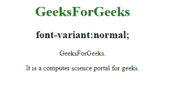
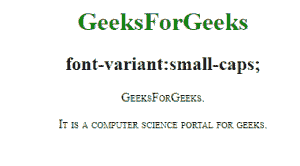
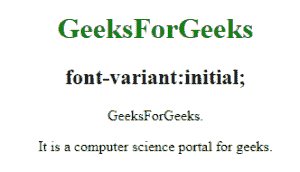

# CSS 字体变体属性

> 原文:[https://www.geeksforgeeks.org/css-font-variant-property/](https://www.geeksforgeeks.org/css-font-variant-property/)

**字体变体**属性用于将所有小写字母转换为大写字母。但是转换后的大写字母比原来的大写字母显得字体太小。

**语法:**

```css
font-variant: normal|small-caps|initial; 
```

**默认值:**

*   **正常**T2】

**属性值**

**正常:**有默认值。它指定正常的字体大小。
**语法:**

```css
font-variant:normal;
```

**例:**

## 超文本标记语言

```css
<!DOCTYPE html>
<html>

<head>
    <style>
        h1 {
            color: green;
        }

        p.geeks {
            font-variant: normal;
        }
    </style>
</head>

<body>
    <center>
        <h1>GeeksForGeeks</h1>
        <h2>font-variant:normal;</h2>
        <p class="geeks">GeeksForGeeks.</p>

<p>It is a computer science portal for geeks.</p>

</body>

</html>
```

**输出:**



**小写:**用于将所有小写字母转换成大写字母。
**语法:**

```css
font-variant:small-caps;
```

**例:**

## 超文本标记语言

```css
<!DOCTYPE html>
<html>

<head>
    <style>
        h1 {
            color: green;
        }

        p.geeks {
            font-variant: small-caps;
        }

        .gfg {
            font-variant: small-caps;
        }
    </style>
</head>

<body>
    <center>
        <h1>GeeksForGeeks</h1>
        <h2>font-variant:small-caps;</h2>
        <p class="geeks">GeeksForGeeks.</p>

        <p class="gfg">
         It is a computer science
         portal for geeks.
        </p>

</body>

</html>
```

**输出:**



**初始值:**将属性设置为默认值。
**语法:**

```css
font-variant:initial;
```

**例:**

## 超文本标记语言

```css
<!DOCTYPE html>
<html>

<head>
    <style>
        h1 {
            color: green;
        }

        p.geeks {
            font-variant: initial;
        }

        .gfg {
            font-variant: initial;
        }
    </style>
</head>

<body>
    <center>
        <h1>GeeksForGeeks</h1>
        <h2>font-variant:initial;</h2>
        <p class="geeks">GeeksForGeeks.</p>

        <p class="gfg">
         It is a computer science
         portal for geeks.
        </p>

</body>

</html>
```

**输出:**



**支持的浏览器:**CSS 字体变体属性支持的浏览器如下:

*   谷歌 Chrome 1.0
*   Internet Explorer 4.0
*   Firefox 1.0
*   歌剧 3.5
*   苹果 Safari 1.0