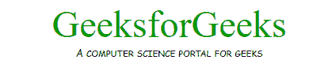
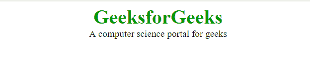

# CSS 源

> 原文:[https://www.geeksforgeeks.org/css-fonts/](https://www.geeksforgeeks.org/css-fonts/)

**示例:**在本例中，我们将使用几个 CSS Font 的属性。

## 超文本标记语言

```html
<!DOCTYPE html>
<html>

<head>
    <title>CSS Font</title>
    <style>
        .gfg {
            font-family: "Arial, Helvetica, sans-serif";
            font-size: 60px;
            color: #090;
            text-align: center;
        }

        .geeks {
            font-family: "Comic Sans MS", cursive, sans-serif;
            font-variant:small-caps;
            text-align: center;
        }
    </style>
</head>

<body>
    <div class="gfg">GeeksforGeeks</div>
    <div class="geeks">
      A computer science portal for geeks
    </div>
</body>

</html>
```

**输出:**



CSS 字体用于设置 HTML 元素的字体内容。CSS 中有许多字体属性，下面会提到并简要讨论:

*   [CSS 字体族属性](https://www.geeksforgeeks.org/css-font-family-property/):字体族属性指定元素的字体。
*   [CSS 字体属性](https://www.geeksforgeeks.org/css-font-style-property/):如果我们想给任何类型的文本进行设计，那么我们可以利用 CSS 字体属性。
*   [CSS 字体粗细属性](https://www.geeksforgeeks.org/css-font-weight-property/):CSS 的字体粗细属性用于设置与 HTML 文本一起使用的字体的粗细。
*   [CSS 字体变体属性](https://www.geeksforgeeks.org/css-font-variant-property/):字体变体属性用于将所有小写字母转换为大写字母。
*   [CSS 字号属性](https://www.geeksforgeeks.org/css-font-size-property/):CSS 中的字号属性用于设置 HTML 文档中文本的字体大小。
*   [CSS 字体拉伸属性](https://www.geeksforgeeks.org/css-font-stretch-property/):CSS 中的字体拉伸属性用于设置文字的宽窄。
*   [CSS 字体字距调整属性](https://www.geeksforgeeks.org/css-font-kerning-property/):该属性用于控制字体中已经存储的字距调整信息的使用。

下面几个例子来自 CSS 字体集。

[**【字体家族】**](https://www.geeksforgeeks.org/css-font-family-property/) **:用于设置一个 HTML 元素的字体类型。它有几个字体名称作为后备系统。
**语法:****

```html
font-family: "font family name";
```

**示例:**

## 超文本标记语言

```html
<!DOCTYPE html>
<html>

<head>
    <title>font-family property</title>
    <style>
        .gfg {
            font-family: "Times New Roman";
            font-weight: bold;
            font-size: 40px;
            color: #090;
            text-align: center;
        }

        .geeks {
            font-family: "Comic Sans MS", cursive, sans-serif;
            text-align: center;
        }
    </style>
</head>

<body>
    <div class="gfg">GeeksforGeeks</div>
    <div class="geeks">
      A computer science portal for geeks
    </div>
</body>

</html>
```

**输出:**


[**字体样式**](https://www.geeksforgeeks.org/css-font-style-property/) **:** 用于指定 HTML 元素的字体样式。可以是“正常、斜体或倾斜”。

**语法:**

```html
font-style: style name;
```

**示例:**

## 超文本标记语言

```html
<!DOCTYPE html>
<html>

<head>
    <title>font-style property</title>
    <style>
        .gfg {
            font-style: normal;
            font-family: "Times New Roman";
            font-weight: bold;
            font-size: 40px;
            color: #090;
            text-align: center;
        }

        .geeks {
            font-style: italic;
            text-align: center;
        }
    </style>
</head>

<body>
    <div class="gfg">GeeksforGeeks</div>
    <div class="geeks">
      A computer science portal for geeks
    </div>
</body>

</html>
```

**输出:**


[**字体粗细**](https://www.geeksforgeeks.org/css-font-weight-property/) **:用于设置字体的气魄。它的值可以是“正常、加粗、更轻、更粗”。
**语法:****

```html
font-weight: font weight value;
```

**示例:**

## 超文本标记语言

```html
<!DOCTYPE html>
<html>

<head>
    <title>font-weight property</title>
    <style>
        .gfg {
            font-weight: bold;
            font-style: normal;
            font-family: "Times New Roman";
            font-size: 40px;
            color: #090;
            text-align: center;
        }

        .geeks {
            font-weight: normal;
            text-align: center;
        }
    </style>
</head>

<body>
    <div class="gfg">GeeksforGeeks</div>
    <div class="geeks">
      A computer science portal for geeks
    </div>
</body>

</html>
```

**输出:**


[**字体变体**](https://www.geeksforgeeks.org/css-font-variant-property/) **:** 用于创建小盘股效果。它可以是“普通或小盘股”。
**语法:**

```html
font-variant: font variant value;
```

**示例:**

## 超文本标记语言

```html
<!DOCTYPE html>
<html>

<head>
    <title>font-variant property</title>
    <style>
        .gfg {
            font-variant: small-caps;
            font-weight: bold;
            font-family: "Times New Roman";
            font-size: 40px;
            color: #090;
            text-align: center;
        }

        .geeks {
            font-variant: normal;
            text-align: center;
        }
    </style>
</head>

<body>
    <div class="gfg">GeeksforGeeks</div>
    <div class="geeks">
      A computer science portal for geeks
    </div>
</body>

</html>
```

**输出:**


[**字号**](https://www.geeksforgeeks.org/css-font-size-property/) **:** 用于设置一个 HTML 元素的字号。字体大小可以用不同的方式设置，比如“像素、百分比、em，或者我们可以设置小、大”等值。
**语法:**

```html
font-size: font size value;
```

**示例:**

## 超文本标记语言

```html
<!DOCTYPE html>
<html>

<head>
    <title>font-size property</title>
    <style>
        .gfg {
            font-size: 40px;
            font-weight: bold;
            font-family: "Times New Roman";
            color: #090;
            text-align: center;
        }

        .geeks {
            font-size: 1.2em;
            text-align: center;
        }
    </style>
</head>

<body>
    <div class="gfg">GeeksforGeeks</div>
    <div class="geeks">
      A computer science portal for geeks
    </div>
</body>

</html>
```

**输出:**

