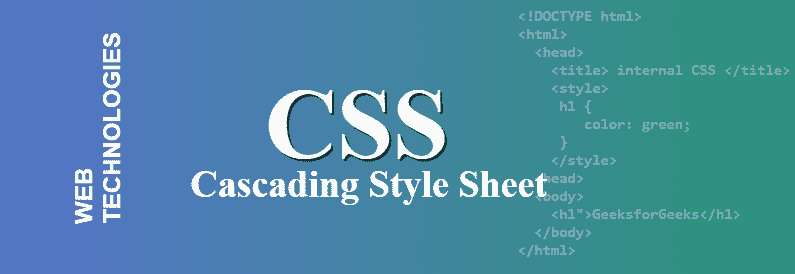
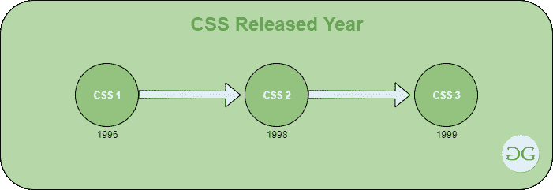

# CSS 完整表单

> 原文:[https://www.geeksforgeeks.org/css-full-form/](https://www.geeksforgeeks.org/css-full-form/)



[CSS](https://www.geeksforgeeks.org/css-tutorials/) 代表层叠样式表，它是一种样式表语言，用于塑造将作为网页显示在浏览器中的 HTML 元素。不使用 CSS，用 HTML 创建的网站看起来会很枯燥。基本上，CSS 为任何 HTML 元素提供了外壳。如果你认为 HTML 是网页的骨架，那么 CSS 就是骨架的皮肤。CSS 的互联网媒体类型(MIME 类型)是文本/CSS。CSS 是由万维网联盟(W3C)在 1996 年开发的。CSS 可以以不同的方式应用于 HTML 文档。

*   **内联**的** CSS 样式，如下代码所示:**

    ```
    <h1 style="color: green;">GeeksforGeeks</h1>
    ```

*   **内部**的** CSS 样式看起来会像下面的代码:**

    ```
    <!DOCTYPE html>
    <html>
      <head>
        <title> internal CSS </title>
        <style>
         h1 {
            color: green;
         } 
        </style>
      <head>
      <body>
        <h1">GeeksforGeeks</h1>
      </body>
    </html>

    ```

*   **外部**的** CSS 样式，如下图代码所示:**

    ```
    /* this will be separate file */
    <style>
    h1 {
       color: green;
    }
    </style>
    ```

**CSS 版本发布年份:**


**CSS 的特性:**

*   **维护:**维护起来很容易，换一个地方会影响到你网站的全局。不需要改变每一个具体的地方。
*   **省时:**可以在多个地方轻松使用任意一个 CSS 脚本。
*   **支持:**所有浏览器和搜索引擎都支持 CSS。
*   **缓存存储:** CSS 可以借助离线缓存在本地存储 web 应用，这样离线时就可以看到网站。
*   **原生前端:** CSS 包含一个庞大的属性和函数列表，有助于设计 HTML 页面。
*   **选择器:**在 CSS 中，有很多选择器(ID 选择器、类选择器等)。)这将有助于执行特定任务。

**CSS 的优势:**

*   CSS 兼容所有的设备。
*   在 CSS 的帮助下，网站维护变得简单快捷。
*   CSS 支持一致和自发的变化。
*   CSS 使网站更快，增强了搜索引擎抓取网页的能力
*   它有一个特别的特点，那就是能够重新定位。

**CSS 的缺点:**

*   在 CSS 中，有一个跨浏览器的问题，如果你设计任何东西并在 chrome 上检查它看起来很完美，但这并不意味着它在其他浏览器中看起来一样。然后，您还必须为该浏览器添加脚本。
*   CSS 缺乏安全性。
*   CSS 是易受攻击的，它有可能被攻击。
*   CSS 有一个碎片问题。