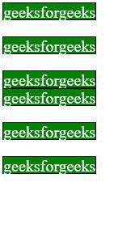
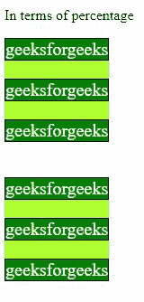

# CSS 间隙属性

> 原文:[https://www.geeksforgeeks.org/css-gap-property/](https://www.geeksforgeeks.org/css-gap-property/)

CSS 的**间隙**属性用于设置行和列之间的间距。就像分别使用列间隙和行间隙一样，这样就可以简单地使用可以给定列间隙和行间隙的间隙属性。

**语法:**

```
gap: <row-gap> <column-gap>

```

**属性值:**

*   **<长度> :** 间距以长度单位给出，即 rm、px 等。例如:间隙:10px 20px
*   **<百分比> :** 间距以百分比单位给出。例如:差距:50%

**例 1:** 在本例中，根据长度设置间距。

## 超文本标记语言

```
<!DOCTYPE html>
<html lang="en">

<head>
    <meta charset="UTF-8">
    <meta name="viewport" content=
        "width=device-width, initial-scale=1.0">

    <style>
        .row {
            display: grid;
            width: 500px;
            gap: 20px 50px;
        }

        .col {
            background-color: green;
            border: 1px solid black;
            color: #fff;
            width: fit-content;
            height: 20px;
            font-size: 20px;
        }
    </style>
</head>

<body>
    <div class="row">
        <div class="col">
            geeksforgeeks
        </div>
        <div class="col">
            geeksforgeeks
        </div>
        <div class="col">
            geeksforgeeks
        </div>
    </div>

    <div class="row">
        <div class="col">
            geeksforgeeks
        </div>
        <div class="col">
            geeksforgeeks
        </div>
        <div class="col">
            geeksforgeeks
        </div>
    </div>
</body>

</html>
```

**输出:**



**示例:**在本例中，间距是根据百分比设置的。

## 超文本标记语言

```
<!DOCTYPE html>
<html lang="en">

<head>
    <meta charset="UTF-8">
    <meta name="viewport" content=
        "width=device-width, initial-scale=1.0">

    <style>
        .row {
            display: grid;
            width: fit-content;
            gap: 20%;
            height: 100px;
            background-color: greenyellow;
        }

        .col {
            background-color: green;
            border: 1px solid black;
            color: #fff;
            width: fit-content;
            font-size: 20px;
        }
    </style>
</head>

<body>

    <p>In terms of percentage</p>

    <div class="row">
        <div class="col">
            geeksforgeeks
        </div>
        <div class="col">
            geeksforgeeks
        </div>
        <div class="col">
            geeksforgeeks
        </div>
    </div>
    <br><br><br>
    <div class="row">
        <div class="col">
            geeksforgeeks
        </div>
        <div class="col">
            geeksforgeeks
        </div>
        <div class="col">
            geeksforgeeks
        </div>
    </div>
</body>

</html>
```

**输出:**



**支持的浏览器:**

*   铬
*   边缘
*   火狐浏览器
*   歌剧