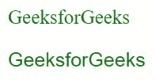
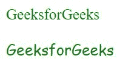
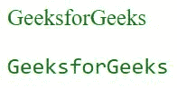
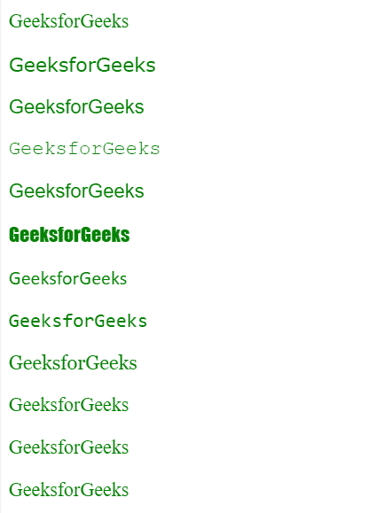

# CSS |通用字体系列集合

> 原文:[https://www . geesforgeks . org/CSS-generic-font-family-collection/](https://www.geeksforgeeks.org/css-generic-font-family-collection/)

字体系列属性用于设置 HTML 文档中文本的字体。不同的字体系列用于创建吸引人的网页。有许多字体可以从字体池中选择，如谷歌字体、Adobe 字体等，并且需要字体应用编程接口链接和自定义。通用字体系列主要分为以下几类，如下所示:

*   衬线
*   无衬线字体
*   草书
*   单一间隔
*   幻想

通用字体系列的详细描述如下:

*   **serif:** It is mostly used when text is written for printing purpose like books, newspaper, magazines, etc. Characters of the text are decorated with stroke at the end. The example of serif font-family is Times New Roman, Garamond, Georgia, Literata, Minion, Perpetua, etc.

    **语法:**

    ```html
    element {
        font-family:serif;
    }
    ```

    **示例:**

    ```html
    <!DOCTYPE html>
    <html>

    <head>
        <title>
            Generic Font Family
        </title>

        <style>
            .GFG {
                font-family:serif ;
            }
            body {
                color:green;
                font-size:20px;
            }
        </style>
    </head>

    <body>
        <p>GeeksforGeeks</p>

        <p class = "GFG">GeeksforGeeks</p>
    </body>

    </html>                    
    ```

    **输出:**
    

*   **sans-serif:** Its style is modern, formal and simple in appearance. Unlike “Serif” It does not have a stroke at the ends. It has a wide range of use but most often in the digital form of text. The example of sans-serif is Verdana, Arial, Calibri, Helvetica, Futura, Impact, Lato, Optima, Skia, etc.

    ```html
    element {
        font-family: sans-serif;
    }
    ```

    **示例:**

    ```html
    <!DOCTYPE html>
    <html>

    <head>
        <title>
            Generic Font Family
        </title>

        <style>
            .GFG {
                font-family:sans-serif ;
            }
            body {
                color:green;
                font-size:20px;
            }
        </style>
    </head>

    <body>
        <p>GeeksforGeeks</p>

        <p class = "GFG">GeeksforGeeks</p>
    </body>

    </html>                    
    ```

    **输出:**
    

*   **cursive:** This type of font is mostly used in the invitation letter, informal messages, headlines, etc. Its appearance is like, handwritten text using a pen or brush. The example of cursive font-family is Flanella, Belluccia, Insolente, Corsiva, Zapfino, etc.

    **语法:**

    ```html
    element {
        font-family:cursive;
    }
    ```

    **示例:**

    ```html
    <!DOCTYPE html>
    <html>

    <head>
        <title>
            Generic Font Family
        </title>

        <style>
            .GFG {
                font-family:cursive;
            }
            body {
                color:green;
                font-size:20px;
            }
        </style>
    </head>

    <body>
        <p>GeeksforGeeks</p>

        <p class = "GFG">GeeksforGeeks</p>
    </body>

    </html>                    
    ```

    **输出:**
    

*   **monospace:** It is used to give examples, typewritten text, instructions, mailing address, code samples, etc.Each character of the text has got the same width. The example of monospace font-family is Courier, Consolas, Monaco, SimSun, Terminal, Menlo, Inconsolata, etc.

    **语法:**

    ```html
    element {
        font-family:monospace;
    }
    ```

    **示例:**

    ```html
    <!DOCTYPE html>
    <html>

    <head>
        <title>
            Generic Font Family
        </title>

        <style>
            .GFG {
                font-family:monospace;
            }
            body {
                color:green;
                font-size:20px;
            }
        </style>
    </head>

    <body>
        <p>GeeksforGeeks</p>

        <p class = "GFG">GeeksforGeeks</p>
    </body>

    </html>                    
    ```

    **输出:**
    

*   **fantasy:** It is used to make the text more decorative, impactful and expressive. This type of font should be used in the shorter text, as it is not easy to read it easily always. The example of fantasy font-family is Impact, Cracked, Critter, Studz, Copperplate, etc.

    **语法:**

    ```html
    element {
        font-family:fantasy;
    }
    ```

    **示例:**

    ```html
    <!DOCTYPE html>
    <html>

    <head>
        <title>
            Generic Font Family
        </title>

        <style>
            .GFG {
                font-family:fantasy;
            }
            body {
                color:green;
                font-size:20px;
            }
        </style>
    </head>

    <body>
        <p>GeeksforGeeks</p>

        <p class = "GFG">GeeksforGeeks</p>
    </body>

    </html>                    
    ```

    **输出:**
    

以下是上述通用字体系列中作为示例提到的一些字体系列的描述，如下所示:

*   **Verdana:**
    *   **设计者:**马修·卡特
    *   **类别:**无衬线
    *   **发布时间:** 1996
*   **helvetica:**
    *   **设计人:**马克斯·米丁格，爱德华·霍夫曼
    *   **类别:**无衬线
    *   **发布于:** 1957 年
*   **快递员:**
    *   **设计者:**霍华德“巴德”凯特勒
    *   **类别:**等宽
    *   **发布时间:** ~1956
*   **arial:**
    *   **设计者:**罗宾·尼古拉斯和帕特里夏·桑德斯
    *   **类别:**无衬线
    *   **发布时间:** 1982 年
*   **撞击:**
    *   **设计人:**杰弗里·李
    *   **类别:**无衬线
    *   **发布于:** 1965 年
*   口径:
    *   **设计人:**吕克·德·格鲁特
    *   **类别:**无衬线
    *   **发布时间:** 2007
*   控制台:
    *   **设计人:**吕克·德·格鲁特
    *   **类别:**等宽
    *   **发布时间:** 2002
*   **佐治亚州:**
    *   **设计者:**马修·卡特
    *   **类别:**衬线
    *   **发布时间:** 1996
*   **garamond:**
    *   **设计人:**保罗·希克森
    *   **类别:**衬线
    *   **发布时间:** 1993 年
*   **无期:t1]**
    *   **设计者:**埃里克·吉尔
    *   **类别:**衬线
    *   **发布于:** 1929-32
*   **缟玛瑙:**
    *   **设计人:**格里·鲍威尔
    *   **类别:**衬线
    *   **发布于:** 1955 年

**示例:**本示例使用不同类型的字体系列。

```html
<!DOCTYPE html>
<html>

<head>
    <title>
        Generic Font Family
    </title>

    <style>
        body {
            color:green;
            font-size:20px;
        }
    </style>
</head>

<body>
    <p>GeeksforGeeks</p>

    <p style="font-family:verdana;">GeeksforGeeks</p>
    <p style="font-family:helvetica;">GeeksforGeeks</p>
    <p style="font-family:courier;">GeeksforGeeks</p>
    <p style="font-family:arial;">GeeksforGeeks</p>
    <p style="font-family:impact;">GeeksforGeeks</p>
    <p style="font-family:calibri;">GeeksforGeeks</p>
    <p style="font-family:consolas;">GeeksforGeeks</p>
    <p style="font-family:georgia;">GeeksforGeeks</p>
    <p style="font-family:garamond;">GeeksforGeeks</p>
    <p style="font-family:perpetua;">GeeksforGeeks</p>
    <p style="font-family:onyx;">GeeksforGeeks</p>
</body>

</html>                    
```

**输出:**
