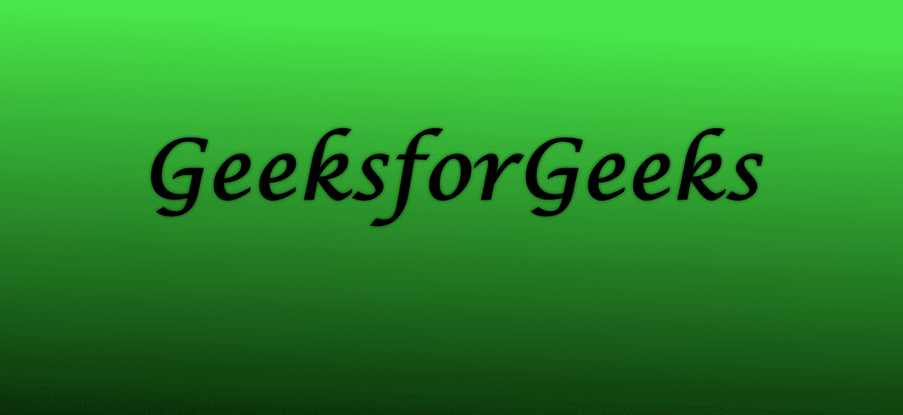
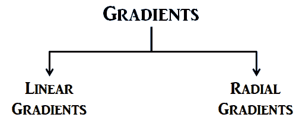
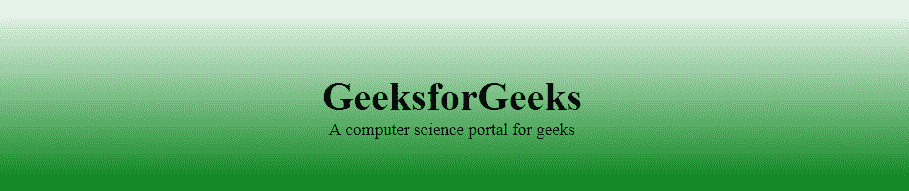
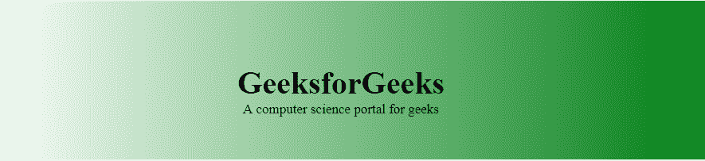
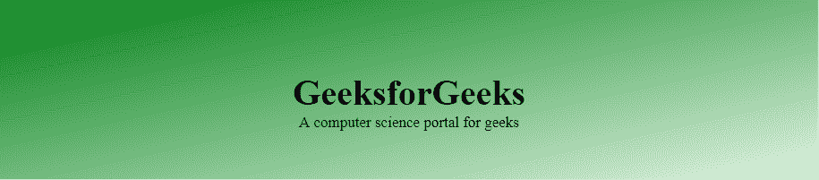
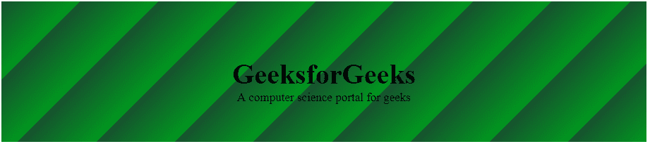
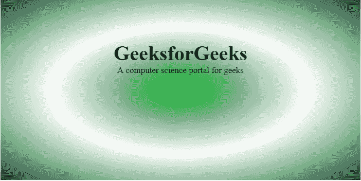
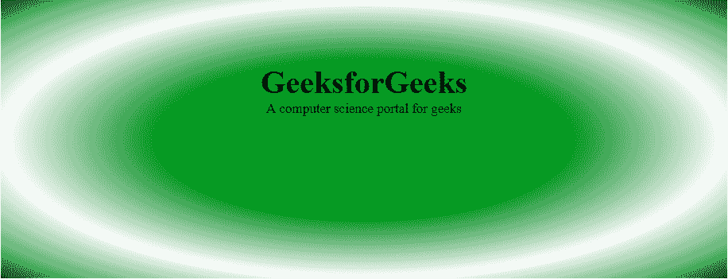

# CSS 梯度

> 原文:[https://www.geeksforgeeks.org/css-gradients/](https://www.geeksforgeeks.org/css-gradients/)

CSS 中的**渐变**是一种特殊类型的图像，由两种或多种颜色之间的渐进&平滑过渡组成。CSS 是为各种网络文档添加样式的方法。通过使用 CSS 中的渐变，我们可以创建图像的变体样式，这有助于创建一个有吸引力的网页。



渐变可以分为两种类型:



[**【线性渐变】**](https://www.geeksforgeeks.org/css-linear-gradient-function/) **:** 包括向上、向下、向左、向右和对角的平滑颜色过渡。创建线性渐变所需的最小双色。在线性渐变中可以有两种以上的颜色元素。渐变效果需要起点和方向。

**语法:**

```
background-image: linear-gradient(direction, color-stop1, color-stop2, ...);
```

线性梯度可以通过以下方式实现:

**从上到下:**在这张图片中，过渡以白色开始，以绿色结束。在交换颜色序列时，过渡将以绿色开始，以白色结束。

**示例:**此示例说明了从顶部&开始到底部的**线性渐变**，从白色开始，过渡到绿色。

## 超文本标记语言

```
<!DOCTYPE html>
<html>
<head>
    <title>CSS Gradients</title>
    <style>
    #main {
        height: 200px;
        background-color: white;
        background-image: linear-gradient(white, green);
    }

    .gfg {
        text-align: center;
        font-size: 40px;
        font-weight: bold;
        padding-top: 80px;
    }

    .geeks {
        font-size: 17px;
        text-align: center;
    }
    </style>
</head>

<body>
    <div id="main">
        <div class="gfg">GeeksforGeeks</div>
        <div class="geeks">
          A computer science portal for geeks
        </div>
    </div>
</body>
</html>
```

**输出:**



**从左到右:**在这张图像中，过渡从左到右开始。它从白色过渡到绿色。

**示例:**此示例说明了从左侧&开始到右侧结束的**线性渐变**。

## 超文本标记语言

```
<!DOCTYPE html>
<html>
<head>
    <title>CSS Gradients</title>
    <style>
    #main {
        height: 200px;
        background-color: white;
        background-image: linear-gradient(to right, white, green);
    }

    .gfg {
        text-align: center;
        font-size: 40px;
        font-weight: bold;
        padding-top: 80px;
    }

    .geeks {
        font-size: 17px;
        text-align: center;
    }
    </style>
</head>

<body>
    <div id="main">
        <div class="gfg">GeeksforGeeks</div>
        <div class="geeks">
          A computer science portal for geeks
        </div>
    </div>
</body>
</html>
```

**输出:**



**对角线:**这个过渡从左上角开始到右下角。它从绿色过渡到白色开始。对于对角线渐变，需要指定水平和垂直起始位置。

**示例:**该示例通过指定水平和垂直起始位置来说明带有对角线过渡的**线性渐变**。

## 超文本标记语言

```
<!DOCTYPE html>
<html>
<head>
    <title>CSS Gradients</title>
    <style>
    #main {
        height: 200px;
        background-color: white;
        background-image: linear-gradient(to bottom right, 
          green, rgba(183, 223, 182, 0.4));
    }

    .gfg {
        text-align: center;
        font-size: 40px;
        font-weight: bold;
        padding-top: 80px;
    }

    .geeks {
        font-size: 17px;
        text-align: center;
    }
    </style>
</head>

<body>
    <div id="main">
        <div class="gfg">GeeksforGeeks</div>
        <div class="geeks">
          A computer science portal for geeks
        </div>
    </div>
</body>
</html>
```

**输出:**



**重复线性渐变:** CSS 允许用户使用单个函数重复线性渐变()来实现多个线性渐变。此处的图像在每个过渡中包含 3 种颜色，并带有一定的百分比值。

**示例:**该示例通过实现多色来说明具有重复过渡效果的**线性渐变**。

## 超文本标记语言

```
<!DOCTYPE html>
<html>
<head>
    <title>CSS Gradients</title>
    <style>
    #main {
        height: 200px;
        background-color: white;
        background-image: repeating-linear-gradient(#090, 
                                      #fff 10%, #2a4f32 20%);
    }

    .gfg {
        text-align: center;
        font-size: 40px;
        font-weight: bold;
        padding-top: 80px;
    }

    .geeks {
        font-size: 17px;
        text-align: center;
    }
    </style>
</head>

<body>
    <div id="main">
        <div class="gfg">GeeksforGeeks</div>
        <div class="geeks">
          A computer science portal for geeks
        </div>
    </div>
</body>
</html>
```

**输出:**


**线性渐变上的角度:** CSS 允许用户在线性渐变中实现方向，而不是将自己限制在预定义的方向。

**示例:**该示例通过在线性梯度上实现方向来说明**线性梯度**。

## 超文本标记语言

```
<!DOCTYPE html>
<html>
<head>
    <title>CSS Gradients</title>
    <style>
    #main {
        height: 200px;
        background-color: white;
        background-image: repeating-linear-gradient(-45deg, #090, 
                                                    #2a4f32 10%);
    }

    .gfg {
        text-align: center;
        font-size: 40px;
        font-weight: bold;
        padding-top: 80px;
    }

    .geeks {
        font-size: 17px;
        text-align: center;
    }
    </style>
</head>

<body>
    <div id="main">
        <div class="gfg">GeeksforGeeks</div>
        <div class="geeks">
          A computer science portal for geeks
        </div>
    </div>
</body>
</html>
```

**输出:**



[**CSS 径向渐变**](https://www.geeksforgeeks.org/css-radial-gradient-function/) **:** 径向渐变不同于线性渐变。它从一个点开始，向外发散。默认情况下，渐变将是椭圆形，大小将是最远的-第一种颜色从元素的中心位置开始，然后向元素的边缘渐变到结束颜色。渐变以相同的速率发生，直到指定。

**语法:**

```
background-image: radial-gradient(shape size at position, start-color, ..., last-color);
```

径向梯度可以通过以下方式实现:

**径向渐变–均匀间隔的颜色停止点:**在 CSS 中，默认情况下，渐变以相同的速率发生。下图显示了带有偶数色光阑的径向渐变。

**颜色停止:**颜色停止通知浏览器使用什么颜色，在渐变的起点&哪里停止。默认情况下，它们是等间距的，但是我们可以通过提供特定的颜色停止来否决它。

**示例:**该示例说明了具有均匀间隔的色块的**径向渐变**。

## 超文本标记语言

```
<!DOCTYPE html>
<html>
<head>
    <title>CSS Gradients</title>
    <style>
    #main {
        height: 350px;
        width: 700px;
        background-color: white;
        background-image: radial-gradient(#090, 
                                  #fff, #2a4f32);
    }

    .gfg {
        text-align: center;
        font-size: 40px;
        font-weight: bold;
        padding-top: 80px;
    }

    .geeks {
        font-size: 17px;
        text-align: center;
    }
    </style>
</head>

<body>
    <div id="main">
        <div class="gfg">GeeksforGeeks</div>
        <div class="geeks">
          computer science portal for geeks
        </div>
    </div>
</body>
</html>
```

**输出:**



**径向渐变-不均匀间隔色块:** CSS 允许用户在应用径向渐变功能时改变色块的间隔。

**示例:**该示例说明了具有不均匀间隔的色块的**径向渐变**。

## 超文本标记语言

```
<!DOCTYPE html>
<html>
<head>
    <title>CSS Gradients</title>
    <style>
    #main {
        height: 350px;
        width: 100%;
        background-color: white;
        background-image: radial-gradient(#090 
                              40%, #fff, #2a4f32);
    }

    .gfg {
        text-align: center;
        font-size: 40px;
        font-weight: bold;
        padding-top: 80px;
    }

    .geeks {
        font-size: 17px;
        text-align: center;
    }
    </style>
</head>

<body>
    <div id="main">
        <div class="gfg">GeeksforGeeks</div>
        <div class="geeks">
          A computer science portal for geeks
        </div>
    </div>
</body>
</html>
```

**输出:**



**支持的浏览器:**

*   谷歌 Chrome 26.0
*   微软边缘 12.0
*   Firefox 16.0
*   歌剧 12.1
*   Internet Explorer 10.0
*   Safari 6.1