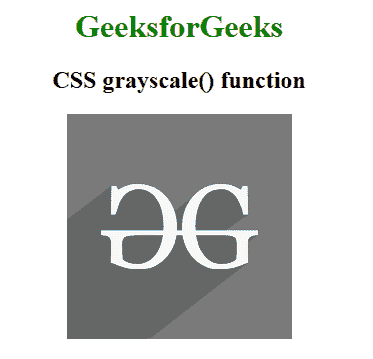

# CSS 灰度()函数

> 原文:[https://www.geeksforgeeks.org/css-grayscale-function/](https://www.geeksforgeeks.org/css-grayscale-function/)

CSS 中的**灰度()**函数是一个内置函数，用于对图像应用滤镜来设置图像的灰度。

**语法:**

```html
grayscale( amount )
```

**参数:**该功能接受保存灰度值的单个参数**量**。灰度值是根据数字和百分比设置的。值 0%表示原始图像，而 0%到 100%之间的值表示效果的线性乘数。

**示例:**下面的示例说明了 CSS 中的灰度()函数。

## 超文本标记语言

```html
<!DOCTYPE html>
<html>

<head>
    <title>CSS grayscale() Function</title>
    <style>
    h1 {
        color: green;
    }

    body {
        text-align: center;
    }

    .grayscale_effect {
        filter: grayscale(100%);
    }
    </style>
</head>

<body>
    <h1>GeeksforGeeks</h1>
    <h2>CSS grayscale() function</h2>
        
</body>

</html>
```

**输出:**



**支持的浏览器:**灰度()函数支持的浏览器如下:

*   谷歌 Chrome 18.0
*   微软边缘 12.0
*   Firefox 35.0
*   Safari 6.0
*   Opera 15.0