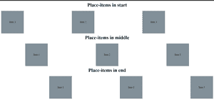

# CSS 网格和放置项目在一起

> 原文:[https://www . geesforgeks . org/CSS-网格和放置项目-在一起/](https://www.geeksforgeeks.org/css-grid-and-place-items-together/)

在本文中，我们将看到如何使用 CSS 网格和 place-items 属性来排列网页中的元素。

**放置物品**不是专门为 **CSS 网格**准备的，它也可以和其他属性一起使用。

**步骤:**

*   用类容器创建三个 div
*   每个 div 将包含另外三个带有类框的 div。
*   将 class initial 添加到第一个 div，中间添加到第二个 div，最后添加到第三个 div。

**示例:** HTML

## 超文本标记语言

```html
<!DOCTYPE html>
<html>
    <body>
        <h1>Place-items in start</h1>
        <!-- Container to be placed from starting -->
        <div class="container initial">
            <div class="box">Item 1</div>
            <div class="box">Item 2</div>
            <div class="box">Item 3</div>
        </div>
        <h1>Place-items in middle</h1>
        <!-- Container to be placed in middle -->
        <div class="container middle">
            <div class="box">Item 1</div>
            <div class="box">Item 2</div>
            <div class="box">Item 3</div>
        </div>
        <h1>Place-items in end</h1>
        <!-- Container to be placed in end -->
        <div class="container end">
            <div class="box">Item 1</div>
            <div class="box">Item 2</div>
            <div class="box">Item 3</div>
        </div>
    </body>
</html>
```

*   使用 CSS 网格将每个容器中的项目排列成三列。
*   添加属性**放置项目:以类首开始**到 div，同样添加**放置项目:中心**和**放置项目:以类中结束**到 div。

**示例:** CSS

## 超文本标记语言

```html
<style>
    h1 {
        text-align: center;
        margin-top: 10px;
    }
    /* arrange boxes of container in three column form*/
    .container {
        display: grid;
        grid-template-columns: 1fr 1fr 1fr;
    }
    /* starting position for first container*/
    .initial {
        place-items: start;
    }
    /* middle position for second container*/
    .middle {
        place-items: center;
    }
    /* ending position for first container*/
    .end {
        place-items: end;
    }
    .box {
        width: 150px;
        height: 150px;
        display: flex;
        align-items: center;
        justify-content: center;
        background-color: #829099;
    }
</style>
```

**完整代码:**

## 超文本标记语言

```html
<!DOCTYPE html>
<html>
    <head>
        <style>
            h1 {
                text-align: center;
                margin-top: 10px;
            }
            /* arrange boxes of container
          in three column form*/
            .container {
                display: grid;
                grid-template-columns: 1fr 1fr 1fr;
            }
            /* starting position for first container*/
            .initial {
                place-items: start;
            }
            /* middle position for second container*/
            .middle {
                place-items: center;
            }
            /* ending position for first container*/
            .end {
                place-items: end;
            }
            .box {
                width: 150px;
                height: 150px;
                display: flex;
                align-items: center;
                justify-content: center;
                background-color: #829099;
            }
        </style>
    </head>
    <body>
        <h1>Place-items in start</h1>
        <!-- Container to be placed from starting -->
        <div class="container initial">
            <div class="box">Item 1</div>
            <div class="box">Item 2</div>
            <div class="box">Item 3</div>
        </div>
        <h1>Place-items in middle</h1>
        <!-- Container to be placed in middle -->
        <div class="container middle">
            <div class="box">Item 1</div>
            <div class="box">Item 2</div>
            <div class="box">Item 3</div>
        </div>
        <h1>Place-items in end</h1>
        <!-- Container to be placed in end -->
        <div class="container end">
            <div class="box">Item 1</div>
            <div class="box">Item 2</div>
            <div class="box">Item 3</div>
        </div>
    </body>
</html>
```

**输出:**

