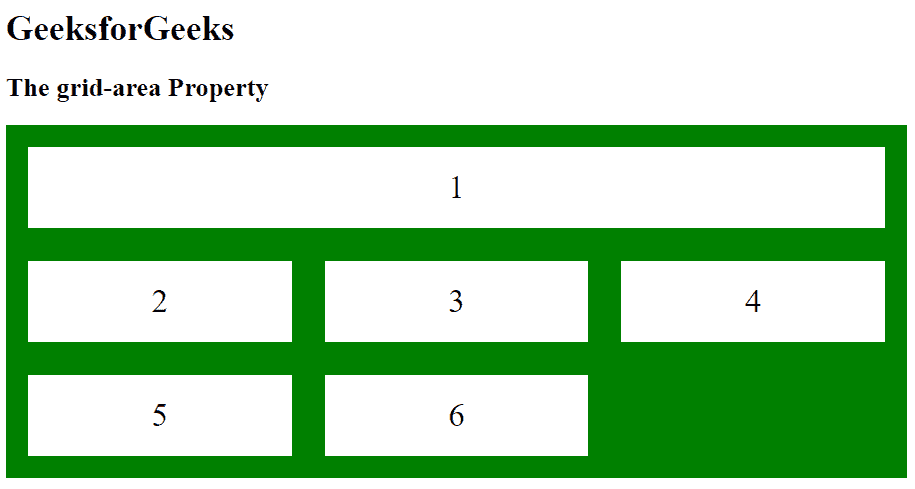
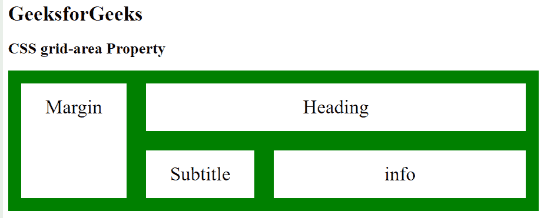

# CSS |网格区域属性

> 原文:[https://www.geeksforgeeks.org/css-grid-area-property/](https://www.geeksforgeeks.org/css-grid-area-property/)

网格区域属性用于设置网格布局中网格项的大小和位置。网格区域属性也用于为网格项设置名称。

**语法:**

```
grid-area: grid-row-start|grid-column-start|grid-row-end|
grid-column-end|itemname;
```

**属性值:**

*   **网格-行-开始:**设置项目最先显示的行。
*   **网格-列-开始:**设置项目首先显示的列。
*   **网格-行-结束:**指定停止显示项目的行-行，或者跨越多少行。
*   **网格-列-结束:**设置要跨越的列数。
*   **项目名称:**为网格项目设置名称。

**例 1:**

```
<!DOCTYPE html>
<html>
<head>
    <title>
        CSS | grid-area Property
    </title>
    <style>
        .item {
            grid-area: Area;
        }
        .grid-container {
            display: grid;
            grid-template-areas: 'Area Area Area';
            grid-gap: 30px;
            background-color: green;
            padding: 20px;
        }
        .GFG {
            background-color: white;
            text-align: center;
            padding: 20px 0;
            font-size: 30px;
        }
    </style>
</head>

<body>
    <h1>GeeksforGeeks</h1>
    <h2>The grid-area Property</h2>

    <div class = "grid-container">
        <div class = "GFG item">1</div>
        <div class = "GFG">2</div>
        <div class = "GFG">3</div>
        <div class = "GFG">4</div>
        <div class = "GFG">5</div>
        <div class = "GFG">6</div>
    </div>
</body>
</html>                    
```

**输出:**


**例 2:**

```
<!DOCTYPE html>
<html>
<head>
    <title>
        CSS grid-area property
    </title>

    <style>
        .GFG1 { 
            grid-area: heading; 
        }
        .GFG2 {
            grid-area: margin; 
        }
        .GFG3 { 
            grid-area: subtitle1; 
        }
        .GFG4 { 
            grid-area: info; 
        }
        .main {
            display: grid;
            grid-gap: 30px;
            background-color: green;
            padding: 20px;
            grid-template-areas:
            'margin heading heading heading heading heading '
            'margin subtitle1 info info info info';
        }
        .GFG {
            background-color: white;
            text-align: center;
            padding: 20px 0;
            font-size: 30px;
        }
    </style>
</head>

<body>
    <h1>GeeksforGeeks</h1>
    <h2>CSS grid-area Property</h2>

    <div class = "main">
        <div class = "GFG GFG1">Heading</div>
        <div class = "GFG GFG2">Margin</div>
        <div class = "GFG GFG3">Subtitle</div>
        <div class = "GFG GFG4">info</div>
    </div>

</body>
</html>                    
```

**输出:**


**支持的浏览器:***网格区属性*支持的浏览器如下:

*   谷歌 Chrome 57.0
*   Internet Explorer 16.0
*   Mozilla Firefox 52.0
*   Safari 10.0
*   Opera 44.0