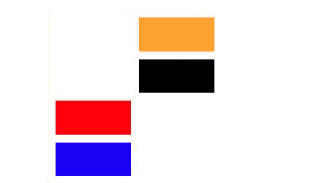
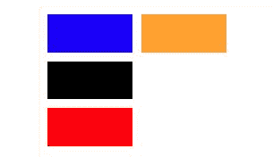

# CSS |网格-自动流动属性

> 原文:[https://www.geeksforgeeks.org/css-grid-auto-flow-property/](https://www.geeksforgeeks.org/css-grid-auto-flow-property/)

**网格自动流动**属性，精确指定自动放置的项目如何流入网格。

**语法:**

```css
grid-auto-flow: row|column|row dense|column dense;

```

1.  **Row:** auto-placement algorithm places items, by filling each row in turn, adding new rows as necessary.

    **语法:**

    ```css
    grid-auto-flow: row; 

    ```

    **示例-1:**

    ```css
    <!DOCTYPE html>
    <html>

    <head>
        <title>
            CSS grid-auto-flow Property
        </title>

        <style>
            .main {
                height: 200px;
                width: 200px;
                display: grid;
                grid-gap: 10px;
                grid-template: repeat(4, 1fr) / repeat(2, 1fr);

                /* grid-auto-flow property used here */
                grid-auto-flow: row;
            }

            .Geeks1 {
                background-color: red;
                grid-row-start: 3;
            }

            .Geeks2 {
                background-color: blue;
            }

            .Geeks3 {
                background-color: black;
            }

            .Geeks4 {
                grid-column-start: 2;
                background-color: orange;
            }
        </style>
    </head>

    <body>
        <div class = "main"> 
            <div class = "Geeks1"></div> 
            <div class = "Geeks2"></div> 
            <div class = "Geeks3"></div> 
            <div class = "Geeks4"></div> 
        </div> 
    </body>

    </html>                        
    ```

    **输出:**
    

2.  **Column:** auto-placement algorithm places items, by filling each column in turn, adding new columns as necessary.

    **语法:**

    ```css
        grid-auto-flow: column; 

    ```

    **示例-2:**

    ```css
    <!DOCTYPE html>
    <html>

    <head>
        <title>
            CSS grid-auto-flow Property
        </title>

        <style>
            .main {
                height: 200px;
                width: 200px;
                display: grid;
                grid-gap: 10px;
                grid-template: repeat(4, 1fr) / repeat(2, 1fr);

                /* grid-auto-flow property used here */
                grid-auto-flow: column;
            }

            .Geeks1 {
                background-color: red;
                grid-row-start: 3;
            }

            .Geeks2 {
                background-color: blue;
            }

            .Geeks3 {
                background-color: black;
            }

            .Geeks4 {
                grid-column-start: 2;
                background-color: orange;
            }
        </style>
    </head>

    <body>
        <div class = "main"> 
            <div class = "Geeks1"></div> 
            <div class = "Geeks2"></div> 
            <div class = "Geeks3"></div> 
            <div class = "Geeks4"></div> 
        </div> 
    </body>

    </html>                    
    ```

    **输出:**
    

3.  **Column Dense:** specifying that the auto-placement algorithm uses a “dense” packing algorithm for column.

    **语法:**

    ```css
       grid-auto-flow: column dense; 

    ```

    **示例-3:**

    ```css
    <!DOCTYPE html>
    <html>

    <head>
        <title>
            CSS grid-auto-flow Property
        </title>

        <style>
            .main {
                height: 200px;
                width: 200px;
                display: grid;
                grid-gap: 10px;
                grid-template: repeat(4, 1fr) / repeat(2, 1fr);

                /* grid-auto-flow property used here */
                grid-auto-flow: column dense;
            }

            .Geeks1 {
                background-color: red;
                grid-row-start: 3;
            }

            .Geeks2 {
                background-color: blue;
            }

            .Geeks3 {
                background-color: black;
            }

            .Geeks4 {
                grid-column-start: 2;
                background-color: orange;
            }
        </style>
    </head>

    <body>
        <div class = "main"> 
            <div class = "Geeks1"></div> 
            <div class = "Geeks2"></div> 
            <div class = "Geeks3"></div> 
            <div class = "Geeks4"></div> 
        </div> 
    </body>

    </html>                    
    ```

    **输出:**
    

4.  **Row Dense:** specifying that the auto-placement algorithm uses a “dense” packing algorithm for rows.
    **Syntax:**

    ```css
       grid-auto-flow: row dense; 

    ```

    **示例-4:**

    ```css
    <!DOCTYPE html>
    <html>

    <head>
        <title>
            CSS grid-auto-flow Property
        </title>

        <style>
            .main {
                height: 200px;
                width: 200px;
                display: grid;
                grid-gap: 10px;
                grid-template: repeat(4, 1fr) / repeat(2, 1fr);

                /* grid-auto-flow property used here */
                grid-auto-flow: row dense;
            }

            .Geeks1 {
                background-color: red;
                grid-row-start: 3;
            }

            .Geeks2 {
                background-color: blue;
            }

            .Geeks3 {
                background-color: black;
            }

            .Geeks4 {
                grid-column-start: 2;
                background-color: orange;
            }
        </style>
    </head>

    <body>
        <div class = "main"> 
            <div class = "Geeks1"></div> 
            <div class = "Geeks2"></div> 
            <div class = "Geeks3"></div> 
            <div class = "Geeks4"></div> 
        </div> 
    </body>

    </html>                                
    ```

    **输出:**
    

**支持的浏览器:**支持的浏览器 **CSS |网格自动流动属性**如下:

*   谷歌 Chrome 57
*   Mozilla Firefox 52
*   边缘 16
*   Safari 10
*   歌剧 44