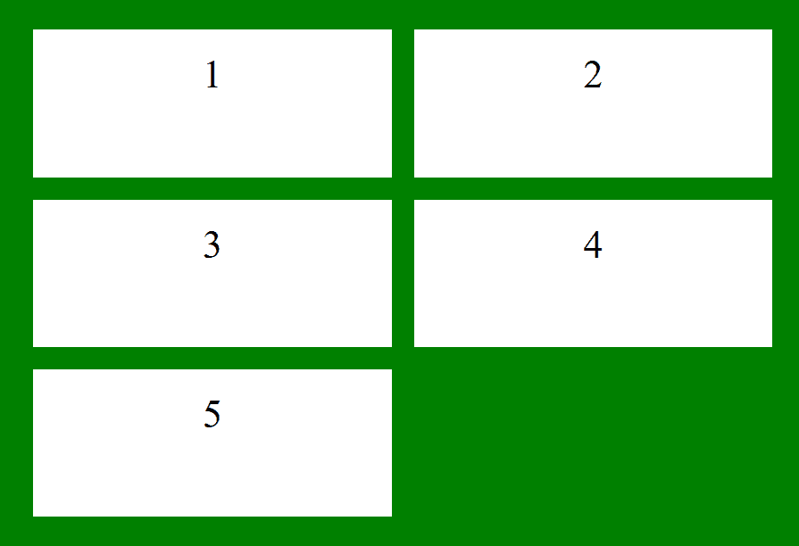
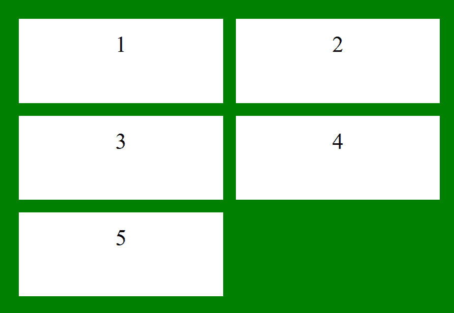
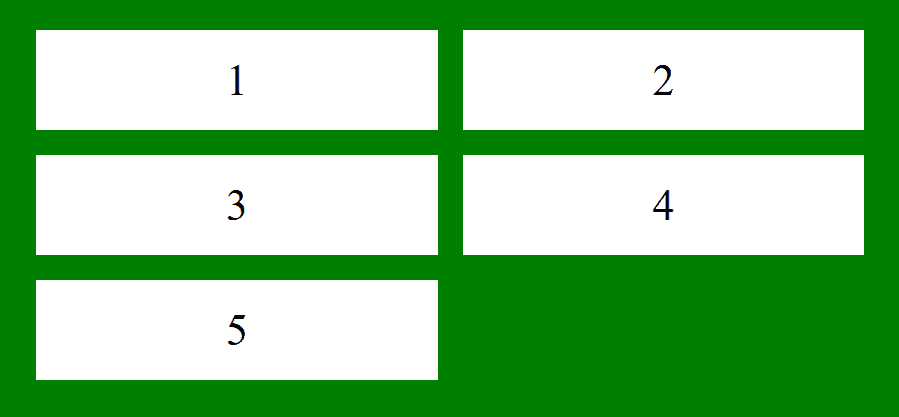

# CSS |网格-自动行属性

> 原文:[https://www.geeksforgeeks.org/css-grid-auto-rows-property/](https://www.geeksforgeeks.org/css-grid-auto-rows-property/)

CSS 中的 grid-auto-rows 属性用于指定隐式生成的网格容器的行的大小。

**语法:**

```
grid-auto-rows: auto|max-content|min-content|length|
percentage|minmax(min, max)|initial|inherit;
```

**属性值:**

*   **auto:** This is the default value. The size is determined implicitly according to the size of the container.

    **示例:**

    ```
    <!DOCTYPE html> 
    <html> 
        <head> 
            <title> 
                CSS grid-auto-rows Property 
            </title> 

            <style> 
                .main { 
                    display: grid; 
                    grid-template-areas: "a a"; 
                    grid-gap: 20px; 
                    padding: 30px; 
                    background-color: green;
                    grid-auto-rows:  auto;

                } 
                .GFG { 
                    text-align: center; 
                    font-size: 35px; 
                    background-color: white; 
                    padding: 20px 0; 
                } 
            </style> 
        </head> 

        <body> 
            <div class = "main"> 
                <div class = "GFG">1</div> 
                <div class = "GFG">2</div> 
                <div class = "GFG">3</div> 
                <div class = "GFG">4</div> 
                <div class = "GFG">5</div> 
            </div> 
        </body> 
    </html> 
    ```

    **输出:**
    

*   **length:** It is used to set grid-auto-rows property to given length. The length value can not be negative.

    **示例:**

    ```
    <!DOCTYPE html> 
    <html> 
        <head> 
            <title> 
                CSS grid-auto-rows Property 
            </title> 

            <style> 
                .main { 
                    display: grid; 
                    grid-template-areas: "a a"; 
                    grid-gap: 20px; 
                    padding: 30px; 
                    background-color: green;
                    grid-auto-rows: 3.5cm;

                } 
                .GFG { 
                    text-align: center; 
                    font-size: 35px; 
                    background-color: white; 
                    padding: 20px 0; 
                } 
            </style> 
        </head> 

        <body> 
            <div class = "main"> 
                <div class = "GFG">1</div> 
                <div class = "GFG">2</div> 
                <div class = "GFG">3</div> 
                <div class = "GFG">4</div> 
                <div class = "GFG">5</div> 
            </div> 
        </body> 
    </html> 
    ```

    **输出:** 

*   **percentage:** It sets the grid-auto-rows property to percentage value.

    **示例:**

    ```
    <!DOCTYPE html> 
    <html> 
        <head> 
            <title> 
                CSS grid-auto-rows Property 
            </title> 

            <style> 
                .main { 
                    display: grid; 
                    grid-template-areas: "a a"; 
                    grid-gap: 20px; 
                    padding: 30px; 
                    background-color: green;
                    grid-auto-rows:  30%;

                } 
                .GFG { 
                    text-align: center; 
                    font-size: 35px; 
                    background-color: white; 
                    padding: 20px 0; 
                } 
            </style> 
        </head> 

        <body> 
            <div class = "main"> 
                <div class = "GFG">1</div> 
                <div class = "GFG">2</div> 
                <div class = "GFG">3</div> 
                <div class = "GFG">4</div> 
                <div class = "GFG">5</div> 
            </div> 
        </body> 
    </html> 
    ```

    **输出:** 

*   **最大含量:**根据容器中最大的物品指定尺寸。
*   **最小含量:**根据容器中最小的物品指定尺寸。
*   **minmax(min, max):** Specifies the size in the range of [min, max]. greater than or equal to min and less than or equal to max.

    **示例:**

    ```
    <!DOCTYPE html> 
    <html> 
        <head> 
            <title> 
                CSS grid-auto-rows Property 
            </title> 

            <style> 
                .main { 
                    display: grid; 
                    grid-template-areas: "a a"; 
                    grid-gap: 20px; 
                    padding: 30px; 
                    background-color: green;
                    grid-auto-rows:  minmax(100px, 3.5cm);

                } 
                .GFG { 
                    text-align: center; 
                    font-size: 35px; 
                    background-color: white; 
                    padding: 20px 0; 
                } 
            </style> 
        </head> 

        <body> 
            <div class = "main"> 
                <div class = "GFG">1</div> 
                <div class = "GFG">2</div> 
                <div class = "GFG">3</div> 
                <div class = "GFG">4</div> 
                <div class = "GFG">5</div> 
            </div> 
        </body> 
    </html> 
    ```

    **输出:** 

*   **initial:** Initializes the value with its default value.

    **示例:**

    ```
    <!DOCTYPE html> 
    <html> 
        <head> 
            <title> 
                CSS grid-auto-rows Property 
            </title> 

            <style> 
                .main { 
                    display: grid; 
                    grid-template-areas: "a a"; 
                    grid-gap: 20px; 
                    padding: 30px; 
                    background-color: green;
                    grid-auto-rows: initial;

                } 
                .GFG { 
                    text-align: center; 
                    font-size: 35px; 
                    background-color: white; 
                    padding: 20px 0; 
                } 
            </style> 
        </head> 

        <body> 
            <div class = "main"> 
                <div class = "GFG">1</div> 
                <div class = "GFG">2</div> 
                <div class = "GFG">3</div> 
                <div class = "GFG">4</div> 
                <div class = "GFG">5</div> 
            </div> 
        </body> 
    </html> 
    ```

    **输出:** 

*   **inherit:** Inherits the value from its parent element.

    **示例:**

    ```
                            <!DOCTYPE html> 
    <html> 
        <head> 
            <title> 
                CSS grid-auto-rows Property 
            </title> 

            <style> 
                .container {
                    grid-auto-rows: 80px;
                }
                .main { 
                    display: grid; 
                    grid-template-areas: "a a"; 
                    grid-gap: 20px; 
                    padding: 30px; 
                    background-color: green;
                    grid-auto-rows: inherit;
                } 
                .GFG { 
                    text-align: center; 
                    font-size: 35px; 
                    background-color: white; 
                    padding: 20px 0; 
                } 
            </style> 
        </head> 

        <body> 
            <div class = "container">
                <div class = "main">
                    <div class = "GFG">1</div> 
                    <div class = "GFG">2</div> 
                    <div class = "GFG">3</div> 
                    <div class = "GFG">4</div> 
                    <div class = "GFG">5</div> 
                </div> 
            </div> 
        </body> 
    </html>                    
    ```

    **输出:** 

**支持的浏览器:***网格自动排*属性支持的浏览器如下:

*   Chrome 57.0
*   Edge 16.0
*   Firefox 52.0
*   Safari 10.0
*   Opera 44.0