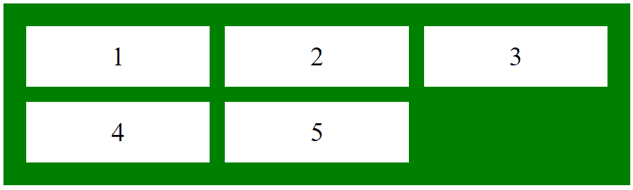
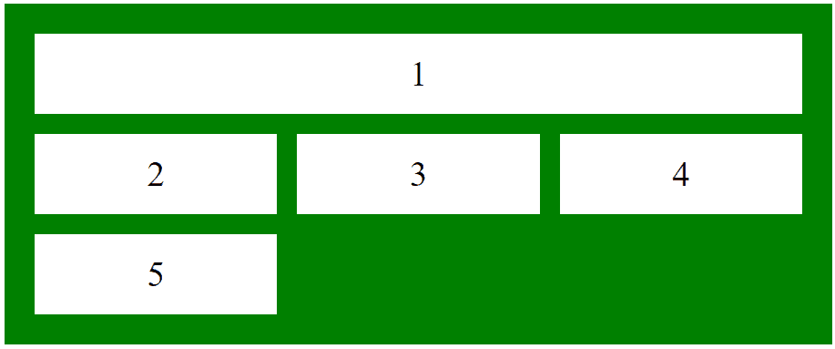
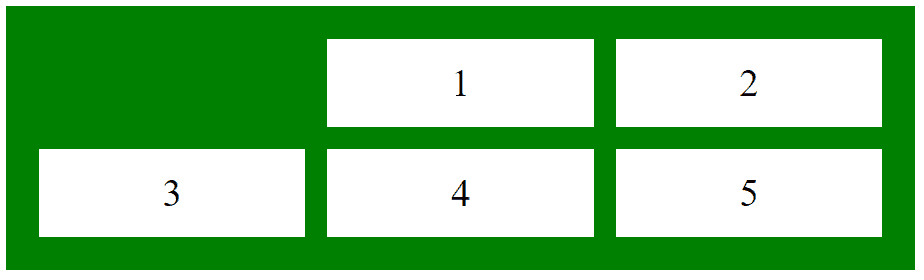

# CSS |网格-列-结束属性

> 原文:[https://www.geeksforgeeks.org/css-grid-column-end-property/](https://www.geeksforgeeks.org/css-grid-column-end-property/)

grid-column-end 属性解释一个项目将跨越的列数，或者该项目将在哪个列线结束。它支持三种不同类型的值。

**语法:**

```
grid-column-end: auto|span n|column-line;
```

**默认值:**

*   **自动**

**属性值:**

*   **自动:**网格项目将跨越一列。这是默认值。

**语法:**

```
grid-column-end: auto;
```

**例:**

## 超文本标记语言

```
<!DOCTYPE html>
<html>
    <head>
        <title>
            CSS grid container Property
        </title>

        <style>
            .main {
                display: grid;
                grid-template-columns: auto auto auto;
                grid-gap: 20px;
                padding: 30px;
                background-color: green;

            }
            .GFG {
                text-align: center;
                font-size: 35px;
                background-color: white;
                padding: 20px 0;
            }
            .Geeks1 {
                grid-column-end: auto;
            }
        </style>
    </head>

    <body>
        <div class = "main">
            <div class = "Geeks1 GFG">1</div>
            <div class = "Geeks2 GFG">2</div>
            <div class = "Geeks3 GFG">3</div>
            <div class = "Geeks4 GFG">4</div>
            <div class = "Geeks5 GFG">5</div>
        </div>
    </body>
</html>                    
```

**输出:**



*   **跨度 n:** 用于指定将要跨度的列项数。

**语法:**

```
grid-column-end: span n;
```

**例:**

## 超文本标记语言

```
<!DOCTYPE html>
<html>
    <head>
        <title>
            CSS grid container Property
        </title>

        <style>
            .main {
                display: grid;
                grid-template-columns: auto auto auto;
                grid-gap: 20px;
                padding: 30px;
                background-color: green;

            }
            .GFG {
                text-align: center;
                font-size: 35px;
                background-color: white;
                padding: 20px 0;
            }
            .Geeks1 {
                grid-column-end: span 3;
            }
        </style>
    </head>

    <body>
        <div class = "main">
            <div class = "Geeks1 GFG">1</div>
            <div class = "Geeks2 GFG">2</div>
            <div class = "Geeks3 GFG">3</div>
            <div class = "Geeks4 GFG">4</div>
            <div class = "Geeks5 GFG">5</div>
        </div>
    </body>
</html>                    
```

**输出:**



*   **列-行:**用于指定在哪个列结束项目的显示，用户可以设置列的结束。

**语法:**

```
grid-column-end: column-line;
```

**例:**

## 超文本标记语言

```
<!DOCTYPE html>
<html>
    <head>
        <title>
            CSS grid container Property
        </title>

        <style>
            .main {
                display: grid;
                grid-template-columns: auto auto auto;
                grid-gap: 20px;
                padding: 30px;
                background-color: green;

            }
            .GFG {
                text-align: center;
                font-size: 35px;
                background-color: white;
                padding: 20px 0;
            }
            .Geeks1 {
                grid-column-end: 3;
            }
        </style>
    </head>

    <body>
        <div class = "main">
            <div class = "Geeks1 GFG">1</div>
            <div class = "Geeks2 GFG">2</div>
            <div class = "Geeks3 GFG">3</div>
            <div class = "Geeks4 GFG">4</div>
            <div class = "Geeks5 GFG">5</div>
        </div>
    </body>
</html>                    
```

**输出:**



**支持的浏览器:**网格列端属性支持的浏览器如下:

*   谷歌 Chrome 57.0
*   Internet Explorer 16.0
*   Mozilla Firefox 52.0
*   Safari 10.0
*   Opera 44.0