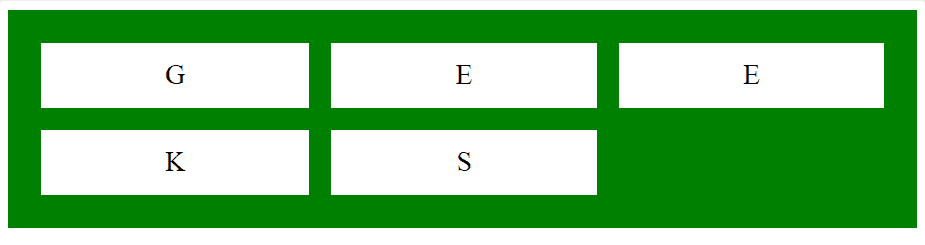
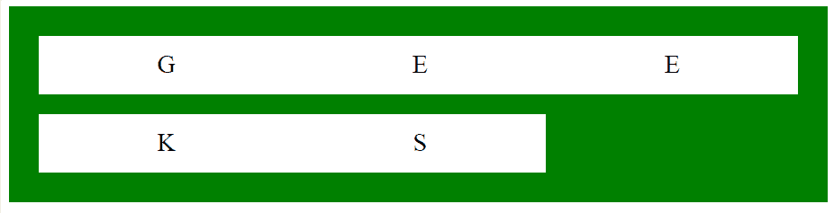

# CSS |网格-列-间隙属性

> 原文:[https://www.geeksforgeeks.org/css-grid-column-gap-property/](https://www.geeksforgeeks.org/css-grid-column-gap-property/)

CSS 中的 grid-column-gap 属性用于设置网格布局中各列之间的间距大小。

**语法:**

```
grid-column-gap: none|length|initial|inherit;
```

**属性值:**

*   **无:**用于将网格-列-间隙属性设置为默认值。网格-列-间隙的默认值为 0。
*   **长度:**柱间间隙的大小以长度给出。长度值可以是 px、em 等形式。该值必须非负。
*   **初始值:**用于将网格-列-间隙属性设置为默认值。
*   **inherit:** 此属性从其父级继承。

**例 1:**

```
<!DOCTYPE html>
<html>
    <head>
        <title>
            CSS grid-column-gap Property
        </title>

        <style>
            .main {
                display: grid;
                grid-template-columns: auto auto auto;

                /* CSS property used here */
                grid-column-gap: 20px;
                grid-row-gap: 20px;
                background-color: green;
                padding: 30px;
            }

            .main > div {
                background-color: white;
                text-align: center;
                padding: 15px;
                font-size: 25px;
            }
        </style>
    </head>

    <body>
        <div class="main">
            <div>G</div>
            <div>E</div>
            <div>E</div>
            <div>K</div>
            <div>S</div>
        </div>
    </body>
</html>                    
```

**输出:**


**示例 2:** 本示例描述了默认的网格-列-间隙属性。

```
<!DOCTYPE html>
<html>
    <head>
        <title>
            CSS grid-column-gap Property
        </title>

        <style>
            .main {
                display: grid;
                grid-template-columns: auto auto auto;

                /* CSS property used here */
                grid-column-gap: initial;
                grid-row-gap: 20px;
                background-color: green;
                padding: 30px;
            }

            .main > div {
                background-color: white;
                text-align: center;
                padding: 15px;
                font-size: 25px;
            }
        </style>
    </head>

    <body>
        <div class="main">
            <div>G</div>
            <div>E</div>
            <div>E</div>
            <div>K</div>
            <div>S</div>
        </div>
    </body>
</html>                    
```

**输出:**


**支持的浏览器:**CSS 网格-列间隙属性支持的浏览器如下:

*   谷歌 Chrome 57.0
*   Safari 10.0
*   Opera 44.0
*   Firefox 52.0
*   Internet Explorer 16.0