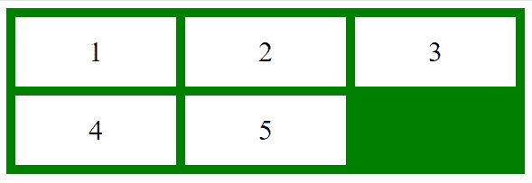
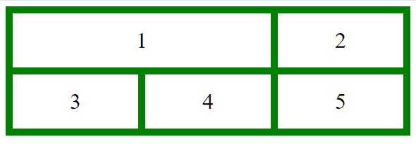
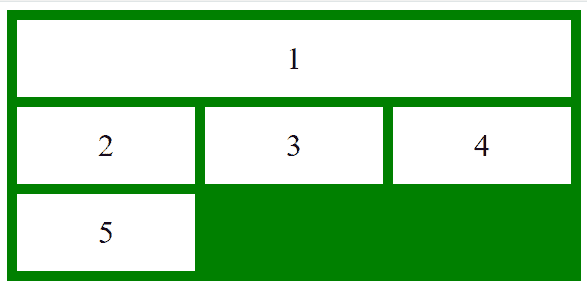

# CSS |网格-列属性

> 原文:[https://www.geeksforgeeks.org/css-grid-column-property/](https://www.geeksforgeeks.org/css-grid-column-property/)

网格是一种 2D(二维)设计模式，用于处理网络上基于网格的用户界面。它描述了允许使用 CSS 设计网格结构和控制网格项目放置的属性的数量。它可以改变网格项目的布局，而不考虑它们的源顺序，这允许移动网格项目以适应这些变化的上下文，而不必修改底层标记。

**语法:**

```html
grid-column: grid-column-start|grid-column-end;
```

**属性值:**网格-列-开始和网格-列-结束，属性可以用三种方式描述:

*   **自动:**元素将被放置在默认流程中。这是默认值。
*   **span n:** 它指定在网格-列-开始和网格-列-结束两种情况下项目将跨越的列数。
*   **列线:**描述网格-列-开始时在哪个列开始显示项目，网格-列-结束时在哪个列结束显示项目。

**示例:**本示例描述了*网格-柱:自动*属性。

## 超文本标记语言

```html
<!DOCTYPE html>  
<html>  
    <head>  
        <title>  
            CSS grid column Property  
        </title>  

        <style>  
            .main {  
                display: grid;  
                grid-template-columns: auto auto auto;  
                grid-gap: 10px;  
                padding: 10px;  
                background-color: green;  

            }  
            .GFG {  
                text-align: center;  
                font-size: 32px;  
                background-color: white;  
                padding: 20px 0;  
            }  
            .Geeks1 {  
                grid-column: 1 / auto;  
            }  
        </style>  
    </head>  

    <body>  
        <div class = "main">  
            <div class = "Geeks1 GFG">1</div>  
            <div class = "Geeks2 GFG">2</div>  
            <div class = "Geeks3 GFG">3</div>  
            <div class = "Geeks4 GFG">4</div>  
            <div class = "Geeks5 GFG">5</div>  
        </div>  
    </body>  
</html>
```

**输出:**



**示例:**本示例描述了*网格-柱:柱-线*属性。

## 超文本标记语言

```html
<!DOCTYPE html>  
<html>  
    <head>  
        <title>  
            CSS grid column Property  
        </title>  

        <style>  
            .main {  
                display: grid;  
                grid-template-columns: auto auto auto;  
                grid-gap: 10px;  
                padding: 10px;  
                background-color: green;  

            }  
            .GFG {  
                text-align: center;  
                font-size: 32px;  
                background-color: white;  
                padding: 20px 0;  
            }  
            .Geeks1 {  
                grid-column: 1 / 3;  
            }  
        </style>  
    </head>  

    <body>  
        <div class = "main">  
            <div class = "Geeks1 GFG">1</div>  
            <div class = "Geeks2 GFG">2</div>  
            <div class = "Geeks3 GFG">3</div>  
            <div class = "Geeks4 GFG">4</div>  
            <div class = "Geeks5 GFG">5</div>  
        </div>  
    </body>  
</html>
```

**输出:**



**示例:**该示例描述了*网格柱:span n* 属性。

## 超文本标记语言

```html
<!DOCTYPE html>  
<html>  
    <head>  
        <title>  
            CSS grid column Property  
        </title>  

        <style>  
            .main {  
                display: grid;  
                grid-template-columns: auto auto auto;  
                grid-gap: 10px;  
                padding: 10px;  
                background-color: green;  

            }  
            .GFG {  
                text-align: center;  
                font-size: 32px;  
                background-color: white;  
                padding: 20px 0;  
            }  
            .Geeks1 {  
                grid-column: 1 / span 3;  
            }  
        </style>  
    </head>  

    <body>  
        <div class = "main">  
            <div class = "Geeks1 GFG">1</div>  
            <div class = "Geeks2 GFG">2</div>  
            <div class = "Geeks3 GFG">3</div>  
            <div class = "Geeks4 GFG">4</div>  
            <div class = "Geeks5 GFG">5</div>  
        </div>  
    </body>  
</html>
```

**输出:**



**支持的浏览器:***格列*属性支持的浏览器如下:

*   谷歌 Chrome 57.0
*   Internet Explorer 16.0
*   Mozilla firefox 52.0
*   Safari 10.0
*   Opera 44.0