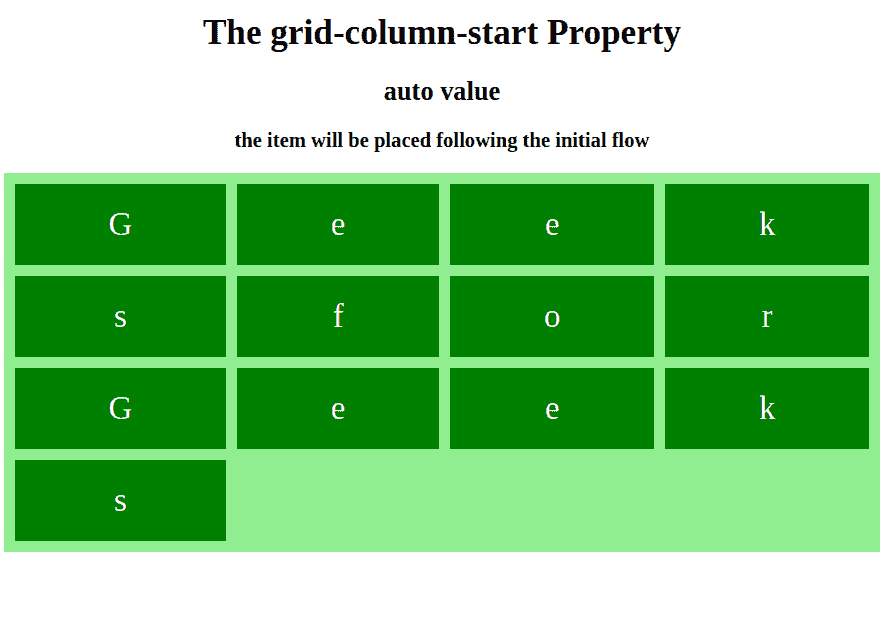

# CSS |网格-列-开始属性

> 原文:[https://www . geesforgeks . org/CSS-grid-column-start-property/](https://www.geeksforgeeks.org/css-grid-column-start-property/)

grid-column-start 属性定义将从哪个列行项目开始。grid-column-start 属性有不同的值，用户可以从任何地方开始使用不同的值。在同一个命名块上也有一个特定的值。

**语法:**

```html
grid-column-start: auto|span n|column-line;
```

**默认值:**

*   **自动**

**房产价值:**

**auto:** 一个关键字，指定属性对网格项的放置没有任何影响。默认值，项目将按照流程放置

*   **语法:**

```html
grid-column-start: auto; 
```

*   **例:**

## 超文本标记语言

```html
<!DOCTYPE html>
<html>

<head>
    <title>
        CSS | grid-column-start Property
    </title>
    <style>
        .grid-container {
            display: grid;
            grid-template-columns: auto auto auto auto;
            grid-gap: 10px;
            background-color: lightgreen;
            padding: 10px;
        }

        .grid-container div {
            background-color: green;
            text-align: center;
            padding: 20px 0;
            font-size: 30px;
            color: white;
        }

        .item1 {
            <!-- grid-column-start property
                               with auto value -->
            grid-column-start: auto;
        }
    </style>
</head>

<body>

    <center>
        <h1>
         The grid-column-start Property
        </h1>
        <h3>auto value</h3>
        <strong>the item will be placed
               following the initial flow</strong>
   </center>

    <div class="grid-container">
        <div class="item1">G</div>
        <div class="item2">e</div>
        <div class="item2">e</div>
        <div class="item3">k</div>
        <div class="item4">s</div>
        <div class="item5">f</div>
        <div class="item6">o</div>
        <div class="item6">r</div>
        <div class="item1">G</div>
        <div class="item2">e</div>
        <div class="item2">e</div>
        <div class="item3">k</div>
        <div class="item4">s</div>
    </div>

</body>

</html>
```

*   **输出:**



**span n:** A 关键字指定项目将跨越的列数，如果名称是 A，则只计算具有该名称的行

*   **语法:**

```html
grid-column-start: span n; 
```

*   **例:**

## 超文本标记语言

```html
<!DOCTYPE html>
<html>

<head>
    <title>
        CSS | grid-column-start Property
    </title>
    <style>
        .grid-container {
            display: grid;
            grid-template-columns: auto auto auto auto;
            grid-gap: 10px;
            background-color: lightgreen;
            padding: 10px;
        }

        .grid-container div {
            background-color: green;
            text-align: center;
            padding: 20px 0;
            font-size: 30px;
            color: white;
        }

        .item1 {
            <!-- grid-column-start property
                                with span value -->
            grid-column-start: span 4;
        }
    </style>
</head>

<body>

     <center>
        <h1>
         The grid-column-start Property
        </h1>
        <h3>auto value</h3>
        <strong>the item will be placed following
                           the initial flow</strong>
    </center>
    <div class="grid-container">
        <div class="item1">G</div>
        <div class="item2">e</div>
        <div class="item2">e</div>
        <div class="item3">k</div>
        <div class="item4">s</div>
        <div class="item5">f</div>
        <div class="item6">o</div>
        <div class="item6">r</div>
        <div class="item1">G</div>
        <div class="item2">e</div>
        <div class="item2">e</div>
        <div class="item3">k</div>
        <div class="item4">s</div>
    </div>

</body>

</html>
```

*   **输出:**


**列-行:**一个关键字指定在哪个列开始显示项目，用户可以设置开始列。

*   **语法:**

```html
grid-column-start: column-line; 
```

*   **例:**

## 超文本标记语言

```html
<!DOCTYPE html>
<html>

<head>
    <title>
        CSS | grid-column-start Property
    </title>
    <style>
        .grid-container {
            display: grid;
            grid-template-columns: auto auto auto auto;
            grid-gap: 10px;
            background-color: lightgreen;
            padding: 10px;
        }

        .grid-container div {
            background-color: green;
            text-align: center;
            padding: 20px 0;
            font-size: 30px;
            color: white;
        }

        .item1 {
            <!-- grid-column-start property
                            with column-line value --!>
          grid-column-start: 2;
        }

    </style>
</head>

<body>

    <center>
        <h1>
         The grid-column-start Property
        </h1>
        <h3>auto value</h3>
        <strong>the item will be placed following
                            the initial flow</strong>
    </center>
    <div class="grid-container">
        <div class="item1">G</div>
        <div class="item2">e</div>
        <div class="item2">e</div>
        <div class="item3">k</div>
        <div class="item4">s</div>
        <div class="item5">f</div>
        <div class="item6">o</div>
        <div class="item6">r</div>
        <div class="item1">G</div>
        <div class="item2">e</div>
        <div class="item2">e</div>
        <div class="item3">k</div>
        <div class="item4">s</div>
    </div>

</body>

</html>
```

*   **输出:**


**支持的浏览器:***网格-列-开始属性*支持的浏览器如下:

*   谷歌 Chrome 57.0
*   Internet Explorer 16.0
*   Mozilla Firefox 52.0
*   Safari 10.0
*   Opera 44.0