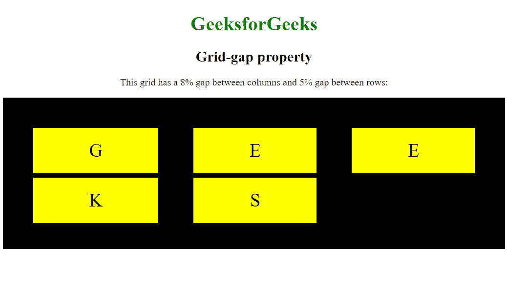

# CSS |网格间隙属性

> 原文:[https://www.geeksforgeeks.org/css-grid-gap-property/](https://www.geeksforgeeks.org/css-grid-gap-property/)

**网格间距**属性设置网格布局中行和列之间的间距大小。
它是以下属性的简写属性:

1.  网格-列-间隙属性
2.  网格行间隙属性

**语法:**

```
grid-gap: grid-row-gap grid-column-gap;
```

**房产价值:**

*   [**【网格-行-间隙】**](https://contribute.geeksforgeeks.org/geek/css-grid-row-gap-property/) **:** 它设置网格布局中各行之间的间隙大小。其默认值为 0。
*   [**【网格-列-间隙】**](https://contribute.geeksforgeeks.org/geek/css-grid-column-gap-property) **:** 设置网格布局中各列之间的间隙大小。其默认值为 0。

**示例-1:**

## 超文本标记语言

```
<!DOCTYPE html>
<html>

<head>
    <title>
        CSS | grid-gap Property
    </title>
    <style>
        body {
            text-align: center;
        }

        h1 {
            color: black;
        }
        .grid-container {
            display: grid;
            grid-template-columns: auto auto auto;
            grid-column-gap: 50px;
            grid-row-gap: 10px;
            background-color: blue;
            padding: 10px;
        }

        .grid-container > div {
            background-color: white;
            text-align: center;
            padding: 20px 0;
            font-size: 30px;
        }
    </style>
</head>

<body>

    <h1>GeeksforGeeks</h1>
    <h2>Grid-gap property</h2>

<p>This grid has a 50px gap between
       columns and 10px gap between rows. :</p>

    <div class="grid-container">
        <div class="item1">G</div>
        <div class="item2">E</div>
        <div class="item3">E</div>
        <div class="item4">K</div>
        <div class="item5">S</div>
    </div>

</body>

</html>
```

**输出:**


**示例-2:**

## 超文本标记语言

```
<!DOCTYPE html>
<html>

<head>
    <title>
        CSS | grid-gap Property
    </title>
    <style>
        body {
            text-align: center;
        }

        h1 {
            color: green;
        }

        .grid-container {
            display: grid;
            grid-template-columns: auto auto auto;
            grid-column-gap: 8%;
            grid-row-gap: 5%;
            background-color: black;
            padding: 6%;
        }

        .grid-container > div {
            background-color: yellow;
            text-align: center;
            padding: 20px 0;
            font-size: 30px;
        }
    </style>
</head>

<body>

    <h1>GeeksforGeeks</h1>
    <h2>Grid-gap property</h2>

<p>This grid has a 8% gap between columns
       and 5% gap between rows:</p>

    <div class="grid-container">
        <div class="item1">G</div>
        <div class="item2">E</div>
        <div class="item3">E</div>
        <div class="item4">K</div>
        <div class="item5">S</div>

    </div>

</body>

</html>
```

**输出:**



**支持的浏览器:****网格间隙属性**支持的浏览器如下:

*   谷歌 Chrome 57.0
*   Internet Explorer 16.0
*   Mozilla Firefox 52.0
*   Safari 10.0
*   Opera 44.0