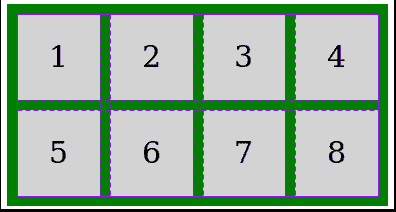
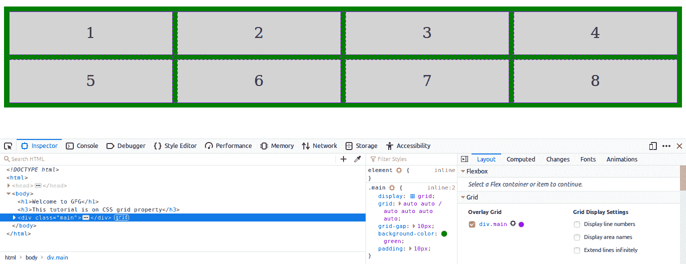
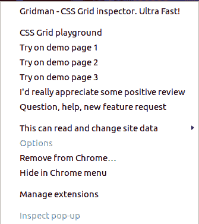

# CSS |网格检查器

> 原文:[https://www.geeksforgeeks.org/css-grid-inspector/](https://www.geeksforgeeks.org/css-grid-inspector/)

**网格检查器**是一个强大的工具，可以使用浏览器验证网格系统。在 Mozilla Firefox 中，有一个内置的网格检查器，但是在谷歌 Chrome 中，您必须使用扩展。网格检查器非常有用，因为网格系统并不复杂，或者跨越许多轨迹。
很难想象将物品固定在适当位置的实际网格。网格检查器允许您查看网格线。
**例:**

**在火狐上使用网格检查器的步骤:**

*   **步骤 1:** 在浏览器中正常查看网页时，右键单击要检查的网格，并从上下文菜单中选择**检查元素**。
*   **第二步:**确保在带有源代码的窗格中选择了带有**显示:网格的元素**，在另一个窗格中选择了**规则**选项卡，点击显示:网格之间的网格图标(网格检查器截图)。

*   **第一步:**访问[链接](https://chrome.google.com/webstore/detail/gridman-css-grid-inspecto/cmplbmppmfboedgkkelpkfgaakabpicn?hl=en)在你的谷歌浏览器中添加扩展。
*   **步骤 2:** 右键单击扩展和任意一个尝试选项，测试您的工具是否准备好。

*   **Step 3:** Mouseover the grid element, will display the row gap and column gap.