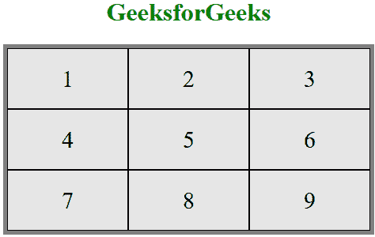
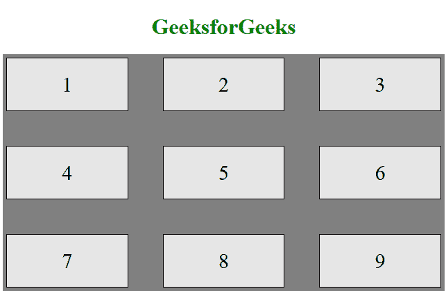
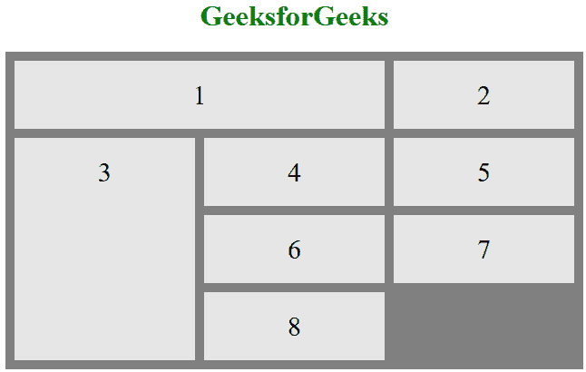

# CSS 网格布局模块

> 原文:[https://www.geeksforgeeks.org/css-grid-layout-module/](https://www.geeksforgeeks.org/css-grid-layout-module/)

CSS **网格布局模块**用于创建基于网格的布局系统，借助行和列，在不使用**浮动**和**定位**的情况下，更容易设计任何网页。

**语法:**

```html
.class {
    display:grid;
}
```

**注意:**如果一个 HTML 元素设置了**显示:** **网格，则该元素成为网格；**在样式部分或**内嵌网格**中。下面你会看到两个例子。

**CSS 网格布局属性:**以下是网格布局属性:

*   [**列间距**](https://www.geeksforgeeks.org/css-column-gap-property/) :用于指定使用列计数属性划分给定文本的列之间的间距。
*   [**间隙**](https://www.geeksforgeeks.org/css-gap-property/) **:** 它用来设置行与列之间的间距也叫天沟。
*   [**网格**](https://www.geeksforgeeks.org/css-grid-property/) :它提供了一个基于网格的布局系统，有行有列，更容易设计没有浮动和定位的网页。
*   [**【网格区域】**](https://www.geeksforgeeks.org/css-grid-area-property/) :用于设置网格布局中网格项目的大小和位置。
*   [**网格-自动列**](https://www.geeksforgeeks.org/css-grid-auto-columns-property/) :用于指定隐式生成的网格容器的列的大小。
*   [**网格-自动流动**](https://www.geeksforgeeks.org/css-grid-auto-flow-property/) :它精确地指定了自动放置的项目如何流入网格。
*   [**网格-自动行**](https://www.geeksforgeeks.org/css-grid-auto-rows-property/) :用于指定隐式生成的网格容器的行的大小。
*   [**【网格柱】**](https://www.geeksforgeeks.org/css-grid-column-property/) :描述了允许设计网格结构和使用 CSS 控制网格项目放置的属性数量。
*   [**网格-列-结束**](https://www.geeksforgeeks.org/css-grid-column-end-property/) :它解释了一个项目将跨越的列数，或者该项目将在哪个列线上结束。
*   [**【网格-列-间隙】**](https://www.geeksforgeeks.org/css-grid-column-gap-property/) :用于设置网格布局中各列之间的间隙大小。
*   [**网格-列-开始**](https://www.geeksforgeeks.org/css-grid-column-start-property/) :定义开始哪个列的行项目。
*   [**【网格-间隙】**](https://www.geeksforgeeks.org/css-grid-gap-property/) :用于设置网格布局中行与列之间的间隙大小。
*   [**【网格行】**](https://www.geeksforgeeks.org/css-grid-row-property/) :用于指定网格布局中的尺寸和位置。
*   [**【网格-行-结束】**](https://www.geeksforgeeks.org/css-grid-row-end-property/) :通过指定网格区域的内联边来定义网格项在网格行内的结束位置。
*   [**网格-行-间隙**](https://www.geeksforgeeks.org/css-grid-row-gap-property/) :用于定义网格元素之间的间隙大小。
*   [**【网格-行-开始】**](https://www.geeksforgeeks.org/css-grid-row-start-property/) :通过指定网格区域的内联开始边，定义网格项目在网格行内的开始位置。
*   [**网格模板**](https://www.geeksforgeeks.org/css-grid-template-property/) :这是一个[简写属性](https://www.geeksforgeeks.org/css-shorthand-properties/)，用于定义网格列、行和区域。
*   [**【网格-模板-区域】**](https://www.geeksforgeeks.org/css-grid-template-areas-property/https://www.geeksforgeeks.org/css-grid-template-areas-property/) :用于指定网格布局内的区域。
*   [**网格-模板-列**](https://www.geeksforgeeks.org/css-grid-template-columns-property/) :用于设置网格的列数和列的大小。
*   [**【网格-模板-行数】**](https://www.geeksforgeeks.org/css-grid-template-rows-property/) :用于设置网格中的行数和行高。

**示例 1:** 本示例说明了**显示:** **网格的使用；**属性。

## 超文本标记语言

```html
<!DOCTYPE html>
<html>

<head>
    <style>

        /* Designing all grid */
    .grid-container {
        display: grid;
        grid-template-columns: auto auto auto;
        background-color: gray;
        padding: 5px;
    }

    /* Designing all grid-items */
    .grid-item {
        background-color: rgba(255, 255, 255, 0.8);
        border: 1px solid black;
        padding: 20px;
        font-size: 30px;
        text-align: center;
    }

    /* Designing h1 element */
    h1 {
        color: green;
        text-align: center;
    </style>
</head>

<body>
    <h1>GeeksforGeeks</h1>

    <!-- Creating grid -->
    <div class="grid-container">
        <div class="grid-item">1</div>
        <div class="grid-item">2</div>
        <div class="grid-item">3</div>
        <div class="grid-item">4</div>
        <div class="grid-item">5</div>
        <div class="grid-item">6</div>
        <div class="grid-item">7</div>
        <div class="grid-item">8</div>
        <div class="grid-item">9</div>
    </div>
</body>

</html>
```

**输出:**



**示例 2:** 该示例说明了**显示的使用:内嵌网格；**属性。

## 超文本标记语言

```html
<!DOCTYPE html>
<html>

<head>
    <style>

        /* Designing all grid */
    .grid-container {
        display: inline-grid;
        grid-template-columns: auto auto auto;
        background-color: gray;
        padding: 5px;
    }

    /* Designing all grid-items */
    .grid-item {
        background-color: rgba(255, 255, 255, 0.8);
        border: 1px solid black;
        padding: 20px;
        font-size: 30px;
    }

    /* Designing h1 element */
    h1 {
        color: green;
        text-align: center;
    </style>
</head>

<body>
    <center>
        <h1>GeeksforGeeks</h1>

        <!-- Creating grids -->
        <div class="grid-container">
            <div class="grid-item">1</div>
            <div class="grid-item">2</div>
            <div class="grid-item">3</div>
            <div class="grid-item">4</div>
            <div class="grid-item">5</div>
            <div class="grid-item">6</div>
            <div class="grid-item">7</div>
            <div class="grid-item">8</div>
            <div class="grid-item">9</div>
        </div>
    </center>
</body>

</html>
```

**输出:**


您可以在网格系统上控制以下内容:

*   栅柱间隙
*   网格行间隙
*   网格间隙

**示例 3:** 在下面的代码中，我们同时使用了**格列间隙**和**格行间隙**。

## 超文本标记语言

```html
<!DOCTYPE html>
<html>

<head>
    <style>

        /* Designing all grid */
    .grid-container {
        display: grid;
        grid-template-columns: auto auto auto;
        background-color: gray;
        grid-column-gap: 50px;
        grid-row-gap: 50px;
        padding: 5px;
    }

    /* Designing all grid-items */
    .grid-item {
        background-color: rgba(255, 255, 255, 0.8);
        border: 1px solid black;
        padding: 20px;
        font-size: 30px;
        text-align: center;
    }

    /* Designing h1 element */
    h1 {
        color: green;
        text-align: center;
    </style>
</head>

<body>
    <h1>GeeksforGeeks</h1>

    <!-- Creating grids -->
    <div class="grid-container">
        <div class="grid-item">1</div>
        <div class="grid-item">2</div>
        <div class="grid-item">3</div>
        <div class="grid-item">4</div>
        <div class="grid-item">5</div>
        <div class="grid-item">6</div>
        <div class="grid-item">7</div>
        <div class="grid-item">8</div>
        <div class="grid-item">9</div>
    </div>
</body>

</html>
```

**输出:**



**注:**同样**格隙**也起作用。

您可以在网格系统上控制以下内容:

*   网格列线
*   网格行线

**示例:4** 在下面的代码中，我们同时使用了**网格-列线**和**网格-行线**。

## 超文本标记语言

```html
<!DOCTYPE html>
<html>

<head>
    <style>

    /* Designing all grid */
    .grid-container {
        display: grid;
        grid-template-columns: auto auto auto;
        grid-gap: 10px;
        background-color: gray;
        padding: 10px;
    }

    /* Designing all grid-items */
    .grid-container > div {
        background-color: rgba(255, 255, 255, 0.8);
        text-align: center;
        padding: 20px 0;
        font-size: 30px;
    }

    /* Grid Column */
    .item1 {
        grid-column-start: 1;
        grid-column-end: 3;
    }

    /* Grid row */
    .item3 {
        grid-row-start: 2;
        grid-row-end: 5;
    }

    /* Designing h1 element */
    h1 {
        color: green;
        text-align: center;
    }
    </style>
</head>

<body>
    <h1>GeeksforGeeks</h1>

    <!-- Creating grids -->
    <div class="grid-container">
        <div class="item1">1</div>
        <div class="item2">2</div>
        <div class="item3">3</div>
        <div class="item4">4</div>
        <div class="item5">5</div>
        <div class="item6">6</div>
        <div class="item7">7</div>
        <div class="item8">8</div>
    </div>
</body>

</html>
```

**输出:**



**支持的浏览器:****CSS 网格布局模块**支持的浏览器如下:

*   谷歌 Chrome 57.0
*   微软边缘 16.0
*   Firefox 52.0
*   Safari 10.1
*   Opera 44.0