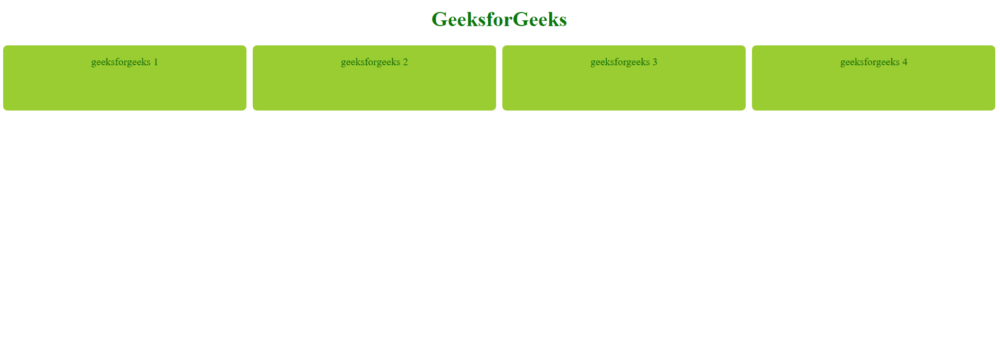

# CSS 网格布局:Fr 单元

> 原文:[https://www.geeksforgeeks.org/css-grid-layout-the-fr-unit/](https://www.geeksforgeeks.org/css-grid-layout-the-fr-unit/)

**CSS 网格布局**模块用于创建基于网格的布局系统，借助行和列，可以更容易地设计任何网页，而无需使用浮动和定位。

**语法:**

```
.class {
    display:grid;
}
```

**注意:**如果一个 HTML 元素设置了**显示:网格**，则该元素成为网格

*   **网格-模板-列:**指定列的大小
*   **网格-模板-行:**指定行的大小。
*   **网格-间隙:**设置行与列之间的间隙。

**部分网格-模板-列关键字值:**

*   网格-模板-列:**重复([ <正整数> |自动填充|自动拟合]，<轨迹-列表>)；**
*   网格-模板-行:**重复([ <正整数> |自动填充|自动拟合]，<轨迹列表>)；**

表示 tracklist 的重复片段，允许大量呈现重复
模式的列以更紧凑的形式写入。它允许您定义重复 X 次的模式。

*   网格-模板-列:自动**；**
*   网格-模板-行:自动；

指示自动放置、自动跨度或一列的默认跨度适合列中的内容。该行适合该行中的内容。

*   网格-模板-列:**最小值(最小值，最大值)；**
*   网格-模板-行:**最小值(最小值，最大值)；**

是定义尺寸范围大于或等于最小值且小于或等于最大值的函数符号

*   **Fr 单位:** Fr 是分数单位。
*   **Fr 单位**是一个输入，当调整网格内的间隙时，它会自动计算布局分区。

**实施例 1。**本例说明了 fr 单位的使用。

## 超文本标记语言

```
<!DOCTYPE html>
<html>

<head>
    <style>
        .container {
            display: grid;

            grid-template-columns: 1fr 1fr 1fr 1fr;
            grid-template-rows: 100px;
            grid-gap: 10px;
        }

        .container div {
            border: 3px black;
            border-radius: 7px;
            background-color: yellowgreen;
            padding: 1em;
            text-align: center;
            color: darkgreen;
        }

        h1 {
            color: green;
            text-align: center;
    </style>
</head>

<body>
    <h1>GeeksforGeeks</h1>
    <div class="container">
        <div>geeksforgeeks 1</div>
        <div>geeksforgeeks 2</div>
        <div>geeksforgeeks 3</div>
        <div>geeksforgeeks 4</div>
    </div>
</body>

</html>
```



产出 1

我们有 4 根柱子，每根占据相同的空间。每个都有 1fr 的宽度。每一列都相等。1fr=25%的可用空间。

**例 2** 。这个例子说明了不同分数值的 fr 单位的使用。

## 超文本标记语言

```
<!DOCTYPE html>
<html>

<head>
  <style>
    .container {
      display: grid;

      grid-template-columns: 1fr 1fr 2fr 2fr;
      grid-template-rows: 100px 150px 200px 200px;

      grid-gap: 10px;
    }

    .container div {
      border: 3px black;
      border-radius: 7px;
      background-color: yellowgreen;
      padding: 1em;
      text-align: center;
      color: darkgreen;
    }

    h1 {
      color: green;
      text-align: center;
  </style>
</head>

<body>
  <h1>GeeksforGeeks</h1>
  <div class="container">
    <div>geeksforgeeks 1</div>
    <div>geeksforgeeks 2</div>
    <div>geeksforgeeks 3</div>
    <div>geeksforgeeks 4</div>
    <div>geeksforgeeks 5</div>
    <div>geeksforgeeks 6</div>
    <div>geeksforgeeks 7</div>
    <div>geeksforgeeks 8</div>
    <div>geeksforgeeks 9</div>
    <div>geeksforgeeks 10</div>
    <div>geeksforgeeks 11</div>
    <div>geeksforgeeks 12</div>
    <div>geeksforgeeks 13</div>
    <div>geeksforgeeks 14</div>
    <div>geeksforgeeks 15</div>
    <div>geeksforgeeks 16</div>
  </div>
</body>

</html>
```


产出 2

我们有 4 列，前两列占用相同的空间，即 1fr，后两列占用相同的空间，即 2fr。

**例 2。**本例说明了 fr 单位与 repeat()和 auto 符号的使用。

## 超文本标记语言

```
<!DOCTYPE html>
<html>

<head>
  <style>
    .container {
      display: grid;

      grid-template-columns: repeat(2, 1fr) repeat(2, 2fr);
      grid-template-rows: auto;

      grid-gap: 10px;
    }

    .container div {
      border: 3px black;
      border-radius: 7px;
      background-color: yellowgreen;
      padding: 1em;
      text-align: center;
      color: darkgreen;
    }

    /* Designing h1 element */
    h1 {
      color: green;
      text-align: center;
  </style>
</head>

<body>
  <h1>GeeksforGeeks</h1>
  <div class="container">
    <div>geeksforgeeks 1</div>
    <div>geeksforgeeks 2</div>
    <div>geeksforgeeks 3</div>
    <div>geeksforgeeks 4</div>
    <div>geeksforgeeks 5</div>
    <div>geeksforgeeks 6</div>
    <div>geeksforgeeks 7</div>
    <div>geeksforgeeks 8</div>
    <div>geeksforgeeks 9</div>
    <div>geeksforgeeks 10</div>
    <div>geeksforgeeks 11</div>
    <div>geeksforgeeks 12</div>
    <div>geeksforgeeks 13</div>
    <div>geeksforgeeks 14</div>
    <div>geeksforgeeks 15</div>
    <div>geeksforgeeks 16</div>
  </div>
</body>

</html>
```

**重复(列数/行数，我们想要的列宽)；**


产出 3

**支持的浏览器:**

*   谷歌 Chrome
*   微软公司出品的 web 浏览器
*   火狐浏览器
*   歌剧
*   旅行队