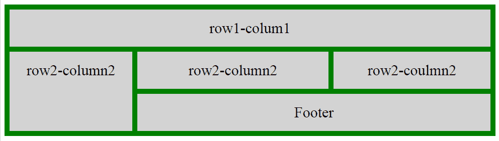
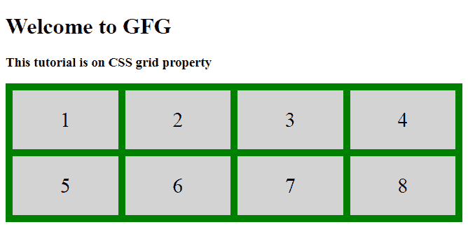
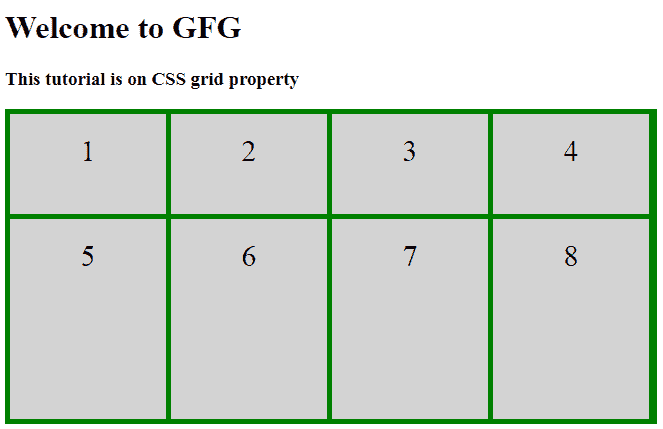

# CSS |网格属性

> 原文:[https://www.geeksforgeeks.org/css-grid-property/](https://www.geeksforgeeks.org/css-grid-property/)

这是一个 CSS 属性，它提供了一个基于网格的布局系统，有行和列，使得设计没有浮动和定位的网页变得更加容易。


**语法:**

```
grid: none|grid-template-rows / grid-template-columns|grid-template-areas|
grid-template-rows / [grid-auto-flow] grid-auto-columns|[grid-auto-flow] 
grid-auto-rows / grid-template-columns|initial|inherit;

```

**属性值:**

| 价值 | 描述 |
| 没有人 | 它是默认值，没有提到行和列的具体大小。 |
| 网格-模板-行/网格-模板-列 | 它用于分隔行和列的大小。 |
| 网格模板区域 | 它用于使用命名项指定网格布局。 |
| 网格-模板-行/网格-自动-列 | 它用于指定自动尺寸(高度)和设置自动尺寸列。 |
| 网格-自动-行/网格-模板-列 | 它用于指定自动大小并设置自动网格大小列。 |
| 网格-模板-行/网格-自动流动网格-自动列 | 它用于指定如何放置项目以及自动调整行和列的大小。 |
| 网格-自动流动网格-自动-行/网格-模板-列 | 它用于指定如何放置项目以及自动调整行和网格模板列的大小。 |

**例 1:**2 行 4 列网格。

```
<!DOCTYPE html>
<html>

<head>
    <title>
        CSS | grid Property
    </title>
    <style>
        .main {
            display: grid;
            grid: auto auto / auto auto auto auto;
            grid-gap: 10px;
            background-color: green;
            padding: 10px;
        }

        .gfg {
            background-color: lightgrey;
            text-align: center;
            padding: 25px 0;
            font-size: 30px;
        }
    </style>
</head>

<body>

    <h1>Welcome to GFG </h1>
    <h3>This tutorial is on CSS grid property</h3>

    <div class="main">
        <div class="gfg">1</div>
        <div class="gfg">2</div>
        <div class="gfg">3</div>
        <div class="gfg">4</div>
        <div class="gfg">5</div>
        <div class="gfg">6</div>
        <div class="gfg">7</div>
        <div class="gfg">8</div>
    </div>

</body>

</html>
```

**输出:**


**这可以用作:**的简写属性

*   **网格-模板-行:**指定行的大小。
*   **网格-模板-列:**指定列的大小。
*   **网格-模板-区域:**使用命名项目指定网格布局。
*   **网格-自动行:**指定行的自动大小。
*   **网格-自动列:**指定列的自动大小。
*   **网格-自动流动:**指定如何放置自动放置的项目，以及行的自动大小。

**示例 2:** 这是**网格模板行**和**网格模板列**的示例。

```
<!DOCTYPE html>
<html>

<head>
    <title>
        CSS | grid Property
    </title>
    <style>
        .main {
            display: grid;
            grid-template-columns: 156px 156px 156px 156px;
            grid-template-rows: 100px 200px;
            grid-gap: 5px;
            background-color: green;
            padding: 5px;
        }

        .gfg {
            background-color: lightgrey;
            text-align: center;
            padding: 20px 0;
            font-size: 30px;
        }
    </style>
</head>

<body>
    <h1>Welcome to GFG </h1>
    <h3>This tutorial is on CSS grid property</h3>

    <div class="main">
        <div class="gfg">1</div>
        <div class="gfg">2</div>
        <div class="gfg">3</div>
        <div class="gfg">4</div>
        <div class="gfg">5</div>
        <div class="gfg">6</div>
        <div class="gfg">7</div>
        <div class="gfg">8</div>
    </div>

</body>

</html>
```

**输出:**
第一行高度设置为 **100px** ，第二行高度设置为 **200px** ，每列宽度设置为 **156px** 。



**支持的浏览器:**以下是 **CSS |网格属性**支持的浏览器:

*   谷歌 Chrome
*   微软公司出品的 web 浏览器
*   火狐浏览器
*   歌剧
*   旅行队