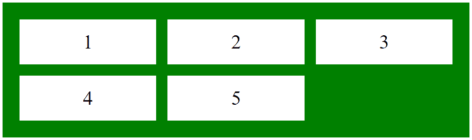
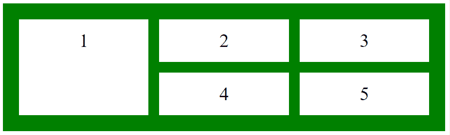

# CSS |网格-行-结束属性

> 原文:[https://www.geeksforgeeks.org/css-grid-row-end-property/](https://www.geeksforgeeks.org/css-grid-row-end-property/)

CSS 中的 grid-row-end 属性用于通过指定网格区域的内联边缘来定义网格行中网格项的结束位置。

**语法:**

```
grid-row-end: value;
```

**默认值:**

*   **自动**

**房产价值:**

*   **自动:**网格项目跨度为一行的默认值。
*   **span int:** 它指定项目将跨越的行数。
*   **整数:**指定项目结束的行。
*   **初始值:**将网格行尾属性设置为默认值。
*   **继承:**网格行尾属性是从其父级继承的。

**注意:**不要显式初始化容器的物品高度和宽度。如果初始化，则无法观察到跨度效应。
**示例 1:** 该示例描述了没有网格行尾属性的容器项。

## 超文本标记语言

```
<!DOCTYPE html>
<html>
    <head>
        <title>
            CSS grid-row-end Property
        </title>

        <style>
            .main {
                display: grid;
                grid-template-columns: auto auto auto;
                grid-gap: 20px;
                padding: 30px;
                background-color: green;

            }
            .GFG {
                text-align: center;
                font-size: 35px;
                background-color: white;
                padding: 20px 0;
            }
        </style>
    </head>

    <body>
        <div class = "main">
            <div class = "GFG">1</div>
            <div class = "GFG">2</div>
            <div class = "GFG">3</div>
            <div class = "GFG">4</div>
            <div class = "GFG">5</div>
        </div>
    </body>
</html>                    
```

**输出:**



**示例 2:** 本示例描述了具有*网格行尾:span n* 属性的容器项目。

## 超文本标记语言

```
<!DOCTYPE html>
<html>
    <head>
        <title>
            CSS grid-row-end Property
        </title>

        <style>
            .main {
                display: grid;
                grid-template-columns: auto auto auto;
                grid-gap: 20px;
                padding: 30px;
                background-color: green;

            }
            .GFG {
                text-align: center;
                font-size: 35px;
                background-color: white;
                padding: 20px 0;
            }
            .Geeks1 {
                grid-row-end: span 2;
            }
        </style>
    </head>

    <body>
        <div class = "main">
            <div class = "Geeks1 GFG">1</div>
            <div class = "Geeks2 GFG">2</div>
            <div class = "Geeks3 GFG">3</div>
            <div class = "Geeks4 GFG">4</div>
            <div class = "Geeks5 GFG">5</div>
        </div>
    </body>
</html>                   
```

**输出:**



**支持的浏览器:**网格行尾属性支持的浏览器如下:

*   谷歌 Chrome 57.0
*   Internet Explorer 16.0
*   Firefox 52.0
*   Safari 10.0
*   Opera 44.0