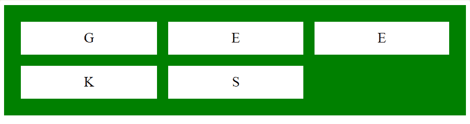
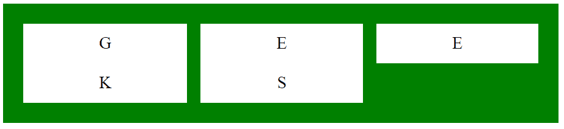

# CSS |网格-行-间隙属性

> 原文:[https://www.geeksforgeeks.org/css-grid-row-gap-property/](https://www.geeksforgeeks.org/css-grid-row-gap-property/)

CSS 中的网格行间隙属性用于定义网格元素之间的间隙大小。用户可以通过向网格行间隙提供值来指定分隔行的间隙的宽度。

**语法:**

```
grid-row-gap: length | percentage | global-values;
```

**属性值:**

*   **length:** The user can set the grid-row-gap value to be fixed length measured in px, cm etc.

    **示例:**

    ```
    <!DOCTYPE html>
    <html>
        <head>
            <title>
                CSS grid-row-gap Property
            </title>

            <style>
                .main {
                    display: grid;
                    grid-template-columns: auto auto auto;
                    grid-row-gap: 20px;
                    grid-column-gap: 20px;
                    background-color: green;
                    padding: 30px;
                }

                .main > div {
                    background-color: white;
                    text-align: center;
                    padding: 15px;
                    font-size: 25px;
                }
            </style>
        </head>

        <body>
            <div class="main">
                <div>G</div>
                <div>E</div>
                <div>E</div>
                <div>K</div>
                <div>S</div>
            </div>
        </body>
    </html>                    
    ```

    **输出:**
    

*   **percentage (%):** This property is used to set grid-row-gap value in the form of percentage, where percentage values are relative to the dimension of the element.

    **示例:**

    ```
    <!DOCTYPE html>
    <html>
        <head>
            <title>
                CSS grid-row-gap Property
            </title>

            <style>
                .main {
                    display: grid;
                    grid-template-columns: auto auto auto;
                    grid-row-gap: 20%;
                    grid-column-gap: 2%;
                    background-color: green;
                    padding: 30px;
                }

                .main > div {
                    background-color: white;
                    text-align: center;
                    padding: 15px;
                    font-size: 25px;
                }
            </style>
        </head>

        <body>
            <div class="main">
                <div>G</div>
                <div>E</div>
                <div>E</div>
                <div>K</div>
                <div>S</div>
            </div>
        </body>
    </html>                    
    ```

    **输出:**
    

*   **global-value:** This property is used to set the grid-row-gap value in the form of some fixed terms which includes inherit, initial.

    **示例:**

    ```
    <!DOCTYPE html>
    <html>
        <head>
            <title>
                CSS grid-row-gap Property
            </title>

            <style>
                .main {
                    display: grid;
                    grid-template-columns: auto auto auto;
                    grid-row-gap: initial;
                    grid-column-gap: 20px;
                    background-color: green;
                    padding: 30px;
                }

                .main > div {
                    background-color: white;
                    text-align: center;
                    padding: 15px;
                    font-size: 25px;
                }
            </style>
        </head>

        <body>
            <div class="main">
                <div>G</div>
                <div>E</div>
                <div>E</div>
                <div>K</div>
                <div>S</div>
            </div>
        </body>
    </html>                    
    ```

    **输出:**
    

**支持的浏览器:**CSS 网格-行间距属性支持的浏览器如下:

*   谷歌 Chrome 57.0
*   Internet Explorer 16.0
*   Firefox 52.0
*   Safari 10.0
*   Opera 44.0