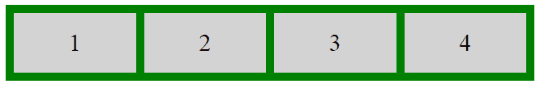
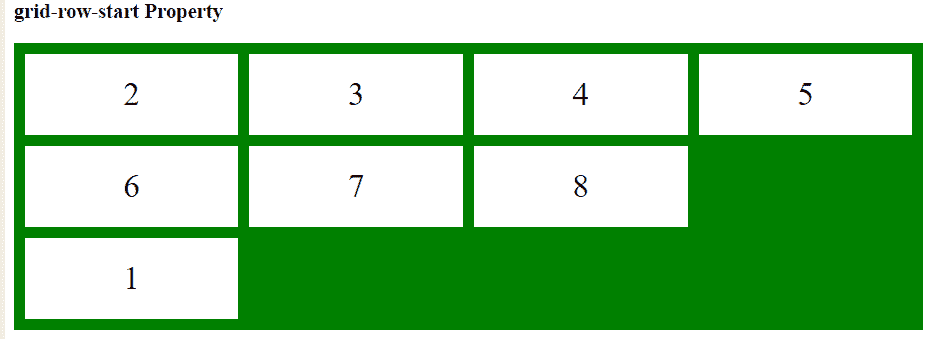
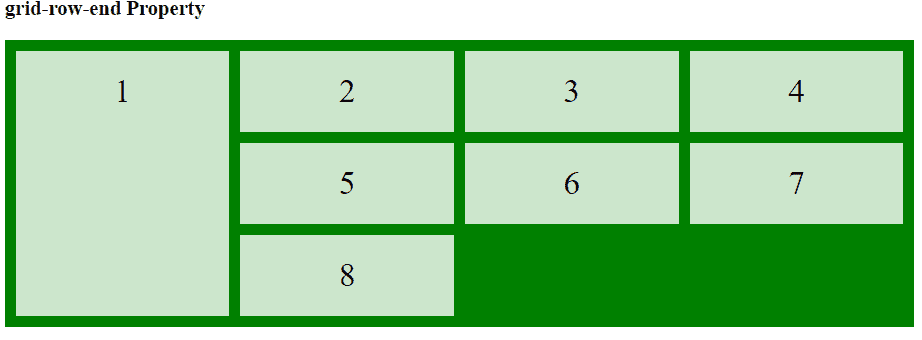

# CSS |网格行属性

> 原文:[https://www.geeksforgeeks.org/css-grid-row-property/](https://www.geeksforgeeks.org/css-grid-row-property/)

CSS 中的网格行属性用于指定网格布局中的大小和位置。它是网格行开始和网格行结束属性的组合。


**语法:**

```html
grid-row: grid-row-start|grid-row-end;
```

**属性值:**

*   **grid-row-start:** It is used to specify the row on which to start displaying the item.

    **示例:**

    ```html
    <!DOCTYPE html>
    <html>
        <head>
            <style>
                .main {
                    display: grid;
                    grid-template-columns: auto auto auto auto;
                    grid-gap: 10px;
                    background-color: green;
                    padding: 10px;
                }

                .GFG {
                    background-color: rgba(255, 255, 255, 0.8);
                    text-align: center;
                    padding: 20px 0;
                    font-size: 30px;
                }

                .Geeks1 {
                    grid-row-start: 3;
                }
            </style>
        </head>

        <body>

            <h3>grid-row-start Property</h3>

            <div class="main">
                <div class="Geeks1 GFG">1</div>
                <div class="Geeks2 GFG">2</div>
                <div class="Geeks3 GFG">3</div>
                <div class="Geeks4 GFG">4</div>
                <div class="Geeks5 GFG">5</div>
                <div class="Geeks6 GFG">6</div>
                <div class="Geeks7 GFG">7</div>
                <div class="Geeks8 GFG">8</div>
            </div>
        </body>
    </html>                    
    ```

    **输出:**
    

*   **grid-row-end** It is used to specify the row-line on which to stop displaying the item or specify how many rows an item will span.
    **Example:**

    ```html
    <!DOCTYPE html>
    <html>
        <head>
            <style>
                .main {
                    display: grid;
                    grid-template-columns: auto auto auto auto;
                    grid-gap: 10px;
                    background-color: green;
                    padding: 10px;
                }

                .GFG {
                    background-color: rgba(255, 255, 255, 0.8);
                    text-align: center;
                    padding: 20px 0;
                    font-size: 30px;
                }

                .Geeks1 {
                    grid-row-end: span 3;
                }
            </style>
        </head>

        <body>

            <h3>grid-row-end Property</h3>

            <div class="main">
                <div class="Geeks1 GFG">1</div>
                <div class="Geeks2 GFG">2</div>
                <div class="Geeks3 GFG">3</div>
                <div class="Geeks4 GFG">4</div>
                <div class="Geeks5 GFG">5</div>
                <div class="Geeks6 GFG">6</div>
                <div class="Geeks7 GFG">7</div>
                <div class="Geeks8 GFG">8</div>
            </div>
        </body>
    </html>                    
    ```

    **输出:**
    

**支持的浏览器:***网格行属性*支持的浏览器如下:

*   谷歌 Chrome 57.0
*   Internet Explorer 16.0
*   Firefox 52.0
*   Safari 10.0
*   Opera 44.0