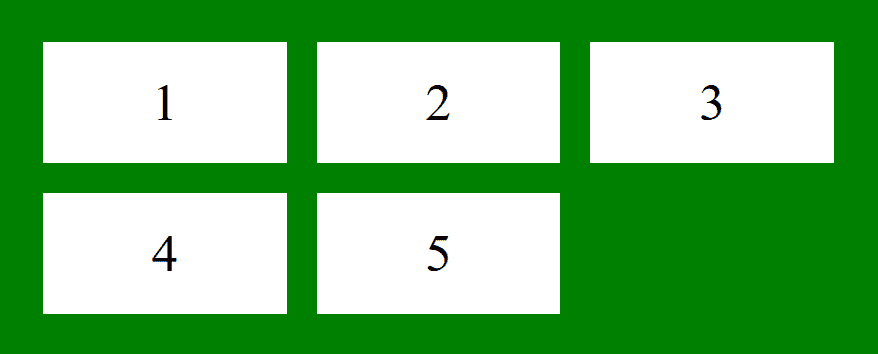
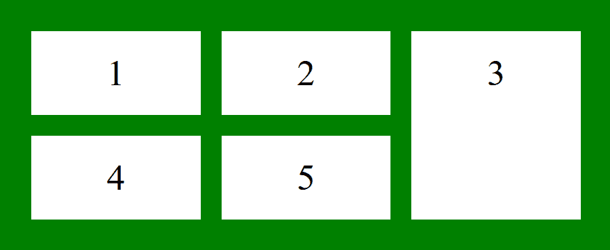
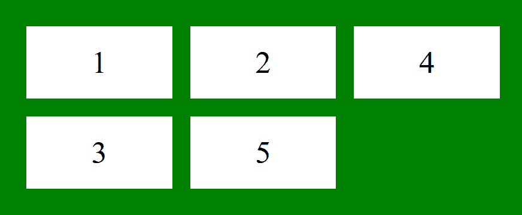
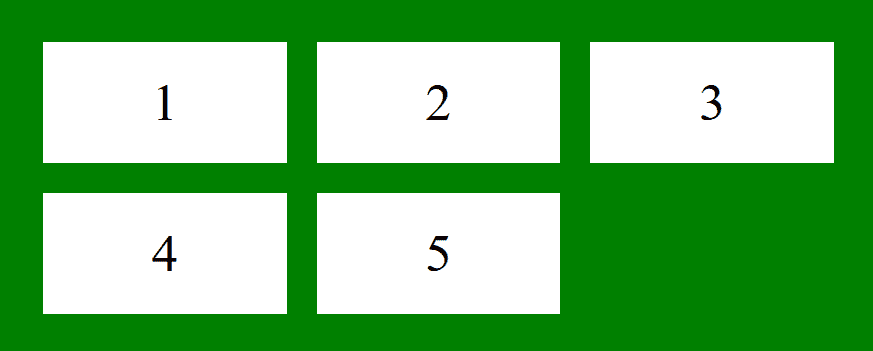

# CSS |网格-行-开始属性

> 原文:[https://www.geeksforgeeks.org/css-grid-row-start-property/](https://www.geeksforgeeks.org/css-grid-row-start-property/)

CSS 中的 grid-row-start 属性用于通过指定网格区域的内联开始边缘来定义网格项在网格行中的开始位置。

**语法:**

```html
grid-row-start: auto|span|row-line|initial|inherit;
```

**默认值:**

*   **自动**

**属性值:**

*   **自动:**将网格行开始属性设置为默认值一行。
*   **span:** 它指定项目将跨越的行数。
*   **整数(行-行):**指定项目开始的行。
*   **初始值:**将网格行开始属性设置为默认值。
*   **继承:**网格行开始属性是从其父级继承的。

**注意:**不要显式初始化容器的物品高度和宽度。如果初始化，它的跨度效应就无法观察到。
**示例 1:** 该示例描述了没有网格-行-开始属性的容器项。

## 超文本标记语言

```html
<!DOCTYPE html>
<html>
    <head>
        <title>
            CSS grid-row-start Property
        </title>

        <style>
            .main {
                display: grid;
                grid-template-columns: auto auto auto;
                grid-gap: 20px;
                padding: 30px;
                background-color: green;

            }
            .GFG {
                text-align: center;
                font-size: 35px;
                background-color: white;
                padding: 20px 0;
            }
        </style>
    </head>

    <body>
        <div class = "main">
            <div class = "GFG">1</div>
            <div class = "GFG">2</div>
            <div class = "GFG">3</div>
            <div class = "GFG">4</div>
            <div class = "GFG">5</div>
        </div>
    </body>
</html>                
```

**输出:**



**示例 2:** 本示例将网格行开始属性描述为自动。

## 超文本标记语言

```html
<!DOCTYPE html>
<html>
    <head>
        <title>
            CSS grid-row-start Property
        </title>

        <style>
            .main {
                display: grid;
                grid-template-columns: auto auto auto;
                grid-gap: 20px;
                padding: 30px;
                background-color: green;

            }
            .GFG {
                text-align: center;
                font-size: 35px;
                background-color: white;
                padding: 20px 0;
            }
            .Geeks3 {
                grid-row-start: auto;

        </style>
    </head>

    <body>
        <div class = "main">
            <div class = "Geeks1 GFG">1</div>
            <div class = "Geeks2 GFG">2</div>
            <div class = "Geeks3 GFG">3</div>
            <div class = "Geeks4 GFG">4</div>
            <div class = "Geeks5 GFG">5</div>
        </div>
    </body>
</html>           
```

**输出:**


**示例 3:** 本示例描述了要跨越的网格行起始属性。

## 超文本标记语言

```html
<!DOCTYPE html>
<html>
    <head>
        <title>
            CSS grid-row-start Property
        </title>

        <style>
            .main {
                display: grid;
                grid-template-columns: auto auto auto;
                grid-gap: 20px;
                padding: 30px;
                background-color: green;

            }
            .GFG {
                text-align: center;
                font-size: 35px;
                background-color: white;
                padding: 20px 0;
            }
            .Geeks3 {
                grid-row-start: span 2;

        </style>
    </head>

    <body>
        <div class = "main">
            <div class = "Geeks1 GFG">1</div>
            <div class = "Geeks2 GFG">2</div>
            <div class = "Geeks3 GFG">3</div>
            <div class = "Geeks4 GFG">4</div>
            <div class = "Geeks5 GFG">5</div>
        </div>
    </body>
</html>           
```

**输出:**



**示例 4:** 本示例将网格-行-开始属性描述为行行。

## 超文本标记语言

```html
<!DOCTYPE html>
<html>
    <head>
        <title>
            CSS grid-row-start Property
        </title>

        <style>
            .main {
                display: grid;
                grid-template-columns: auto auto auto;
                grid-gap: 20px;
                padding: 30px;
                background-color: green;

            }
            .GFG {
                text-align: center;
                font-size: 35px;
                background-color: white;
                padding: 20px 0;
            }
            .Geeks3 {
                grid-row-start: 2;

        </style>
    </head>

    <body>
        <div class = "main">
            <div class = "Geeks1 GFG">1</div>
            <div class = "Geeks2 GFG">2</div>
            <div class = "Geeks3 GFG">3</div>
            <div class = "Geeks4 GFG">4</div>
            <div class = "Geeks5 GFG">5</div>
        </div>
    </body>
</html>           
```

**输出:**



**示例 5:** 本示例将网格行起始属性描述为 initial。

## 超文本标记语言

```html
<!DOCTYPE html>
<html>
    <head>
        <title>
            CSS grid-row-start Property
        </title>

        <style>
            .main {
                display: grid;
                grid-template-columns: auto auto auto;
                grid-gap: 20px;
                padding: 30px;
                background-color: green;

            }
            .GFG {
                text-align: center;
                font-size: 35px;
                background-color: white;
                padding: 20px 0;
            }
            .Geeks3 {
                grid-row-start: initial;

        </style>
    </head>

    <body>
        <div class = "main">
            <div class = "Geeks1 GFG">1</div>
            <div class = "Geeks2 GFG">2</div>
            <div class = "Geeks3 GFG">3</div>
            <div class = "Geeks4 GFG">4</div>
            <div class = "Geeks5 GFG">5</div>
        </div>
    </body>
</html>           
```

**输出:**



**示例 6:** 本示例描述了要继承的网格-行-开始属性。

## 超文本标记语言

```html
<!DOCTYPE html>
<html>
    <head>
        <title>
            CSS grid-row-start Property
        </title>

        <style>
            .main {
                display: grid;
                grid-template-columns: auto auto auto;
                grid-gap: 20px;
                padding: 30px;
                background-color: green;

            }
            .GFG {
                text-align: center;
                font-size: 35px;
                background-color: white;
                padding: 20px 0;
            }
            .Geeks3 {
                grid-row-start: inherit;

        </style>
    </head>

    <body>
        <div class = "main">
            <div class = "Geeks1 GFG">1</div>
            <div class = "Geeks2 GFG">2</div>
            <div class = "Geeks3 GFG">3</div>
            <div class = "Geeks4 GFG">4</div>
            <div class = "Geeks5 GFG">5</div>
        </div>
    </body>
</html>           
```

**输出:**


**支持的浏览器:***网格行开始属性*支持的浏览器如下

*   谷歌 Chrome 57.0
*   Internet Explorer 16.0
*   Firefox 52.0
*   Safari 10.0
*   Opera 44.0