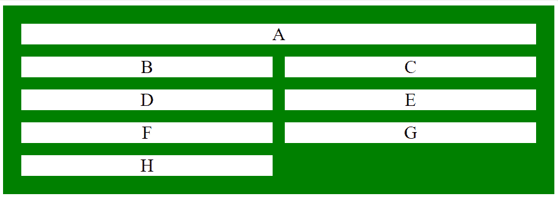

# CSS |网格-模板-区域属性

> 原文:[https://www . geesforgeks . org/CSS-grid-template-areas-property/](https://www.geeksforgeeks.org/css-grid-template-areas-property/)

CSS 中的网格模板区域属性用于指定网格布局中的区域。命名的网格区域可以基于网格模板区域属性的值序列呈现在屏幕上。

**语法:**

```css
grid-template-areas: none|itemnames;
```

**属性值:**

*   **无:**为默认值，不包含网格命名区域。
*   **item name:**是行、列形式的网格区域名称序列。

**注:**

*   每个区域名称由空格分隔。
*   每行都包含在单引号“”中。
*   声明的末尾只有一个分号。
*   句点代表没有名称的项目。

**示例 1:** 本示例显示网格模板区域属性。

```css
<!DOCTYPE html> 
<html> 
    <head> 
        <title> 
            CSS grid-template-areas Property 
        </title> 

        <style> 
            .GFG1 {
                grid-area: area;
            }
            .geeks { 
                background-color:green; 
                padding:30px; 
                display: grid; 
                grid-template-areas: 'area area';
                grid-gap: 20px; 
            } 
            .GFG { 
                background-color: white; 
                font-size: 30px; 
                text-align: center; 
            } 
        </style> 
    </head> 

    <body> 
        <div class="geeks"> 
            <div class="GFG GFG1">A</div> 
            <div class="GFG">B</div> 
            <div class="GFG">C</div> 
            <div class="GFG">D</div> 
            <div class="GFG">E</div> 
            <div class="GFG">F</div> 
            <div class="GFG">G</div> 
            <div class="GFG">H</div> 
        </div> 
    </body> 
</html>                     
```

**输出:**


**示例 2:** 本示例显示网格模板区域属性。

```css
<!DOCTYPE html> 
<html> 
    <head> 
        <title> 
            CSS grid-template-areas Property 
        </title> 

        <style> 
            .GFG1 {
                grid-area: area;
            }
            .geeks { 
                background-color:green; 
                padding:30px; 
                display: grid; 
                grid-template-areas:
                'area area . . .'
                'area area . . .';
                grid-gap: 20px; 
            } 
            .GFG { 
                background-color: white; 
                font-size: 30px; 
                text-align: center; 
            } 
        </style> 
    </head> 

    <body> 
        <div class="geeks"> 
            <div class="GFG GFG1">A</div> 
            <div class="GFG">B</div> 
            <div class="GFG">C</div> 
            <div class="GFG">D</div> 
            <div class="GFG">E</div> 
            <div class="GFG">F</div> 
            <div class="GFG">G</div> 
        </div> 
    </body> 
</html>                     
```

**输出:**


**支持的浏览器:***网格模板区域属性*支持的浏览器如下:

*   谷歌 Chrome 57.0
*   Internet Explorer 16.0
*   Firefox 52.0
*   Safari 10.0
*   Opera 44.0