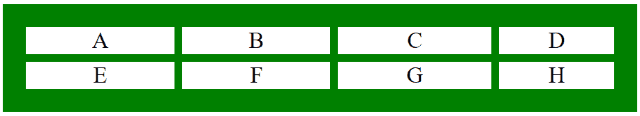
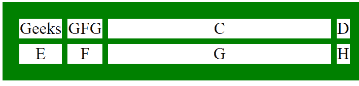

# CSS |网格-模板-列属性

> 原文:[https://www . geesforgeks . org/CSS-grid-template-columns-property/](https://www.geeksforgeeks.org/css-grid-template-columns-property/)

CSS 中的 grid-template-columns 属性用于设置网格的列数和列大小。此属性接受多个值。列的数量由赋予该属性的值的数量来设置。

**语法:**

```
grid-template-columns: none|auto|max-content|min-content|length|
initial|inherit;
```

**属性值:**

*   **无:**是网格-模板-列属性的默认值。除非需要，否则网格不包含任何列。
    **语法:**

    ```
    grid-template-columns: none;
    ```

*   **长度:**设置网格-模板-列属性的长度。长度可以设置为 px、em、百分比等形式，指定列的大小。
    **语法:**

```
grid-template-columns: length;
```

*   **自动:**列的大小是根据内容和元素大小自动设置的。
    **语法:**

    ```
    grid-template-columns: auto;
    ```

    *   **最小内容:**根据最大最小内容大小设置栏目大小。
    **语法:**

    ```
    grid-template-columns: min-content;
    ```

    *   **最大内容:**根据最大最大内容大小设置栏目大小。
    **语法:**

    ```
    grid-template-columns: max-content;
    ```

    *   **初始值:**将网格-模板-列属性设置为默认值。
    **语法:**

    ```
    grid-template-columns: initial;
    ```

    *   **inherit:** It sets the grid-template-columns property from its parent element.
    **Syntax:**

    ```
    grid-template-columns: inherit;
    ```

    **例 1:**

    ```
    <!DOCTYPE html>
    <html>
        <head>
            <title>
                CSS grid-template-columns Property
            </title>

            <style>
                .geeks {
                    background-color:green;
                    padding:30px;
                    display: grid;
                    grid-template-columns: auto auto 200px 150px;
                    grid-gap: 10px;
                }
                .GFG {
                    background-color: white;
                    border: 1px solid white;
                    font-size: 30px;
                    text-align: center;
                }
            </style>
        </head>

        <body>
            <div class="geeks">
                <div class="GFG">A</div>
                <div class="GFG">B</div> 
                <div class="GFG">C</div>
                <div class="GFG">D</div>
                <div class="GFG">E</div>
                <div class="GFG">F</div>
                <div class="GFG">G</div> 
                <div class="GFG">H</div>
            </div>
        </body>
    </html>                    
    ```

    **输出:**
    

    **例 2:**

    ```
    <!DOCTYPE html>
    <html>
        <head>
            <title>
                CSS grid-template-columns Property
            </title>

            <style>
                .geeks {
                    background-color:green;
                    padding:30px;
                    display: grid;
                    grid-template-columns: 
                    min-content max-content 400px min-content;
                    grid-gap: 10px;
                }
                .GFG {
                    background-color: white;
                    border: 1px solid white;
                    font-size: 30px;
                    text-align: center;
                }
            </style>
        </head>

        <body>
            <div class="geeks">
                <div class="GFG">Geeks</div>
                <div class="GFG">GFG</div> 
                <div class="GFG">C</div>
                <div class="GFG">D</div>
                <div class="GFG">E</div>
                <div class="GFG">F</div>
                <div class="GFG">G</div> 
                <div class="GFG">H</div>
            </div>
        </body>
    </html>                    
    ```

    **输出:**
    

    **支持的浏览器:***网格-模板-列*属性支持的浏览器如下:

    *   谷歌 Chrome 57.0
    *   Internet Explorer 16.0
    *   Firefox 52.0
    *   Opera 44.0
    *   Safari 10.0