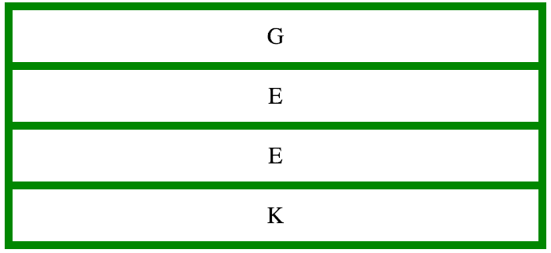
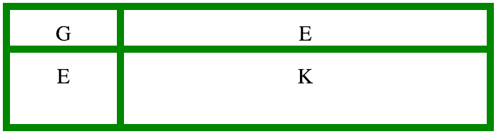
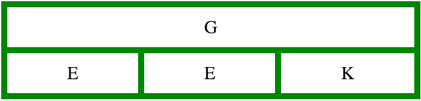
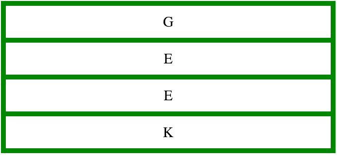
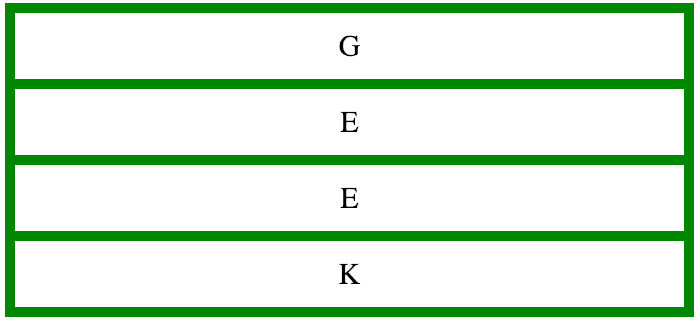

# CSS |网格模板属性

> 原文:[https://www.geeksforgeeks.org/css-grid-template-property/](https://www.geeksforgeeks.org/css-grid-template-property/)

CSS 中的网格模板属性是定义网格列、行和区域的简写属性。用户可以设置以下长整型属性的值:

*   [网格-模板-行](https://www.geeksforgeeks.org/css-grid-template-rows-property/)

*   [网格-模板-柱子](https://www.geeksforgeeks.org/css-grid-template-columns-property/)

*   网格-模板-区域

**语法:**

```
grid-template: none| grid-template-rows/ grid-template-columns | 
grid-template-areas | initial | inherit
```

**房产价值:**

*   **无:**用户可以使用“无”将行和列的大小设置为默认值。
    **例**

## 超文本标记语言

```
<!DOCTYPE html>
<html>

<head>
    <title>
        CSS | grid-template Property
    </title>
    <style>
        .main {
            display: grid;
            grid-template: none;
            grid-gap: 10px;
            background-color: green;
            padding: 10px;
        }

        .main > div {
            background-color: white;
            text-align: center;
            padding: 15px 0;
            font-size: 30px;
        }
    </style>
</head>

<body>
    <div class="main">
        <div class="item1">G</div>
        <div class="item2">E</div>
        <div class="item3">E</div>
        <div class="item4">K</div>
    </div>
</body>

</html>
```

*   **输出:**



*   **网格-模板-行/网格-模板-列:**该属性值用于指定以 px、cm 等度量的行和列的大小。如果用户希望行或列的大小保持默认，则将该行或列设置为“自动”。
    **例:**

## 超文本标记语言

```
<!DOCTYPE html>
<html>

<head>
    <title>
        CSS | grid-template Property
    </title>
    <style>
        .main {
            display: grid;
            grid-template: 50px 100px/150px auto;
            grid-gap: 10px;
            background-color: green;
            padding: 10px;
        }

        .main > div {
            background-color: white;
            text-align: center;
            padding: 15px 0;
            font-size: 30px;
        }
    </style>
</head>

<body>
    <div class="main">
        <div class="item1">G</div>
        <div class="item2">E</div>
        <div class="item3">E</div>
        <div class="item4">K</div>
    </div>
</body>

</html>
```

*   **输出:**



*   **网格-模板-区域:**该属性值指定网格布局内的区域。grid-area 属性用于命名网格项，然后使用 grid-template-area 引用它们。
    **例:**

## 超文本标记语言

```
<!DOCTYPE html>
<html>

<head>
    <title>
        CSS | grid-template Property
    </title>
    <style>
        .item1 {
            grid-area: item1;
        }

        .item2 {
            grid-area: item2;
        }

        .item3 {
            grid-area: item3;
        }

        .item4 {
            grid-area: item4;
        }

        .main {
            display: grid;
            grid-template: 'item1 item1 item1'
                           'item2 item3 item4';
            grid-gap: 10px;
            background-color: green;
            padding: 10px;
        }

        .main > div {
            background-color: white;
            text-align: center;
            padding: 15px 0;
            font-size: 30px;
        }
    </style>
</head>

<body>
    <div class="main">
        <div class="item1">G</div>
        <div class="item2">E</div>
        <div class="item3">E</div>
        <div class="item4">K</div>
    </div>
</body>

</html>
```

*   **输出:**



*   **初始值:**该属性值将属性设置为默认值。
    **例:**

## 超文本标记语言

```
<!DOCTYPE html>
<html>

<head>
    <title>
        CSS | grid-template Property
    </title>
    <style>
        .main {
            display: grid;
            grid-template: initial;
            alignnone grid-gap: 10px;
            background-color: green;
            padding: 10px;
        }

        .main > div {
            background-color: white;
            text-align: center;
            padding: 15px 0;
            font-size: 30px;
        }
    </style>
</head>

<body>
    <div class="main">
        <div class="item1">G</div>
        <div class="item2">E</div>
        <div class="item3">E</div>
        <div class="item4">K</div>
    </div>
</body>

</html>
```

*   **输出:**



*   **继承:**这将从其父元素继承该属性。
    **例:**

## 超文本标记语言

```
<!DOCTYPE html>
<html>

<head>
    <title>
        CSS | grid-template Property
    </title>
    <style>
        .main {
            display: grid;
            grid-template: inherit;
            grid-gap: 10px;
            background-color: green;
            padding: 10px;
        }

        .main > div {
            background-color: white;
            text-align: center;
            padding: 15px 0;
            font-size: 30px;
        }

        alignnone
    </style>
</head>

<body>
    <div class="main">
        <div class="item1">G</div>
        <div class="item2">E</div>
        <div class="item3">E</div>
        <div class="item4">K</div>
    </div>
</body>

</html>
```

*   **输出:**



*   **支持的浏览器:**CSS 网格模板属性支持的浏览器如下:
    *   谷歌 Chrome 57.0
    *   Internet Explorer 16.0
    *   Firefox 52.0
    *   Safari 10.0
    *   Opera 44.0