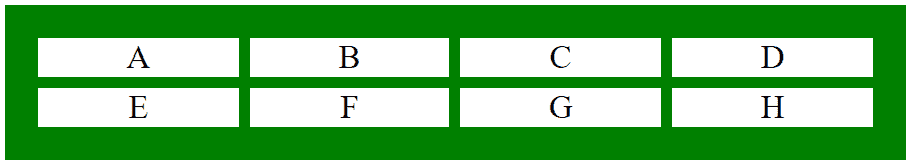
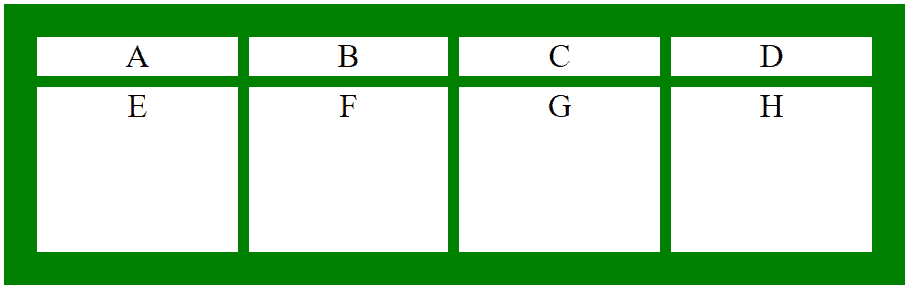

# CSS |网格-模板-行属性

> 原文:[https://www . geesforgeks . org/CSS-grid-template-rows-property/](https://www.geeksforgeeks.org/css-grid-template-rows-property/)

CSS 中的**网格-模板-行**属性用于设置网格中的行数和行高。网格模板行的值用空格分隔，其中每个值代表行的高度。

**语法:**

```html
grid-template-rows: none|auto|max-content|min-content|length|
initial|inherit;
```

**属性值:**

*   **无:**不设置网格-模板-行属性的高度。它在需要时创建行。
    **语法:**

    ```html
    grid-template-rows: none;
    ```

*   **自动:**用于自动设置行的大小，即取决于容器的大小&行中的内容。
    **语法:**

```html
grid-template-rows: auto;
```

*   **最大内容:**代表网格中项目的最大内容。

    ```html
    grid-template-rows: max-content;
    ```

    *   **最小内容:**它代表网格中项目的最小内容。

    ```html
    grid-template-rows: min-content;
    ```

    *   **length:** The size of row is set according to the specified length.

    ```html
    grid-template-rows: length;
    ```

    **例 1:**

    ```html
    <!DOCTYPE html> 
    <html> 
        <head> 
            <title> 
                CSS grid-template-rows Property 
            </title> 

            <style> 
                .geeks { 
                    background-color:green; 
                    padding:30px; 
                    display: grid; 
                    grid-template-columns: auto auto auto auto;
                    grid-template-rows: auto auto;
                    grid-gap: 10px; 
                } 
                .GFG { 
                    background-color: white; 
                    border: 1px solid white; 
                    font-size: 30px; 
                    text-align: center; 
                } 
            </style> 
        </head> 

        <body> 
            <div class="geeks"> 
                <div class="GFG">A</div> 
                <div class="GFG">B</div> 
                <div class="GFG">C</div> 
                <div class="GFG">D</div> 
                <div class="GFG">E</div> 
                <div class="GFG">F</div> 
                <div class="GFG">G</div> 
                <div class="GFG">H</div> 
            </div> 
        </body> 
    </html>                     
    ```

    **输出:**
    

    **例 2:**

    ```html
    <!DOCTYPE html> 
    <html> 
        <head> 
            <title> 
                CSS grid-template-rows Property 
            </title> 

            <style> 
                .geeks { 
                    background-color:green; 
                    padding:30px; 
                    display: grid; 
                    grid-template-columns: auto auto auto auto;
                    grid-template-rows: auto 150px ;
                    grid-gap: 10px; 
                } 
                .GFG { 
                    background-color: white; 
                    border: 1px solid white; 
                    font-size: 30px; 
                    text-align: center; 
                } 
            </style> 
        </head> 

        <body> 
            <div class="geeks"> 
                <div class="GFG">A</div> 
                <div class="GFG">B</div> 
                <div class="GFG">C</div> 
                <div class="GFG">D</div> 
                <div class="GFG">E</div> 
                <div class="GFG">F</div> 
                <div class="GFG">G</div> 
                <div class="GFG">H</div> 
            </div> 
        </body> 
    </html>                     
    ```

    **输出:**
    

    **支持的浏览器:***网格-模板-行属性*支持的浏览器如下:

    *   谷歌 Chrome 57.0
    *   Internet Explorer 16.0
    *   Firefox 52.0
    *   Safari 10.0
    *   Opera 44.0