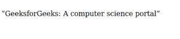

# CSS |悬挂标点属性

> 原文:[https://www . geesforgeks . org/CSS-hang-标点-property/](https://www.geeksforgeeks.org/css-hanging-punctuation-property/)

CSS 中的 [**悬挂-标点符号**](https://en.wikipedia.org/wiki/Hanging_punctuation) **属性**为网页设计师在网页排版上提供了一些优势。悬挂标点符号属性指定标点符号是放在行框外的某一行文本的开头还是结尾。
基本上，它让网页设计者可以将项目符号或任何符号设置为向左或向右对齐，以便第一个字母与文档的其余部分正确对齐。
我们可以使用以下关键词和悬挂标点属性，可以使用不同的模式或类型:

*   关键字值
*   两个关键字值
*   三个关键字值
*   全局关键字值

*   **语法:**为关键字值

```css
ohanging-punctuation: none;
hanging-punctuation: first;
hanging-punctuation: last;
hanging-punctuation: force-end;
hanging-punctuation: allow-end;
```

*   **语法:**为*两个关键字值*

```css
hanging-punctuation: first force-end;
hanging-punctuation: first allow-end;
hanging-punctuation: first last;
hanging-punctuation: last force-end;
hanging-punctuation: last allow-end;
```

*   **语法:**代表*三个关键词值*

```css
hanging-punctuation: first force-end last;
hanging-punctuation: first allow-end last;
```

*   **语法:**代表*全球价值观*代表

```css
hanging-punctuation: inherit;
hanging-punctuation: initial;
hanging-punctuation: unset;
```

**默认值:**

*   **无**

**属性值:**

<figure class="table">

| key word | functionality |
| --- | --- |
| **None** | This is the default value of this property. No characters hang. |
| **The first** | Use an available character to hang at the beginning of the first formatted line of an element. |
| **Last** | Available characters at the end of the last formatted line of the element are suspended.
 |
| **Force-end** | Use a period or comma to hang at the end of a line. |
| **允许-结束** | If the period or comma at the end of the line does not fit before alignment, it will hang up. |

</figure>

**例:**

## 超文本标记语言

```css
<!DOCTYPE HTML>
<html>
    <head>
        <title>
            CSS Hanging Punctuation Property
        </title>
        <style>
            p {
                 hanging-punctuation: first;
              } 
        </style>
    </head>

    <body>

<p>“GeeksforGeeks: A computer science portal”</p>

    </body>
</html>
```

**输出:**



**支持的浏览器:***挂标点属性*支持的浏览器如下:

*   Safari 10.0+