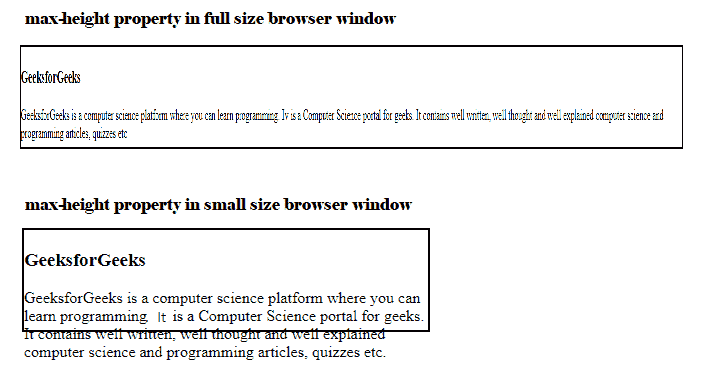

# CSS |高度和宽度

> 原文:[https://www.geeksforgeeks.org/css-height-and-width/](https://www.geeksforgeeks.org/css-height-and-width/)

CSS 中的高度和宽度用于设置框的高度和宽度。它的值可以使用长度、百分比或自动设置。


**示例:**

```css
<!DOCTYPE html>
<html>
   <head>
      <title>width and height</title>
      <style>
         .GFG{
         height: 120px;
         width: 50%;
         border: 5px solid black;
         padding-left: 50px;
         padding-top: 50px;
         font-size:42px;
         font-weight:bold;
         color:green;
         margin-left:50px;
         margin-top:50px;
         }
      </style>
   </head>
   <body>
      <div class = "GFG"> GeeksforGeeks </div>
   </body>
</html>
```

**输出:**


**图像的高度和宽度:**用于设置图像的高度和宽度。它的值可以是像素、厘米、百分比等。
T3】例:

```css
<!DOCTYPE html>
<html>
   <head>
      <title>Height and width of image</title>
      <style>
         .GFG {
         width:300px;
         height:200px;
         border:3px solid black;
         }
      </style>
   </head>
   <body>
      <h3>Set the width and height of an Image</h3>
      
   </body>
</html>
```

**输出:**


**设置元素的最大宽度和最小宽度:**

*   **max-width:** It is used to set the maximum width of the box. It’s effect can be seen by resizing the browsers.

    ```css
    <!DOCTYPE html>
    <html>
       <head>
          <title>max-width of element</title>
          <style>
             .GFG {
             max-width:500px;
             border:2px solid black;
             }
          </style>
       </head>
       <body>
          <div class="GFG">
          <h3>GeeksforGeeks</h3>
          <p>GeeksforGeeks is a computer science platform
             where you can learn programming. It is a Computer 
             Science portal for geeks. It contains well written,
             well thought and well explained computer science 
             and programming articles, quizzes etc.
          </p>
       </body>
    </html>
    ```

    **输出:**

    

*   **最小宽度:**用于设置盒子的最小宽度。它的效果可以通过调整浏览器的大小来看到。
    T3】例:

```css
<!DOCTYPE html>
<html>
   <head>
      <title>min-width of element</title>
      <style>
         .GFG {
         min-width:400px;
         border:2px solid black;
         }
      </style>
   </head>
   <body>
      <div class="GFG">
      <h3>GeeksforGeeks</h3>
      <p>GeeksforGeeks is a computer science platform
         where you can learn programming. It is a Computer 
         Science portal for geeks. It contains well written,
         well thought and well explained computer science 
         and programming articles, quizzes etc.
      </p>
   </body>
</html>
```

**输出:**


**设置元素的最大高度和最小高度:**

*   **max-height:** It is used to set the maxumum height of the box. It’s effect can be seen by resizing the browsers.
    **Example:**

    ```css
    <!DOCTYPE html>
    <html>
       <head>
          <title>max-height of element</title>
          <style>
             .GFG {
             max-height:100px;
             border:2px solid black;
             }
          </style>
       </head>
       <body>
          <div class="GFG">
          <h3>GeeksforGeeks</h3>
          <p>GeeksforGeeks is a computer science platform
             where you can learn programming. It is a Computer 
             Science portal for geeks. It contains well written,
             well thought and well explained computer science 
             and programming articles, quizzes etc.
          </p>
       </body>
    </html>
    ```

    **输出:**

    

*   **min-height:** It is used to set the minimum height of the box. It’s effect can be seen by resizing the browsers.
    **Example:**

    ```css
    <!DOCTYPE html>
    <html>
       <head>
          <title>min-height of element</title>
          <style>
             .GFG {
             min-height:50px;
             border:2px solid black;
             }
          </style>
       </head>
       <body>
          <div class="GFG">
          <h3>GeeksforGeeks</h3>
          <p>GeeksforGeeks is a computer science platform
             where you can learn programming. It is a Computer 
             Science portal for geeks. It contains well written,
             well thought and well explained computer science 
             and programming articles, quizzes etc.
          </p>
       </body>
    </html>
    ```

    **输出:**

    