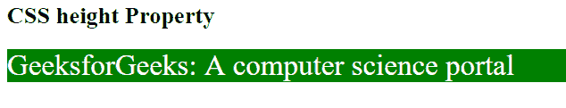
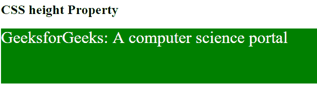

# CSS |高度属性

> 原文:[https://www.geeksforgeeks.org/css-height-property/](https://www.geeksforgeeks.org/css-height-property/)

height 属性用于设置元素的高度。height 属性不包含元素的填充、边距和边框。

**语法:**

```html
height: auto|length|initial|inherit;
```

**默认值:**

*   **自动**

**属性值:**

*   **自动:**用于将高度属性设置为默认值。如果高度属性设置为自动，浏览器将计算元素的高度。

**语法:**

```html
height: auto;
```

**例:**

## 超文本标记语言

```html
<!DOCTYPE html>
<html>
    <head>
        <title>
            CSS height Property
        </title>

        <style>
            .Geeks {
                height: auto;
                color: white;
                font-size: 30px;
                background-color: green;
            }
        </style>
    </head>

    <body>
        <h2>CSS height Property</h2>

        <div class = "Geeks">
            GeeksforGeeks: A computer science portal
        </div>
    </body>
</html>                   
```

**输出:**



*   **长度:**用于以 px、cm 等形式设置元素的高度。长度不能为负。

**语法:**

```html
height: length;
```

**例:**

## 超文本标记语言

```html
<!DOCTYPE html>
<html>
    <head>
        <title>
            CSS height Property
        </title>

        <style>
            .Geeks {
                height: 100px;
                color: white;
                font-size: 30px;
                background-color: green;
            }
        </style>
    </head>

    <body>
        <h2>CSS height Property</h2>

        <div class = "Geeks">
            GeeksforGeeks: A computer science portal
        </div>
    </body>
</html>                   
```

**输出:**



*   **初始值:**用于将高度属性设置为默认值。

**语法:**

```html
height: initial;
```

**例:**

## 超文本标记语言

```html
<!DOCTYPE html>
<html>
    <head>
        <title>
            CSS height Property
        </title>

        <style>
            .Geeks {
                height: initial;
                color: white;
                font-size: 30px;
                background-color: green;
            }
        </style>
    </head>

    <body>
        <h2>CSS height Property</h2>

        <div class = "Geeks">
            GeeksforGeeks: A computer science portal
        </div>
    </body>
</html>                   
```

**输出:**


*   **继承:**用于从其父元素设置高度属性。

**支持的浏览器:**高度属性支持的浏览器如下:

*   谷歌 Chrome 1.0
*   Internet Explorer 4.0
*   Firefox 1.0
*   Safari 1.0
*   Opera 7.0