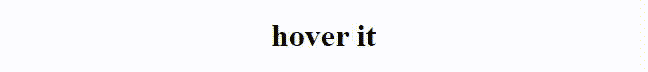
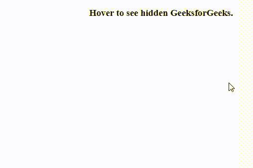
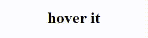
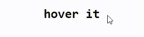

# CSS:悬停选择器

> 原文:[https://www.geeksforgeeks.org/css-hover-selector/](https://www.geeksforgeeks.org/css-hover-selector/)

**:悬停选择器** CSS [伪类](https://www.geeksforgeeks.org/css-pseudo-classes/)用于当鼠标悬停在元素上时为元素设置样式。它可以用在每个元素上。

我们可以使用[:链接选择器](https://www.geeksforgeeks.org/css-link-selector/)为未访问页面的链接设置样式，使用[:访问选择器](https://www.geeksforgeeks.org/css-visited-selector/) &为活动链接设置样式，使用[:活动选择器](https://www.geeksforgeeks.org/css-active-selector/)。如果:link 和:visited 选择器出现在 CSS 定义中，那么为了看到效果，我们必须在它后面添加:悬停选择器。

**语法:**

```css
element :hover{
    // CSS declarations;
}
```

**示例 1:** 该示例说明了悬停在元素上时背景颜色的变化。

## 超文本标记语言

```css
<!DOCTYPE html>
<html>

<head>
    <style>
    h1:hover {
        color: white;
        background-color: green;
    }
    </style>
</head>

<body>
    <h1 align="center"> hover it</h1>
</body>

</html>
```

**输出:**



**示例 2:** 该示例显示了悬停在文本上的隐藏块。

## 超文本标记语言

```css
<!DOCTYPE html>
<html>

<head>
    <style>
    ul {
        display: none;
    }

    div {
        background: green;
        width: 200px;
        height: 200px;
        padding: 20px;
        padding-left: 50px;
        font-size: 30px;
        color: white;
        display: none;
    }

    h3:hover + div {
        display: block;
    }
    </style>
</head>

<body>
    <h3 align="center">
        Hover to see hidden GeeksforGeeks.
    </h3>
    <div> GeeksforGeeks </div>
</body>

</html>
```

**输出:**



**示例 3:** 该示例说明了悬停在元素上时字体颜色的变化。

## 超文本标记语言

```css
<!DOCTYPE html>
<html>

<head>
    <style>
    h1:hover {
        color: red;
    }
    </style>
</head>

<body>
    <h1 align="center"> hover it</h1>
</body>

</html>
```

**输出:**



**示例 4:** 该示例说明了悬停在文本上时文本字体系列的变化。

## 超文本标记语言

```css
<!DOCTYPE html>
<html>

<head>
    <style>
    h1:hover {
        font-family: monospace;
    }
    </style>
</head>

<body>
    <h1 align="center"> hover it</h1>
</body>

</html>
```

**输出:**



**示例 5:** 此示例说明将悬停在元素上时的文本装饰更改为下划线。

## 超文本标记语言

```css
<!DOCTYPE html>
<html>

<head>
    <style>
    h1:hover {
        text-decoration: underline;
    }
    </style>
</head>

<body>
    <h1 align="center"> hover it</h1>
</body>

</html>
```

**输出:**


**支持的浏览器:**

*   谷歌 Chrome 4.0
*   微软边缘 7.0
*   Mozilla Firefox 2.0
*   Safari 3.1
*   歌剧 9.6