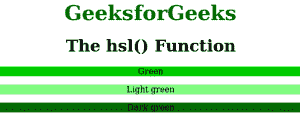

# CSS | hsl()函数

> 原文:[https://www.geeksforgeeks.org/css-hsl-function/](https://www.geeksforgeeks.org/css-hsl-function/)

hsl()函数是 CSS 中的一个内置函数，用于使用色调-饱和度-亮度模型(HSL)定义颜色。
**语法:**

```css
hsl( hue, saturation, lightness )
```

**参数:**该功能接受三个参数，如上所述，描述如下:

*   **色相:**此参数用于定义色轮上的度数。它的值介于 0 到 360 之间，其中 0 或 360 代表红色，120 代表绿色，240 代表蓝色。
*   **饱和度:**此参数用于定义饱和度，其中 0%代表灰色阴影，100%代表全色。
*   **明度:**此参数用于定义明度，其中 0%代表黑色，50%代表正常，100%代表白色。

下面的程序说明了 CSS 中的 hsl()函数:
**程序:**

## 超文本标记语言

```css
<!DOCTYPE html>
<html>
    <head>
        <title>hsl() function</title>
        <style>
            .gfg1 {
                background-color:hsl(120, 100%, 40%);
                text-align:center;
            }
            .gfg2 {
                background-color:hsl(120, 100%, 75%);
                text-align:center
            }
            .gfg3 {
                background-color:hsl(120, 100%, 20%);
                text-align:center
            }
            .gfg {
                font-size:40px;
                font-weight:bold;
                color:green;
                text-align:center;
            }
            h1 {
                text-align:center;
            }
        </style>
    </head>
    <body>
        <div class = "gfg">GeeksforGeeks</div>
        <h1>The hsl() Function</h1>
        <p class = "gfg1">Green</p>

        <p class = "gfg2">Light green</p>

        <p class = "gfg3">Dark green</p>

    </body>
</html>
```

**输出:**



**支持的浏览器:**HSL()功能支持的浏览器如下:

*   Chrome 1.0 及以上版本
*   Internet Explorer 9.0 及以上版本
*   Firefox 1.0 及以上版本
*   Safari 3.1 及以上版本
*   Opera 9.5 及以上