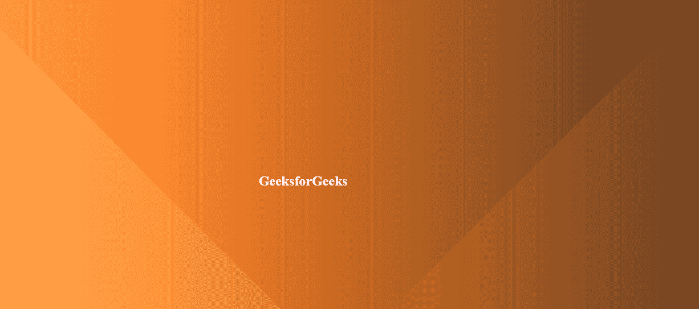

# CSS |色相背景

> 原文:[https://www.geeksforgeeks.org/css-hue-background/](https://www.geeksforgeeks.org/css-hue-background/)

色调背景是一种新的设计方法的概念，侧重于干净美观的用户界面。它给网站一个干净美观的外观。它非常适合一些专业网站，如一些产品登陆页面或一些组织的主页。它还有一个高级版本，其中颜色不断变化，我们将只关注高级部分，因为如果你知道如何制作高级背景，你可以制作基本部分。

**方法:**方法是给一个渐变的背景，做一些边框，给它一种闪亮的反射的样子。对于高级概念，我们将使用关键帧来更改背景颜色。

**HTML 代码:**在这部分，我们已经创建了一个小节。

```html
<!DOCTYPE html>
<html lang="en">
  <head>
    <meta charset="UTF-8" />
    <meta name="viewport"
          content="width=device-width, 
                   initial-scale=1.0" />
    <title>HUE background</title>
 </head>
  <body>
    <section><h1>GeeksforGeeks</h1></section>
  </body>
</html>
```

**CSS 代码:**对于 CSS，请按照下面给出的步骤操作。

*   **步骤 1:** 使用[线性渐变](https://www.geeksforgeeks.org/css-linear-gradient-function/)应用基本渐变背景
*   **第 2 步:**现在使用一个名为*的标识符应用动画属性制作*动画
*   **步骤 3:** 现在使用[色调-旋转](https://www.geeksforgeeks.org/css-hue-rotate-function/)使用关键帧在您选择的任何角度旋转色调。这将使每一帧的颜色发生变化。我们已经把框架分成了三部分，但是你可以根据自己的需要来选择
*   **步骤 4:** 现在使用选择器之前的[创建从顶部出现的左侧边框。](https://www.geeksforgeeks.org/css-before-selector/)
*   **第五步:**现在使用选择器后的[创建从顶部出现的右侧边框。](https://www.geeksforgeeks.org/css-after-selector/)

**提示:**如果想要基本背景，关键帧步骤是完全可选的。产生反射效果的边框可以是不同的类型。我们选择使用从顶部出现的边界。你可以根据自己的需要和创造力改变他们的出现方向和几乎所有的事情。

```html
section {
       position: absolute;
       top: 0;
       left: 0;
       width: 100%;
       height: 100vh;
       background: linear-gradient(90deg, #07f79b, #01442a);
       animation: animate 20s linear infinite;
     }
     @keyframes animate {
       0% {
         filter: hue-rotate(0deg);
       }

       50% {
         filter: hue-rotate(360deg);
       }

       100% {
         filter: hue-rotate(0deg);
       }
     }

     section::before {
       content: "";
       position: absolute;
       top: 0;
       left: 0;
       border-top: 100vh solid transparent;
       border-left: 100vh solid #fff;
       opacity: 0.1;
     }

     section::after {
       content: "";
       position: absolute;
       bottom: 0;
       right: 0;
       border-top: 100vh solid transparent;
       border-right: 100vh solid #fff;
       opacity: 0.1;
     }

     h1 {
       position: absolute;
       top: 50%;
       left: 40%;
       color: white;
       font: 40px;
     }
```

**完整代码:**是以上两段代码的组合。

```html
<!DOCTYPE html>
<html lang="en">
  <head>
    <meta charset="UTF-8" />
    <meta name="viewport" 
          content="width=device-width, 
                   initial-scale=1.0" />
    <title>HUE background</title>
    <style>
      section {
        position: absolute;
        top: 0;
        left: 0;
        width: 100%;
        height: 100vh;
        background: linear-gradient(90deg, #07f79b, #01442a);
        animation: animate 20s linear infinite;
      }
      @keyframes animate {
        0% {
          filter: hue-rotate(0deg);
        }

        50% {
          filter: hue-rotate(360deg);
        }

        100% {
          filter: hue-rotate(0deg);
        }
      }

      section::before {
        content: "";
        position: absolute;
        top: 0;
        left: 0;
        border-top: 100vh solid transparent;
        border-left: 100vh solid #fff;
        opacity: 0.1;
      }

      section::after {
        content: "";
        position: absolute;
        bottom: 0;
        right: 0;
        border-top: 100vh solid transparent;
        border-right: 100vh solid #fff;
        opacity: 0.1;
      }

      h1 {
        position: absolute;
        top: 50%;
        left: 40%;
        color: white;
        font: 40px;
      }
    </style>
  </head>
  <body>
    <section><h1>GeeksforGeeks</h1></section>
  </body>
</html>
```

**输出:**
